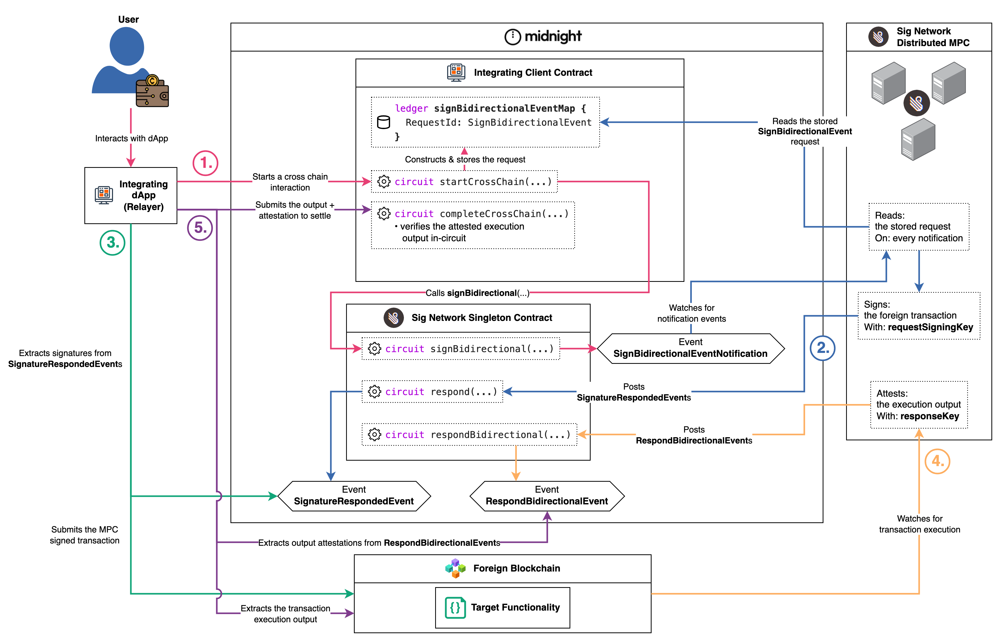

# Midnight Contracts Calling Foreign Chains with Sig Network

This monorepo holds experimental example Midnight contracts that leverage the Sig Network [Distributed MPC](https://github.com/sig-net/mpc) to execute arbitrary transactions on foreign blockchains through integration of the [Sign Bidirectional Protocol Flow](#sign-bidirectional-protocol-flow).

The examples demonstrate how to integrate using the following packages:
- [`@sig-net/midnight`](https://www.npmjs.com/package/@sig-net/midnight): the
  client-agnostic protocol library (the shared Compact modules, state readers,
  event decoders, request feed and crypto helpers).
- [`@sig-net/midnight-contract`](https://www.npmjs.com/package/@sig-net/midnight-contract):
  the central Signet singleton contract.
- [`@sig-net/midnight-contract-deploy`](https://www.npmjs.com/package/@sig-net/midnight-contract-deploy):
  deploy tooling for that contract plus generic Midnight deploy and wallet
  plumbing. Used here by the test harness to deploy the singleton for the
  local e2e stack.

## Reading Guide
- Start by reading the [Sign Bidirectional Flow](#sign-bidirectional-protocol-flow) to understand the fundamentals of the cross chain protocol.
- Then go through the [Integration guide](#integration-guide) to see how to wire your own applications with Sig Network to make cross chain calls.
- Or jump straight into complete [examples](#examples) to see applications of the protocol.

If you are looking for the parts of the Sig Network stack that these examples are built upon, visit:
- [Midnight Integration Protocol and SDK Repository](https://github.com/sig-net/midnight-integration)
- [Sig Network Distributed MPC Repository](https://github.com/sig-net/mpc)

## Examples

Each example is a directory under [`examples/`](examples/) holding up to four packages, split by what the code is: `contract` (required), plus `client`, `deploy` and `integration-tests` as warranted.

> ## ⚠️ CAUTION ⚠️
>
> These are example applications for educational and experimental purposes.
> Use at your own risk and expect rapid iteration.

| Example | What it demonstrates | Flow walkthroughs |
|---|---|---|
| [ERC20 Vault](examples/erc20-vault/README.md) | A Midnight vault holding, swapping (Uniswap) and lending (Aave) ERC20 tokens on an EVM chain. | [deposit](examples/erc20-vault/docs/deposit/deposit.md), [withdraw](examples/erc20-vault/docs/withdraw/withdraw.md), [swap](examples/erc20-vault/docs/swap/swap.md), [supply](examples/erc20-vault/docs/supply/supply.md), [redeem](examples/erc20-vault/docs/redeem/redeem.md) |

## Sign Bidirectional Protocol Flow

This Sig Network Protocol Flow brings foreign blockchain assets and functionality to contracts on Midnight. Contracts record signature requests that the Sig Network MPC signs. dApps relay signed transactions to foreign chains and the MPC attests their execution outcomes back to Midnight. Then contracts complete cross chain interactions with in-circuit validation of the MPC foreign execution attestation.

Illustrated below, the protocol is best understood in 5 steps:



1. A user interacts with a dApp, which starts a cross chain interaction by calling a circuit (`startCrossChain(...)` in the diagram) on a contract on Midnight that has integrated with Sig Network.
2. The MPC network, watching for events on the Singleton contract, picks up the emitted **SignBidirectionalEventNotification** and honours the signature request it points to.
3. The integrating dApp, watching for events on the Singleton contract, picks up the emitted **SignatureRespondedEvent** and relays the fully signed transaction to the foreign chain.
4. The MPC network observes execution of the signed transaction on the foreign blockchain and posts an attestation thereof back to Midnight.
5. The integrating dApp collects the execution output and its attestation and submits both back to the integrating contract, completing the cross chain interaction.

Consult the [protocol documentation in the Midnight integration repository](https://github.com/sig-net/midnight-integration/blob/main/README.md#sign-bidirectional-protocol-flow) for a more detailed description of the protocol including:
  - MPC key derivation and signing
  - MPC discovery and verification of the Sign Bidirectional Event signature requests
  - MPC & Client foreign transaction execution output recovery (including failed transaction flow)
  - MPC foreign transaction execution & failure attestation

## Integration guide

Integrating a contract on Midnight with the Sig Network MPC requires 4 once-off setup
steps and 5 per-request runtime steps.

Setup entails:
1. Installing `@sig-net/midnight` into your project.
2. Importing the Signet Compact module into your contract.
3. Declaring the required protocol state in your ledger (the `signBidirectionalEventMap` your requests live in and the `SignetSigner` singleton reference your circuits call to notify the MPC of requests).
4. Setting the contract's own `mpcResponseKey` with an initialisation circuit call after deploy (its derivation takes the contract's address as input, which exists only once the contract is deployed).

At runtime you integrate the [Sign Bidirectional Flow above](#sign-bidirectional-protocol-flow):
- **Steps 1** and **5** are circuits on your contract.
- **Steps 2**, **3** and **4** are off-chain client/dApp/relayer code built on the readers and helpers in `@sig-net/midnight`.

Consult the [Integrator Guide documentation](https://github.com/sig-net/midnight-integration/blob/main/README.md#integrator-guide) in the Midnight integration repository for a more detailed description of how to integrate.

## Contributor guide

There are two test layers. Unit tests run offline against a simulated Midnight
runtime: no docker stack, no zk keys, seconds not minutes. The end to end
integration suites drive the full protocol against the local docker stack and
the fakenet MPC responder, and take minutes.

Everything runs from the repository root, with the
[Prerequisites](#prerequisites) below installed. Only contract packages have a compile
step, and `build`, `test` and `lint` all read the compiler's generated
`src/managed/` output, so compile first:

```sh
yarn install         # from the root, never from inside a workspace member
yarn compile         # compact compiler per contract package, without zk keys
yarn compile:zk      # with zk keys: needed for deploys and the e2e suites only
yarn build           # typecheck every package
yarn test            # unit tests: offline, simulator only
yarn format:check    # prettier check. `yarn format` rewrites
yarn lint            # eslint, type-aware. `yarn lint:fix` applies the autofixes
yarn deploy:erc20-vault             # deploy a vault. Needs `yarn compile:zk` first
yarn deploy-initialise:erc20-vault  # deploy + the deployer-gated initialise (remote networks)
yarn initialise:erc20-vault         # initialise an already-deployed vault (recovers a half-done run)
```

Scripts targeting one example carry that example's directory name:
`yarn compile:erc20-vault`, `yarn compile:erc20-vault:zk`,
`yarn test:erc20-vault` and `yarn build:erc20-vault`. Deploying a vault is
`yarn deploy:erc20-vault` (needing `yarn compile:erc20-vault:zk` first), with
`yarn deploy-initialise:erc20-vault` for the one-shot remote bring-up and
`yarn initialise:erc20-vault` to recover a run whose deploy landed but whose
initialise did not. ESLint and Prettier are
configured once at the repo root and cover every member, and each example's CI
workflow runs `yarn format:check` and `yarn lint` before its tests, so
formatting drift or a lint finding fails the build.

The e2e suites need the docker stack running and the fakenet MPC responder, and
they also run from the root:

```sh
yarn test:erc20-vault:e2e                              # every spec in the suite
yarn test:erc20-vault:e2e tests/happy-day-e2e.test.ts  # one spec file
```

Getting there from a fresh clone (the `.env` file and its Sepolia fork RPC, the
zk keys, bringing the stack up, what a green first run looks like, and recovering
a run the proof server was OOM-killed in) is walked end to end in the example's
own README: [examples/erc20-vault/README.md](examples/erc20-vault/README.md).

## Prerequisites

| Prerequisite | Version | Check With | Where to Get It |
| ------- | ------| ------  |----------- |
| Node | ≥ 20 (22+ recommended) | `node --version` | [nodejs.org](https://nodejs.org) or your version manager (nvm, fnm, …) |
| Yarn 4 (via Corepack) | 4.x | `corepack enable && yarn --version` | Corepack ships with Node. The repo's `packageManager` field pins the Yarn version |
| Compact toolchain | compiler 0.33.0-rc.2, invoked with `--feature-zkir-v3` (see note) | `compact compile --version` → `0.33.0` | Install the `compact` launcher per [Midnight's docs](https://docs.midnight.network/), then `compact update 0.33.0-rc.2` (compiler builds live at [LFDT-Minokawa/compact releases](https://github.com/LFDT-Minokawa/compact/releases)). If the launcher refuses the rc version, use the direct-download recipe in [.github/workflows/example-test.yaml](.github/workflows/example-test.yaml) |
| A docker environment | any recent engine | `docker --version` | [Docker Desktop](https://www.docker.com/products/docker-desktop/) (macOS/Windows) or your distro's engine, with **≥ 16 GB RAM allocated** (see note) |
| Docker Compose v2 | ≥ 2.x | `docker compose version` | Included with Docker Desktop, plugin package on Linux |

**NOTE:** every `compact compile` against this stack must pass the
`--feature-zkir-v3` flag: it is part of the pinned ledger-9 matched set
(compiler, node, indexer, proof server), and output compiled without it is not
compatible with that stack. This repository's compile scripts already pass it.
Integrators compiling their own contracts must pass it themselves, as shown in
the [Integrator Guide](https://github.com/sig-net/midnight-integration/blob/main/README.md#integrator-guide).

**NOTE:** the midnight proof server is quite heavy. Allocate at least 16 GB of
RAM to your docker environment, otherwise expect to restart the tests multiple
times as the proof server hangs.
