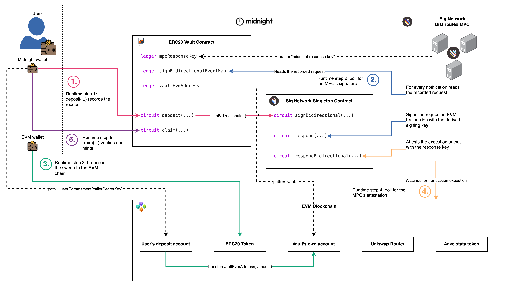

# ERC20 Vault

This example demonstrates bridging ERC20 assets from an EVM chain into shielded tokens on Midnight and back again. A Midnight contract
(the vault) owns an EVM account whose key nobody holds. The address is derived
from the Signature Network MPC's root public key, and every EVM transaction the
vault sends is signed by the MPC network on the vault's request via the
[sign bidirectional flow](https://github.com/sig-net/midnight-integration/blob/main/README.md#sign-bidirectional-flow).

> ## ⚠️ CAUTION ⚠️
>
> This example application is for educational and experimental purposes.
> Expect rapid iteration.
> **Use at your own risk.**

What this example demonstrates, end to end:

- A Compact contract requesting EVM transaction signatures from the Signature Network singleton contract with a cross-contract call on Midnight.
- The MPC observing the request, signing the EVM transaction (secp256k1), and later attesting the EVM outcome with an ECDSA-signed `RespondBidirectionalEvent`, signed by a response key derived for THIS contract (from the MPC root key, the vault's own address and the fixed path `"midnight response key"`). Both responses are emitted as contract events on Midnight.
- The vault verifying that response in-circuit against the response key it
  pinned at `initialize` time, and minting or burning shielded vault tokens
  accordingly, including a refund branch for when the EVM leg fails.

# The Actors



The actor map lays out every actor in the example and the vault's fourteen
exported circuits. The only edges it draws are the dashed key derivations:
every runtime interaction between these actors belongs to a specific MPC flow,
and each flow's own walkthrough page draws its steps (see
[Vault Sign Bidirectional Flow](#vault-sign-bidirectional-flow)).

- **Sig Network Distributed MPC**: signs requested transactions with keys
  derived for the requesting contract, and attests their execution outcomes.
  It only ever signs.
- **Midnight Blockchain (source chain)** hosts two contracts: the
  **Sig Network Singleton Contract**, which the vault notifies of each request
  and through which the MPC posts its responses as contract events, and the
  **ERC20 Vault Contract**, this example's contract, whose fourteen exported
  circuits appear on the map.
- **EVM Blockchain (destination chain)** hosts what the vault transacts with:
  the ERC20 token contract being bridged, the Uniswap V3 router (`swap`) and
  the Aave stataToken wrapper (`supply` / `redeem`), plus the vault's own
  derived EVM account holding the pooled tokens.
- **Vault dApp (Relayer)**: the off-chain client. It polls the singleton's
  emitted events for the MPC's signature, assembles and broadcasts the
  MPC-signed transaction to the EVM chain, then polls for the MPC's
  attestation and hands the attested output back for settling. The MPC only
  signs: broadcasting is the relayer's responsibility.
- **Users**: each user holds a Midnight wallet (calls the circuits and
  receives the shielded vault tokens), their own EVM wallet, and a derived
  EVM deposit account the MPC signs deposit sweeps from (see
  [Derived keys and accounts](#derived-keys-and-accounts)).

# The vault's circuits

Every circuit is a variation on one shape: record a signature request, let the
MPC sign it, have the relayer broadcast it, then settle in-circuit against the
MPC's attestation. The [deposit walkthrough](docs/deposit.md) documents that
shape in full for **`deposit` → `claim`**. The rest of the circuits reuse it,
so the table names each and what it adds without repeating the detail.

| Circuit(s) | What it adds over `deposit` → `claim` |
|---|---|
| [`deposit`](docs/deposit.md) → [`claim`](docs/deposit.md) | **The reference flow, documented in full in the [deposit walkthrough](docs/deposit.md).** Request → sign → broadcast → attest → verify-and-mint. |
| `withdraw` / `completeWithdraw` | The same flow in the other direction, plus the coin-spend-as-authorisation pattern and a settle circuit that branches on the EVM result. |
| `refund` | Settling a request whose transaction never executed, routed by the 5-byte failure-output width (shared by the withdraw, swap, supply and redeem failure paths). |
| `approveRouter` | A sign-only request, with no settle circuit at all. |
| `swap` / `completeSwap` | A second request map at its own ledger field and calldata width, reusing the same optimistic burn-then-mint shape. exactOutputSingle: mint the exact `amountOut` of tokenOut plus the unspent tokenIn as change. |
| `approveStata` | A second sign-only approval, mirroring `approveRouter`: a one-time `approve(stataToken, MAX)` on the underlying so the ERC-4626 wrapper can pull it during `supply`. |
| `supply` / `completeSupply` | The vault lending on Aave through the stataToken wrapper: `supply` burns the surrendered underlying vault coin and records the wrapper's `deposit(amount, vault)`, and `completeSupply` mints shielded stataToken vault tokens for the attested shares. |
| `redeem` / `completeRedeem` | The return leg: `redeem` burns the surrendered stataToken coin and records the wrapper's `redeem(shares, vault, vault)`, and `completeRedeem` mints shielded underlying vault tokens for the attested assets (principal plus accrued interest). |

# Vault Sign Bidirectional Flow

Each MPC interaction flow has its own walkthrough page pairing the flow's
diagram, its step-by-step description with the full code excerpts, and its
sequence diagram:

- [Deposit](docs/deposit.md)


The cross-flow skeleton is the protocol's six phases: fund the sending
account, request a signature on Midnight, receive the MPC's signature,
broadcast on the foreign chain, receive the MPC's attestation of the outcome,
and settle by verifying that attestation in-circuit. Step numbers are
ordinals per flow: deposit opens with a fund step and runs steps 1 to 6,
while withdraw has nothing to fund (the value to move is already pooled in
the vault's account) and runs steps 1 to 5 starting at the request phase.

| Phase | Deposit round trip | Withdraw round trip |
|---|---|---|
| Fund | **Step 1**: the user funds their derived deposit account with the ERC20 being deposited plus gas ETH, from their own EVM wallet | (no step in this flow) |
| Request | **Step 2**: `deposit()` records a signature request for `transfer(vaultEvmAddress, amount)` on the ERC20, to be signed by the **user's deposit account**, and notifies the MPC | **Step 1**: `withdraw()` takes the surrendered vault tokens and requests `transfer(destEvmAddress, amount)`, to be signed by the **vault's account** |
| Signature | **Step 3**: the MPC posts the transaction signature back to Midnight (signature by the user's derived key) and the relayer polls it out | **Step 2**: the same, signature by the vault's derived key |
| Broadcast | **Step 4**: the relayer broadcasts the signed transaction on the foreign chain: the ERC20 moves user → vault | **Step 3**: the same, the ERC20 moves vault → destination |
| Attestation | **Step 5**: the MPC attests the execution output back to Midnight (a signed `RespondBidirectionalEvent` for the sweep) and the relayer polls it out | **Step 4**: the same, for the payout |
| Settle | **Step 6**: `claim()` verifies the attestation in-circuit and mints shielded vault tokens to the depositor | **Step 5**: `completeWithdraw()` finalises an executed transfer, or refunds the withdrawer on a false return. `refund()` refunds the withdrawer when the transfer never executed (reverted or replaced) |

> **Output recovery (between the attestation and settle phases):** the attestation event carries the request id it answers and the MPC's signature, never the output, so the client recovers the execution output itself. For EVM chains it is the mined call's return data, extracted with `debug_traceTransaction` (callTracer, top call frame), the same RPC method the MPC observes executions with. This example fetches it from the fakenet responder's helper API at `GET /responses/{requestId}` (client in [`integration-tests/src/fakenet-responses.ts`](integration-tests/src/fakenet-responses.ts), signature verification in [`integration-tests/src/flows/respond-output.ts`](integration-tests/src/flows/respond-output.ts), server in [`ResponsesApi.ts`](https://github.com/sig-net/solana-signet-program/blob/fakenet-v0.10.0/fakenet-signer/src/server/ResponsesApi.ts), port 3040 in the local stack). The fetched bytes are untrusted until the settle phase's in-circuit signature verification.

# Derived keys and accounts

Every key the MPC signs with is scoped by the requesting contract:

`derivedSigningKey = f(mpcRootKey[keyVersion], vaultContractAddress, path)`

The path is 32 opaque bytes of the client contract's choosing. There are no
format requirements, and the contract address is always part of the
derivation, so no contract can ever reach another contract's derived keys.
Within one contract, distinct paths yield disjoint accounts. The vault uses
exactly three derivations:

| Account / key | Path | What it does |
|---|---|---|
| The user's deposit account (EVM) | `userCommitment(callerSecretKey)`, the caller's 32-byte identity commitment | Signs the deposit sweep `transfer(vault, amount)`. The user funds this address with the ERC20 being deposited plus gas ETH. One account per identity: the contract recomputes the commitment in-circuit from the secret-key witness, so the path is never a circuit argument and the MPC can only ever sign with THIS caller's account. |
| The vault's own account (EVM) | The contract-fixed literal `"vault"` (`pad(32, "vault")`) | Holds the vault's ERC20 balance and signs every withdraw `transfer(destination, amount)`. It also pays the withdraw gas, which is why the whole fee envelope is contract-fixed. |
| The MPC RESPONSE key (secp256k1, not an account) | The fixed literal `"midnight response key"` | Signs every `RespondBidirectionalEvent` the MPC posts back for this contract, ECDSA over the attestation digest of the request id and execution output (the event carries the id it answers plus the signature, nothing else). It never signs transactions: it is per-client-contract yet independent of any request's own path, and `claim`/`completeWithdraw` verify responses against it in-circuit. |

Deposits and withdrawals therefore move between two MPC-derived accounts on
the EVM chain, and neither key ever exists anywhere: the MPC network signs
for them on the vault's request, and only through the vault's circuits.

Derivation happens off-chain with the `@sig-net/midnight` helpers:
`deriveEvmAddress(mpcPublicKey, vaultContractAddress, path)` for the two EVM
accounts and `deriveMidnightResponseKey(mpcPublicKey, vaultContractAddress)`
for the response key (the setup pipeline derives all three and prints them).
The vault's own address and the response key both take the contract address
as INPUT, so they cannot exist at construction time: the deployer-gated
one-shot `initialize` circuit pins them right after deploy, when the address
(and therefore the derivations) exist.

The MPC composes the derivation string by rendering the 32 opaque path bytes
as their full-width lowercase hex (no `0x` prefix, padding included), a total
and injective rendering that accepts any bytes the contract chooses. Client
code deriving an account off-chain must feed `deriveEvmAddress` the same
rendering: `bytesToHex` of the stored path bytes, so the vault's own account
derives from the hex of `pad(32, "vault")` and the user's account from the
hex of the identity commitment (see the reader setup snippet in the
[deposit walkthrough](docs/deposit.md)).

# Integration walkthrough

Integrating the vault with the Sig Network MPC consists of 4 once-off
**setup** steps, after which each flow runs its own per-request **runtime**
steps, documented flow by flow in the walkthrough pages listed under
[Vault Sign Bidirectional Flow](#vault-sign-bidirectional-flow). Each Compact
snippet is abridged from
[`contract/src/erc20-vault.compact`](contract/src/erc20-vault.compact), where
a matching `Setup step N` marker locates the full code. Each off-chain
snippet has an executable counterpart in
[`integration-tests/src/flows/`](integration-tests/src/flows/), the example's
executable documentation.

## Setup (once per vault deployment)

### Setup step 1: add the protocol dependencies

The contract package's dependency list is the minimal integration surface:

```jsonc
// contract/package.json
"dependencies": {
  "@midnight-ntwrk/compact-runtime": "0.18.0-rc.1",
  "@sig-net/midnight": "0.18.0",
  "@sig-net/midnight-contract": "0.18.0"
}
```

`@sig-net/midnight` is the client-agnostic protocol library: the Compact
module the contract imports, plus the TypeScript twins, state readers and
derivation helpers used off-chain. `@sig-net/midnight-contract` supplies the
Signet singleton's compiled artefacts, which the vault's cross-contract calls
link against.

### Setup step 2: import the Signet module and compile

At the top of `erc20-vault.compact`:

```compact
import "@sig-net/midnight/src/Signet";
```

The compile script resolves that import through `node_modules` with
`COMPACT_PATH`, passes the mandatory `--feature-zkir-v3` flag, and links the
Signet singleton's managed artefacts in as `src/managed/SignetSigner` for the
cross-contract call:

```sh
COMPACT_PATH=../../../node_modules compact compile --feature-zkir-v3 \
  src/erc20-vault.compact src/managed/erc20-vault
ln -sfn ../../../../../node_modules/@sig-net/midnight-contract/dist/managed \
  src/managed/SignetSigner
```

This is `yarn compile:zk` in [`contract/package.json`](contract/package.json).
The plain `compile` variant adds `--skip-zk` for fast iteration without
generating proving keys.

### Setup step 3: declare the ledger state

The vault declares the three protocol-required fields (the event map, the
singleton reference, the response key) plus its own state:

```compact
// The three protocol-required fields, kept together: the event map, the
// Signet singleton reference, and the MPC response key.

// The request map the MPC reads deposit and withdraw events back from.
// Sized for an ERC20 transfer(address,uint256): 2 calldata words, no access
// list, and the vault's exact 34-byte response schema. This declaration is
// ledger FIELD 0, so its resolved ledger-tree path is [0]: the request
// circuits pack this path into their notifications and the MPC follows it
// to locate the map, so it must stay first and never move after the first
// deploy. No other field's position carries meaning.
export ledger signBidirectionalEventMap: SignBidirectionalEventMap<EvmType2TxParams<2, 0, 0>, 34, 34>;

// The Signet singleton the request circuits notify, pinned at deploy.
sealed ledger signetSigner: SignetSigner;

// The MPC response key every response is verified against, set in Setup step 4.
export ledger mpcResponseKey: Secp256k1Point;

// The vault's own state.
export ledger signetRequestNonce: Counter;  // keeps identical requests' ids distinct
export ledger initialized: Counter;         // one-shot initialize marker
export ledger vaultEvmAddress: Bytes<20>;   // the vault's derived EVM account
export ledger evmChainId: Uint<64>;         // the pinned EVM chain, numeric...
export ledger caip2Id: Bytes<32>;           // ...and CAIP-2 form
sealed ledger deployer: Bytes<32>;          // only they may initialize
export ledger refundCommitment: Map<RequestId, Bytes<32>>; // pending withdrawals

constructor(deployerCommitment: Bytes<32>, signetContract: SignetSigner) {
  deployer = disclose(deployerCommitment);
  signetSigner = disclose(signetContract);
}
```

Two vault-specific points:

- The contract package exports the event map's resolved ledger-tree path as
  `VAULT_REQUESTS_PATH` so off-chain readers cannot drift from it. The vault
  has 15 or fewer ledger fields, so the map at field 0 has the depth-1 path
  `[0]`, and the request circuits pack it into their notifications as
  `requestsPathDepth` 1 + `requestsPath` [0, 0, 0, 0]. The compiler records
  the same path as the field's "index" in the compiled
  `contract-info.json`.
- The deploy tooling ([`contract/deploy.ts`](contract/deploy.ts)) computes
  `deployerCommitment` off-chain by calling the compiled `userCommitment`
  circuit over the deployer's secret, never a TypeScript re-implementation.

### Setup step 4: pin the derived addresses and the response key

Both post-deploy values take the vault's contract address as derivation
input, so they cannot exist at construction time. Right after deploy, derive
them off-chain:

```ts
import { deriveEvmAddress, deriveMidnightResponseKey } from "@sig-net/midnight";

// The vault's own EVM account: path "vault".
const vaultEvmAddress = deriveEvmAddress(mpcRootPublicKey, vaultContractAddress, "vault");

// The vault's response key: path fixed to "midnight response key" by the protocol.
const mpcResponseKey = deriveMidnightResponseKey(mpcRootPublicKey, vaultContractAddress);
```

and seal them (together with the one EVM chain this vault operates on) with
the deployer-gated one-shot `initialize` circuit:

```compact
export circuit initialize(
  vaultEvm: Bytes<20>,
  chainId: Uint<64>,
  chainCaip2Id: Bytes<32>,
  responseKey: Secp256k1Point
): [] {
  assert(initialized == 0, "Already initialized");
  assert(userCommitment(callerSecretKey()) == deployer, "Not the deployer");
  assert(chainId > 0 as Uint<64>, "Chain ID must be positive");
  initialized.increment(1);
  vaultEvmAddress = disclose(vaultEvm);
  evmChainId = disclose(chainId);
  caip2Id = disclose(chainCaip2Id);
  mpcResponseKey = disclose(responseKey);
}
```

The gate prevents front-running: nobody else can initialise the vault to
point at their own address, chain or key. Flow function:
[`initialize.ts`](integration-tests/src/flows/initialize.ts). The setup
pipeline derives and prints all three derived values as `EVM_VAULT_ACCOUNT_ADDRESS`,
`EVM_USER1_DEPOSIT_ADDRESS` and `MPC_VAULT_RESPONSE_PUBLIC_KEY`.

## Runtime: joining the deployed vault

At runtime, every flow's circuit calls go through the deployed vault, joined
once with the caller's secret key as private state (the witnesses answer the
contract's `callerSecretKey()` from it during proving):

```ts
import { findDeployedContract } from "@midnight-ntwrk/midnight-js/contracts";
import { createVaultPrivateState } from "@midnight-examples/erc20-vault-contract";

const vault = await findDeployedContract(providers, {
  contractAddress: vaultContractAddress,
  compiledContract: vaultCompiledContract, // the compiled contract bound to its witnesses
  privateStateId: "erc20-vault",
  initialPrivateState: createVaultPrivateState(callerSecretKey),
});
```

From here, each flow's per-request steps live on its own walkthrough page:
the deposit round trip, from funding the deposit account through `claim()`,
is documented step by step with full code in [docs/deposit.md](docs/deposit.md).

## Runtime: the other circuits

The remaining circuits reuse the [`deposit` → `claim` shape](docs/deposit.md). Below is only what
each one changes. Full code lives in the flow files under
[`integration-tests/src/flows/`](integration-tests/src/flows/).

### Withdraw (`withdraw` / `completeWithdraw` / `refund`)

The same phases with the roles swapped: the caller surrenders shielded vault
tokens up front, and the requested EVM transfer spends from the vault's own
account.

| | Deposit round trip (steps 1 to 6) | Withdraw round trip (steps 1 to 5) |
|---|---|---|
| Fund phase | Step 1: the user funds their deposit account | No entry: the value is already pooled in the vault's account |
| Request phase | `deposit()` (step 2) | `withdraw()` (step 1), which also takes (and burns) the surrendered coin |
| Derivation path → signer | The caller's identity commitment → the user's deposit account | `"vault"` → the vault's own account |
| Who pays the EVM gas | The user's account, caller-chosen envelope | The vault's account, contract-fixed envelope |
| Signature phase `expectedSigner` | `evmUserAddress` | `evmVaultAddress = deriveEvmAddress(mpcRootPublicKey, vaultContractAddress, "vault")` |
| Broadcast and attestation phases | Identical mechanics | Identical mechanics |
| Settle phase | `claim()` (step 6): depositor-only, mints on success | `completeWithdraw()` (step 5): open to anyone on success, withdrawer-only refund on a false return. `refund()` (step 5): withdrawer-only refund when the transfer never executed |

Two patterns to take from it
([`withdraw.ts`](integration-tests/src/flows/withdraw.ts) /
[`complete-withdraw.ts`](integration-tests/src/flows/complete-withdraw.ts)):

- **Coin-spend as authorisation.** `withdraw()` is optimistic: the surrendered
  coin is BURNED first (`sendImmediateShielded` forwards its full value to the
  stdlib's `shieldedBurnAddress()`, so vault tokens are IOUs a refund
  re-mints), and the refund path exists for when the EVM leg later fails. The spend IS the auth, so anyone may
  withdraw to any destination. The vault's account pays the gas, so the fee
  envelope is contract-FIXED (a caller-chosen cap would let anyone drain the
  vault's ETH). The request is keyed under the vault's own `"vault"` path so the
  MPC signs with the vault account, and a `refundCommitment` is pinned so only the
  withdrawer can claim a refund.
- **The settle branches on the MPC-attested output, never the caller, and the
  output WIDTH routes the call.** An executed transfer's 1-byte packed bool settles
  through `completeWithdraw` (final on success, so anyone holding the attestation
  may settle it, withdrawer-only re-mint on a `0x00` false return). A transfer that
  never executed is attested as the protocol's fixed 5-byte failure output
  (`0xdeadbeef01`, `MPC_FAILURE_OUTPUT`) and can only type-fit `refund`'s
  `Bytes<5>`. Refunds re-mint under a fresh nonce (unlinkable to the request), and
  the refund commitment is a DIFFERENT scheme from `userCommitment` (distinct
  domain + the request id) so a withdrawal's refund marker can't be linked to a
  depositor's identity.

### Swap (`approveRouter`, `swap` / `completeSwap`)

The swap leg has the vault trade its pooled ERC20s on Uniswap V3 as if it were an
EVM user. `approveRouter` is a **sign-only** request: one allowance per token,
contract-fixed spender and amount, and no settle circuit at all (a stale allowance
just makes the next swap revert and refund). `swap` reuses the optimistic
burn-then-mint shape on a SEPARATE request map at its own ledger field (the
calldata width is part of the ledger type), recording an `exactOutputSingle` on
the pinned router: it burns `amountInMaximum` of tokenIn up front and asserts
`amountOut ≤ Uint64` BEFORE the burn (so an oversized mint can never strand the
coin). `completeSwap` mints the exact `amountOut` of tokenOut plus the unspent
tokenIn as change (the attested `amountIn` spent, native-deserialized from a uint64
respond schema), and a swap that reverts settles through the shared `refund`. Flow
functions: [`approve.ts`](integration-tests/src/flows/approve.ts),
[`swap.ts`](integration-tests/src/flows/swap.ts).

# Package layout

| Package | What it is |
|---|---|
| [`contract/`](contract/) | The Compact contract (`src/erc20-vault.compact`), its witnesses, a curated environment-agnostic export surface, simulator unit tests, and a deploy entrypoint. Its dependency list (`@sig-net/midnight`, `@sig-net/midnight-contract` and the compact tooling) is the minimal integration surface. |
| [`integration-tests/`](integration-tests/) | The executable documentation: typed in-process flow functions (`src/flows/`) driving every runtime step above, the setup pipeline that deploys the whole stack, and eight e2e specs. The EVM leg runs against a Sepolia fork, so the flows use real USDC (and EURC for swaps) dealt to the derived accounts with anvil cheatcodes. |

# Running it

Everything runs from the repo root against the local docker stack (Midnight
node, indexer, proof server, anvil forking Sepolia, fakenet MPC responder).
The anvil service forks Sepolia so the real Uniswap V3 deployment and real
USDC are present, so `SEPOLIA_FORK_RPC_URL` (any Sepolia RPC) MUST be in
`.env` before the stack comes up. The fakenet responder's compose service
sits behind the `fakenet` profile, so a plain `docker compose up -d` does not
start it: the test setup starts it itself mid-run once the hand-off values are
in `.env`. Beyond `SEPOLIA_FORK_RPC_URL` the setup pipeline fills `.env`
itself, recording everything it deploys so that later runs reuse the same
contracts.

```sh
corepack enable
yarn install
cp .env.example .env                # then set SEPOLIA_FORK_RPC_URL to any Sepolia RPC
compact update 0.33.0-rc.2          # Exact version required.
yarn compile:erc20-vault:zk         # ~10 min zk key generation, background it
docker compose up -d                # node, indexer, proof server, anvil forking
                                    # Sepolia (NOT the fakenet responder: it is
                                    # behind the `fakenet` profile, the test setup
                                    # starts it mid-run)
yarn test:erc20-vault:e2e           # the eight e2e specs, serially, bail on first failure
```

Offline checks that need no stack and no proving keys beyond `yarn compile`:

```sh
yarn compile:erc20-vault            # generate src/managed (skip-zk)
yarn build                          # typecheck everything
yarn test:erc20-vault               # simulator unit tests + offline-skipped e2e files
```

Beware: rerunning plain `yarn compile` (or `yarn compile:erc20-vault`) after
a deploy regenerates `src/managed` WITHOUT proving keys, deleting the zk keys
directory the e2e suite proves with, so `yarn compile:erc20-vault:zk` is
required again before the next e2e run.

Deploy a fresh vault by hand (the e2e setup does this automatically when the
`.env` has no vault address):

```sh
yarn deploy:erc20-vault
```

**TIP:** If you are using Claude Code you can ask it to run these tests for
you using this [skill](../../.claude/skills/e2e/SKILL.md). It knows the whole
operational runbook (rerun vs redeploy modes, the fakenet responder hand-off,
failure recovery) and will drive it for you.

# The e2e suite

Eight specs run serially in a pinned order (see
`integration-tests/vitest.config.ts`). `happy-day-e2e` runs first because it
initialises the vault and cycles the funds that the later flows build on.
Each spec is rerun-tolerant against kept contract addresses and prints resume
ids in banners as it goes, for recovering a run that died mid-flow.

| Spec | Tests | What it proves | Resume var(s) |
|---|---|---|---|
| `happy-day-e2e` | 15 | Full deposit + withdraw round trips, every leg asserted (incl. the MPC-convention reads a responder does) | `DEPOSIT_REQUEST_ID`, `WITHDRAW_REQUEST_ID` |
| `deposit-withdrawal-failure-refund` | 9 | A withdraw whose EVM transfer reverts ends in an in-circuit REFUND of the escrowed shielded value | `FAILURE_REFUND_DEPOSIT_REQUEST_ID`, `FAILURE_REFUND_WITHDRAW_REQUEST_ID` |
| `deposit-claimant-not-caller` | 6 | `claim` can direct the mint to a different wallet's coin public key, discovered from chain data alone | `DEPOSIT_CLAIMANT_NOT_CALLER_DEPOSIT_REQUEST_ID` |
| `benchmark` | 29 | Per-leg wall-clock report covering every vault circuit: initialize (fresh deploys), approveRouter, deposit/claim, withdraw/completeWithdraw, swap/completeSwap, and a forced-revert refund (`BENCHMARK_TIMINGS_JSON` greppable line) | `BENCHMARK_DEPOSIT_REQUEST_ID`, `BENCHMARK_WITHDRAW_REQUEST_ID`, `BENCHMARK_SWAP_REQUEST_ID`, `BENCHMARK_REFUND_DEPOSIT_REQUEST_ID`, `BENCHMARK_REFUND_WITHDRAW_REQUEST_ID` |
| `false-claimer` | 6 | A deposit recorded for identity A is NOT claimable by identity B, even with the valid MPC attestation | `FALSE_CLAIMER_DEPOSIT_REQUEST_ID` |
| `bearer-transfer` | 11 | Shielded vault tokens are bearer assets: a plain Midnight transfer hands the claim to wallet B, the emptied wallet A cannot withdraw, and B completes a full withdraw on the transferred balance | `BEARER_TRANSFER_DEPOSIT_REQUEST_ID`, `BEARER_TRANSFER_WITHDRAW_REQUEST_ID` |
| `swap-e2e` | 1 | A deposit-funded `exactOutputSingle` swap mints exactly the requested `amountOut` of tokenOut plus the unspent tokenIn as change | none |
| `swap-refund-e2e` | 1 | A swap whose `amountInMaximum` is below the real cost reverts on-chain and the settle re-mints the surrendered tokenIn | none |

78 tests total (the two swap specs and the benchmark's swap legs self-skip
when the EVM chain has no Uniswap router, e.g. an un-forked anvil). A rerun
against kept contract addresses (a populated `.env`)
completes in roughly 25–35 minutes on a laptop. A fresh deployment adds the
setup pipeline's deploys (a few minutes) on top, and a cold clone adds the
~10 minute zk key generation. The claim/settle proofs are the heavy legs: the
proof server peaks above 12 GiB, so give the docker VM 16 GB.

# Test run recovery

The proof server being OOM-killed mid-run is routine on a 16 GB Docker VM and
not a defect. It presents as a spec failing with
`connect ECONNREFUSED 127.0.0.1:6300`, with `docker ps -a` showing
`midnight-proof-server` as `Exited (137)` (confirm with
`docker inspect midnight-proof-server --format '{{.State.OOMKilled}}'`).
You do not need to start over. Every on-chain step that already completed
stays completed, and each spec prints its request ids in banners as it goes.

To recover:

1. `docker restart midnight-proof-server`
2. Rerun the same spec file, passing the request id it printed via the spec's
   resume env var (see the table above) so that it resumes the pending
   request, not a fresh deposit:

   ```sh
   DEPOSIT_REQUEST_ID=<id from the banner> \
     yarn test:erc20-vault:e2e tests/happy-day-e2e.test.ts
   ```

The flows are rerun-tolerant: already-mined EVM broadcasts skip through
idempotently and already-claimed or settled requests are skipped cleanly. If
the spec died on the proving call itself and printed no request-id banner
then there is nothing to resume. Rerun the spec plain and it spends a fresh
deposit. On the rerun the interrupted proof is the first one served by a
fresh proof server, so the rest of the file fits in the remaining headroom.

One corner case: if the proof server died while the fakenet responder was
posting a response, that request strands unresponded (a signature poll then
times out even though the responder logged the request). Recover with
`docker compose --profile fakenet restart fakenet` (its startup backfill
re-posts the missing responses), then rerun with the resume var as above.

**TIP:** If you are using Claude Code you can ask it to run the suite for you
using this [skill](../../.claude/skills/e2e/SKILL.md). It will handle the
proof server restarts and resume vars between failures for you.
