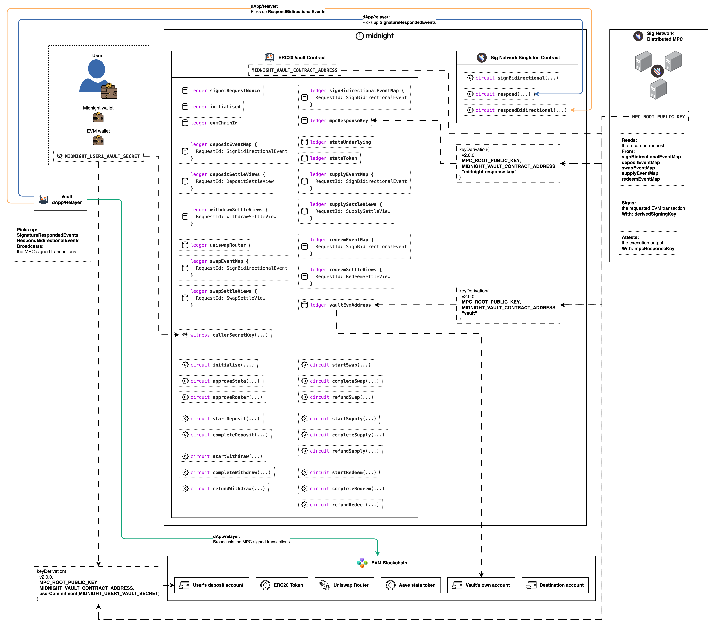

# ERC20 Vault

This example bridges ERC20 assets from an EVM chain into shielded tokens on
Midnight and back again, through a Midnight contract (the vault) that owns an
EVM account whose key nobody holds.

> ## ⚠️ CAUTION ⚠️
>
> This example application is for educational and experimental purposes.
> Expect rapid iteration.
> **Use at your own risk.**

## The vault's circuits

Every flow circuit is a variation on one shape: record a signature request, let
the MPC sign it, have the relayer broadcast it, then settle in-circuit against
the MPC's attestation. The [deposit walkthrough](docs/deposit/deposit.md)
documents that shape in full for **`startDeposit` → `completeDeposit`**, and
every circuit below links to the page for its own flow.

| Circuit(s) | What it does |
|---|---|
| [`initialise`](#setup-step-4-pin-the-derived-addresses-and-the-response-key) | Deployment setup rather than an MPC flow: the deployer-gated one-shot that pins the vault's derived EVM address, the EVM chain, the Uniswap router, the Aave stataToken pair and the MPC response key. |
| [`startDeposit`](docs/deposit/deposit.md) → [`completeDeposit`](docs/deposit/deposit.md) | **The reference flow, documented in full in the [deposit walkthrough](docs/deposit/deposit.md).** Request → sign → broadcast → attest → verify-and-mint. |
| [`startWithdraw`](docs/withdraw/withdraw.md) / [`completeWithdraw`](docs/withdraw/withdraw.md) | The same flow in the other direction, plus the coin-spend-as-authorisation pattern and a settle circuit that branches on the EVM result. |
| [`refundWithdraw`](docs/withdraw/withdraw.md) / [`refundSwap`](docs/swap/swap.md) / [`refundSupply`](docs/supply/supply.md) / [`refundRedeem`](docs/redeem/redeem.md) | Settling a request whose transaction never executed, routed by the 5-byte failure-output width. One refund circuit per request kind, each reading only its own kind's pending marker. The width routing is sound as every vault respond schema packs to 1 or 8 bytes, never 5: see [Handling Failure](https://github.com/sig-net/midnight-integration/blob/main/README.md#handling-failure). |
| [`approveRouter`](docs/swap/swap.md) | A sign-only request, with no settle circuit at all. |
| [`startSwap`](docs/swap/swap.md) / [`completeSwap`](docs/swap/swap.md) | A second request map at its own ledger field and calldata width, reusing the same optimistic burn-then-mint shape. `exactOutputSingle`: mint the exact `amountOut` of `tokenOut` plus the unspent `tokenIn` as change. |
| [`approveStata`](docs/supply/supply.md) | A second sign-only approval, mirroring `approveRouter`: a one-time `approve(stataToken, MAX)` on the underlying so the ERC-4626 wrapper can pull it during supply. |
| [`startSupply`](docs/supply/supply.md) / [`completeSupply`](docs/supply/supply.md) | The vault lending on Aave through the stataToken wrapper: `startSupply` burns the surrendered underlying vault coin and records the wrapper's `deposit(amount, vault)`, and `completeSupply` mints shielded stataToken vault tokens for the attested shares. |
| [`startRedeem`](docs/redeem/redeem.md) / [`completeRedeem`](docs/redeem/redeem.md) | The return leg: `startRedeem` burns the surrendered stataToken coin and records the wrapper's `redeem(shares, vault, vault)`, and `completeRedeem` mints shielded underlying vault tokens for the attested assets (principal plus accrued interest). |

## The actors



The actor map lays out every actor in the example and the vault's seventeen
exported circuits.

The edges it draws are the dashed key derivations plus the three standing
responsibilities of the dApp/relayer: picking up the singleton's
`SignatureRespondedEvent`s and `RespondBidirectionalEvent`s, and broadcasting
the MPC-signed transactions. Everything else is per-flow: every other runtime
interaction between these actors belongs to a specific MPC flow, and each
flow's own walkthrough page draws its steps (see [The flows](#the-flows)).

- **Sig Network Distributed MPC**: signs requested transactions with keys
  derived for the requesting contract, and attests their execution outcomes.
  It only ever signs.
- **Midnight Blockchain (source chain)** hosts two contracts: the
  **Sig Network Singleton Contract**, which the vault notifies of each request
  and through which the MPC posts its responses as contract events, and the
  **ERC20 Vault Contract**, this example's contract, whose seventeen exported
  circuits appear on the map.
- **EVM Blockchain (destination chain)** hosts what the vault transacts with:
  the ERC20 token contract being bridged, the Uniswap V3 router (swap) and
  the Aave stataToken wrapper (supply / redeem), the vault's own derived EVM
  account holding the pooled tokens, and the destination account a withdraw
  pays out to (`WithdrawRequest.destEvmAddress`, any EVM address the caller
  names). The vault's own account grants two standing allowances on those
  token contracts: `approveRouter` lets the Uniswap router spend the bridged
  ERC20, and `approveStata` lets the stataToken wrapper pull the underlying
  token during a supply.
- **Vault dApp/Relayer**: the off-chain client. It polls the singleton's
  emitted events for the MPC's signature, assembles and broadcasts the
  MPC-signed transaction to the EVM chain, then polls for the MPC's
  attestation and hands the attested output back for settling. The MPC only
  signs: broadcasting is the relayer's responsibility.
- **Users**: each user holds a Midnight wallet (calls the circuits and
  receives the shielded vault tokens), their own EVM wallet, and a derived
  EVM deposit account the MPC signs deposit sweeps from (see
  [Derived keys and accounts](#derived-keys-and-accounts)).

## The underlying protocol

Every flow here is one pass through the sign bidirectional flow: the vault
records a signature request on Midnight, the MPC signs the EVM transaction, the
relayer broadcasts it, the MPC attests the outcome, and the vault settles by
verifying that attestation in-circuit. Read
[Sign Bidirectional Flow](../../README.md#sign-bidirectional-protocol-flow) in the repo
README for the protocol diagram and its step walkthrough, which points on to
the integration repository for the full detail.

## Integration guide

Integrating any Compact contract with the Signature Network is the same shape
every time: add the protocol dependencies, import the Signet module, declare
the protocol-required ledger fields, and pin the derived addresses and the
response key after deploy. Read
[Integration guide](../../README.md#integrator-guide) in the repo README for
that overview, and the [Integration walkthrough](#integration-walkthrough)
below for the vault's own code, step by step.

## The flows

Each MPC interaction flow has its own walkthrough page pairing the flow's
diagram, its step-by-step description with the full code excerpts, and its
sequence diagram:

- [Deposit](docs/deposit/deposit.md)
- [Withdraw](docs/withdraw/withdraw.md)
- [Swap](docs/swap/swap.md)
- [Supply](docs/supply/supply.md)
- [Redeem](docs/redeem/redeem.md)

Each page numbers its own steps from 1 in that flow's execution order, so a
step number identifies a step within one flow and never across two: deposit
opens with a fund step and runs steps 1 to 6, while withdraw has nothing to
fund (the value to move is already pooled in the vault's account) and runs
steps 1 to 5 starting at the request phase.

## Derived keys and accounts

Every key the MPC signs with is scoped by the requesting contract:

`derivedSigningKey = f(mpcRootKey[keyVersion], vaultContractAddress, path)`

The path is 32 opaque bytes of the client contract's choosing. There are no
format requirements, and the contract address is always part of the
derivation, so no contract can ever reach another contract's derived keys.
Within one contract, distinct paths yield disjoint accounts. The vault uses
exactly three derivations:

| Account / key | Path | What it does |
|---|---|---|
| The user's deposit account (EVM) | `userCommitment(callerSecretKey)`, the caller's 32-byte identity commitment | Signs the deposit sweep `transfer(vault, amount)`. The user funds this address with the ERC20 being deposited plus gas ETH. One account per identity: the contract recomputes the commitment in-circuit from the secret-key witness, so the path is never a circuit argument and the MPC can only ever sign with THIS caller's account. |
| The vault's own account (EVM) | The contract-fixed literal `"vault"` (`pad(32, "vault")`) | Holds the vault's ERC20 balance and signs every withdraw `transfer(destination, amount)`. It also pays the withdraw gas, which is why the whole fee envelope is contract-fixed. |
| The MPC RESPONSE key (secp256k1, not an account) | The fixed literal `"midnight response key"` | Signs every `RespondBidirectionalEvent` the MPC posts back for this contract, ECDSA over the attestation digest of the request id and execution output (the event carries the id it answers plus the signature, nothing else). It never signs transactions: it is per-client-contract yet independent of any request's own path, and `completeDeposit`/`completeWithdraw` verify responses against it in-circuit. |

The identity secret behind the first row is the user's OWN random value, held
by the application itself and never by a wallet: a Lace wallet cannot expose
its seed, so the `callerSecretKey()` witness needs a value the app holds
independently. The diagrams name it `MIDNIGHT_USER1_VAULT_SECRET`, and the
integration tests take it from the `VAULT_USER_SECRET_KEY` environment variable.

Deposits and withdrawals therefore move between two MPC-derived accounts on
the EVM chain, and neither key ever exists anywhere: the MPC network signs
for them on the vault's request, and only through the vault's circuits.

Derivation happens off-chain with the `@sig-net/midnight` helpers:
`deriveEvmAddress(mpcPublicKey, vaultContractAddress, path)` for the two EVM
accounts and `deriveMidnightResponseKey(mpcPublicKey, vaultContractAddress)`
for the response key (the setup pipeline derives all three and persists its environment).
The diagrams render both helpers as one abstract `keyDerivation(...)` note per
derived value: a note reading `keyDerivation(v2.0.0, MPC_ROOT_PUBLIC_KEY,
MIDNIGHT_VAULT_CONTRACT_ADDRESS, <path>)` is `deriveEvmAddress` for the two EVM
accounts and `deriveMidnightResponseKey` for the response key, with `v2.0.0`
the SDK's epsilon derivation version.

The vault's own address and the response key both take the contract address
as INPUT, so they cannot exist at construction time: the deployer-gated
one-shot `initialise` circuit pins them right after deploy, when the address
(and therefore the derivations) exist.

The MPC composes the derivation string by rendering the 32 opaque path bytes
as their full-width lowercase hex (no `0x` prefix, padding included), a total
and injective rendering that accepts any bytes the contract chooses. Client
code deriving an account off-chain must feed `deriveEvmAddress` the same
rendering: `bytesToHex` of the stored path bytes, so the vault's own account
derives from the hex of `pad(32, "vault")` and the user's account from the
hex of the identity commitment (see the shared setup section of the
[deposit walkthrough](docs/deposit/deposit.md)).

## Integration walkthrough

Integrating the vault with the Sig Network MPC consists of 4 once-off
**setup** steps, run once per vault deployment, after which each flow runs its
own per-request **runtime** steps, documented flow by flow in the walkthrough
pages listed under [The flows](#the-flows). Each Compact snippet is abridged
from [`contract/src/erc20-vault.compact`](contract/src/erc20-vault.compact),
which is laid out in banner sections: `Ledger state`, `Shared helpers`,
`Initialisation and configuration`, then one section per request kind
(`Deposit`, `Withdraw`, `Swap`, `Supply`, `Redeem`). Each snippet keeps the
declaration and circuit names of the code it abridges, so searching one of
those names reaches the full code in its section. Each off-chain snippet has
an executable counterpart in
[`integration-tests/src/flows/`](integration-tests/src/flows/), the example's
executable documentation.

### Setup step 1: add the protocol dependencies

The contract package's dependency list is the minimal integration surface:

```jsonc
// contract/package.json
"dependencies": {
  "@midnight-ntwrk/compact-runtime": "0.18.0-rc.1",
  "@midnight-ntwrk/midnight-js": "5.0.0-beta.6",
  "@sig-net/midnight": "0.21.0",
  "@sig-net/midnight-contract": "0.21.0"
}
```

`@sig-net/midnight` is the client-agnostic protocol library: the Compact
module the contract imports, plus the TypeScript twins, state readers and
derivation helpers used off-chain. `@sig-net/midnight-contract` supplies the
Signet singleton's compiled artefacts, which the vault's cross-contract calls
link against.

### Setup step 2: import the Signet module and compile

At the top of `erc20-vault.compact`:

```compact
import "@sig-net/midnight/src/Signet";
```

The compile script resolves that import through `node_modules` with
`COMPACT_PATH`, passes the mandatory `--feature-zkir-v3` flag, and links the
Signet singleton's managed artefacts in as `src/managed/SignetSigner` for the
cross-contract call:

```sh
COMPACT_PATH=../../../node_modules compact compile --feature-zkir-v3 \
  src/erc20-vault.compact src/managed/erc20-vault
ln -sfn ../../../../../node_modules/@sig-net/midnight-contract/dist/managed \
  src/managed/SignetSigner
```

This is `yarn compile:zk` in [`contract/package.json`](contract/package.json).
The plain `compile` variant adds `--skip-zk` for fast iteration without
generating proving keys.

### Setup step 3: declare the ledger state

The vault declares the three protocol-required fields (the event map, the
singleton reference, the response key) plus its own state:

```compact
// The three protocol-required fields, kept together: the event map, the
// Signet singleton reference, and the MPC response key.

// The request map the MPC reads approve and withdraw events back from.
// Sized for an ERC20 transfer(address,uint256): 2 calldata words, no access
// list, and the vault's exact 34-byte response schema. Its resolved
// ledger-tree path is what the request circuits pack into their
// notifications, and the MPC follows that path to locate the map, so every
// field's position is load-bearing once deployed.
export ledger signBidirectionalEventMap: SignBidirectionalEventMap<EvmType2TxParams<2, 0, 0>, 34, 34>;

// The Signet singleton the request circuits notify, pinned at deploy.
sealed ledger signetSigner: SignetSigner;

// The MPC response key every response is verified against, set in Setup step 4.
export ledger mpcResponseKey: Secp256k1Point;

// The vault's own state.
export ledger signetRequestNonce: Counter;  // keeps identical requests' ids distinct
export ledger initialised: Counter;         // one-shot initialise marker
export ledger vaultEvmAddress: Bytes<20>;   // the vault's derived EVM account
export ledger evmChainId: Uint<64>;         // EIP-155 chain id of the pinned Ethereum network
sealed ledger deployer: Bytes<32>;          // only they may initialise
// Deposits get their own map: kind isolation is structural, so completeDeposit
// never sees an approve or withdraw request at all.
export ledger depositEventMap: SignBidirectionalEventMap<EvmType2TxParams<2, 0, 0>, 34, 34>;
export ledger depositSettleViews: Map<RequestId, DepositSettleView>;   // pending deposits: depositor commitment + typed token/amount
export ledger withdrawSettleViews: Map<RequestId, WithdrawSettleView>; // pending withdrawals: gate commitment + typed token/amount
// ... then the swap, supply and redeem state: the pinned EVM addresses, one
//     request map per calldata width, and their settle views ...

constructor(deployerCommitment: Bytes<32>, signetContract: SignetSigner) {
  deployer = disclose(deployerCommitment);
  signetSigner = disclose(signetContract);
}
```

Two vault-specific points:

- The contract package exports each request map's resolved ledger-tree path
  (`VAULT_REQUESTS_PATH`, `VAULT_DEPOSIT_REQUESTS_PATH`,
  `VAULT_SWAP_REQUESTS_PATH`, `VAULT_SUPPLY_REQUESTS_PATH`,
  `VAULT_REDEEM_REQUESTS_PATH`) so off-chain readers cannot drift from them.
  The vault has 20 ledger fields, past the 15-field flat limit, so the compiler
  chunks the state tree: chunk 0 holds fields 0–4, chunk 1 holds fields 5–19,
  and every path is depth 2. The approve/withdraw map at field 0 has the path
  `[0, 0]`, and its circuits pack `requestsPathDepth` 2 + `requestsPath`
  [0, 0, 0, 0]. The deposit map at field 8 has `[1, 3]` and packs
  [1, 3, 0, 0]. The compiler records the same paths as each field's "index" in
  the compiled `contract-info.json`, and a ledger declaration change re-chunks
  the tree, so re-read them there and update every notification vector in the
  same change.
- The deploy tooling ([`deploy/src/deploy-vault.ts`](deploy/src/deploy-vault.ts)) computes
  `deployerCommitment` off-chain by calling the compiled `userCommitment`
  circuit over the deployer's secret, never a TypeScript re-implementation.

### Setup step 4: pin the derived addresses and the response key

Both post-deploy values take the vault's contract address as derivation
input, so they cannot exist at construction time. Right after deploy, derive
them off-chain:

```ts
import { deriveEvmAddress, deriveMidnightResponseKey } from "@sig-net/midnight";

// The vault's own EVM account: path "vault".
const vaultEvmAddress = deriveEvmAddress(mpcRootPublicKey, vaultContractAddress, "vault");

// The vault's response key: path fixed to "midnight response key" by the protocol.
const mpcResponseKey = deriveMidnightResponseKey(mpcRootPublicKey, vaultContractAddress);
```

and seal them with the deployer-gated one-shot `initialise` circuit, together
with the one EVM chain this vault operates on and the EVM contracts it is
allowed to transact with (the Uniswap router and the Aave stataToken pair):

```compact
export circuit initialise(
  vaultEvm: Bytes<20>,
  swapRouter: Bytes<20>,
  stataUnderlyingAddr: Bytes<20>,
  stataTokenAddr: Bytes<20>,
  chainId: Uint<64>,
  responseKey: Secp256k1Point
): [] {
  assert(initialised == 0, "Already initialised");
  assert(userCommitment(callerSecretKey()) == deployer, "Not the deployer");
  assert(chainId > 0 as Uint<64>, "Chain ID must be positive");
  assert(swapRouter as Field != 0 as Field, "Router cannot be zero");
  assert(stataUnderlyingAddr as Field != 0 as Field, "stataUnderlying cannot be zero");
  assert(stataTokenAddr as Field != 0 as Field, "stataToken cannot be zero");
  initialised.increment(1);
  vaultEvmAddress = disclose(vaultEvm);
  uniswapRouter = disclose(swapRouter);
  stataUnderlying = disclose(stataUnderlyingAddr);
  stataToken = disclose(stataTokenAddr);
  evmChainId = disclose(chainId);
  mpcResponseKey = disclose(responseKey);
}
```

The chain id is the only per-network value a request carries: it binds each
signed transaction to one Ethereum network (mainnet, Sepolia or a local anvil),
and it must name the network the MPC watches. Every request's `caip2Id` is the
SDK's fixed `ethereumCaip2Id()`, whichever Ethereum network that is.

The gate prevents front-running: nobody else can initialise the vault to
point at their own address, chain or key. Flow function:
[`initialise.ts`](integration-tests/src/flows/initialise.ts). The setup
pipeline derives and prints all three derived values as `EVM_VAULT_ADDRESS`,
`EVM_USER_ADDRESS` and `MPC_RESPONSE_KEY`.

### Runtime: joining the deployed vault

At runtime, every flow's circuit calls go through the deployed vault, joined
once with the caller's secret key as private state (the witnesses answer the
contract's `callerSecretKey()` from it during proving):

```ts
import { findDeployedContract } from "@midnight-ntwrk/midnight-js/contracts";
import { createVaultPrivateState } from "@sig-net/midnight-examples-erc20-vault-contract";

const vault = await findDeployedContract(providers, {
  contractAddress: vaultContractAddress,
  compiledContract: vaultCompiledContract, // the deploy package's binding: generated module + witnesses + managed/ assets
  privateStateId: "erc20-vault",
  initialPrivateState: createVaultPrivateState(callerSecretKey),
});
```

From here, each flow's per-request steps live on its own walkthrough page:
the deposit round trip, from funding the deposit account through
`completeDeposit`, is described step by step in
[docs/deposit/deposit.md](docs/deposit/deposit.md).

## Package layout

| Package | What it is |
|---|---|
| [`contract/`](contract/) | The Compact contract (`src/erc20-vault.compact`), its witnesses, and the curated environment-agnostic export surface a client uses: circuit-id/private-state/provider types, ledger reads and the EVM constants, all browser-safe. Plus simulator unit tests. Its runtime dependencies are the SDK (`@sig-net/midnight`, `@sig-net/midnight-contract`) plus the two Midnight packages the generated module and the provider types import (`@midnight-ntwrk/compact-runtime`, `@midnight-ntwrk/midnight-js`). |
| [`deploy/`](deploy/) | Deploying and post-deploy initialisation: the split base-deploy-plus-maintenance-adds, the deployer-gated `initialise`, and the configuration those resolve, as typed functions taking an environment map plus thin CLI entrypoints over them, so a hand-run deploy and the e2e setup execute identical code. Also the Node half of the vault's client surface those flows and the integration tests share: the compiled-contract binding over the contract package's compiler output, and the midnight-js provider set built around a wallet. Everything here needs Node, which is why it is not in the contract package. |
| [`integration-tests/`](integration-tests/) | The executable documentation: typed in-process flow functions (`src/flows/`) driving every runtime step above, the Vitest adapter for the shared deployment setup, and the e2e specs. The EVM leg runs against a Sepolia fork, so the flows use real USDC (and EURC for swaps) dealt to the derived accounts with anvil cheatcodes. |

## Running it

Everything runs from the repo root against the local docker stack (Midnight
node, indexer, proof server, anvil forking Sepolia, fakenet MPC responder).
The anvil service forks Sepolia so the real Uniswap V3 deployment and real
USDC are present, so `SEPOLIA_FORK_RPC_URL` (any Sepolia RPC) MUST be in
`.env` before the stack comes up. The fakenet responder's compose service
sits behind the `fakenet` profile, so a plain `docker compose up -d` does not
start it: the test setup starts it itself mid-run once the hand-off values are
in `.env`. Beyond `SEPOLIA_FORK_RPC_URL` the setup pipeline fills `.env`
itself, recording everything it deploys so that later runs reuse the same
contracts.

```sh
corepack enable
yarn install
cp .env.example .env                # then set SEPOLIA_FORK_RPC_URL to any Sepolia RPC
compact update 0.33.0-rc.2          # Exact version required.
yarn compile:erc20-vault:zk         # ~10 min zk key generation, background it
docker compose up -d                # node, indexer, proof server, anvil forking
                                    # Sepolia (NOT the fakenet responder: it is
                                    # behind the `fakenet` profile, the test setup
                                    # starts it mid-run)
yarn test:erc20-vault:e2e           # the full e2e suite, serially, bail on first failure
```

Offline checks that need no stack and no proving keys beyond `yarn compile`:

```sh
yarn compile:erc20-vault            # generate src/managed (skip-zk)
yarn build                          # typecheck everything
yarn test:erc20-vault               # contract, deploy and integration-tests unit tests (e2e files skip offline)
```

Beware: rerunning plain `yarn compile` (or `yarn compile:erc20-vault`) after
a deploy regenerates `src/managed` WITHOUT proving keys, deleting the zk keys
directory the e2e suite proves with, so `yarn compile:erc20-vault:zk` is
required again before the next e2e run.

**TIP:** If you are using Claude Code you can ask it to run these tests for
you using this [skill](../../.claude/skills/e2e/SKILL.md). It knows the whole
operational runbook (rerun vs redeploy modes, the fakenet responder hand-off,
failure recovery) and will drive it for you.

### Running against the real Sepolia network

By default the EVM leg runs on the local anvil chain from `docker-compose.yaml`,
which forks Sepolia. To point the suite at the real Sepolia network, only the
EVM side changes: the Midnight stack and the fakenet MPC responder stay local.
Minimal changes, all in `.env`:

```sh
# Both must point at the SAME chain: the tests' endpoint and the responder's
# container-side twin (an Infura/Alchemy/etc. Sepolia RPC URL works for both):
EVM_RPC_URL=https://sepolia.infura.io/v3/<your-key>
FAKENET_EVM_RPC_URL=https://sepolia.infura.io/v3/<your-key>

# Required on any non-local chain: an existing ERC20 with code on Sepolia,
# e.g. USDC.
ERC20_ADDRESS=0x...
```

Then recreate the responder so it re-reads `.env`
(`docker compose --profile fakenet up -d --force-recreate fakenet`) and run the
suite as usual. The chain id (11155111) is resolved from the RPC automatically
and sealed into the vault contract at initialise.

What does NOT happen automatically on a real chain, by design:

- **No auto-funding.** The flows spend from two EVM accounts *derived from the
  vault contract's address*, so you only learn them mid-run, when setup prints
  `EVM_VAULT_ADDRESS` / `EVM_USER_ADDRESS` with funding hints (the user account needs >= 0.01 ETH for gas and >= 0.1 USDC, and the
  vault account needs ETH for withdrawal gas). Fund them when printed, either
  across two runs (first run derives + prints, second run tests), or in one
  attended run with `STEP_THROUGH` (below).
- **Bring your own token.** On the real Sepolia network you set
  `ERC20_ADDRESS` to an existing ERC20 with code. The local anvil
  already has real USDC from the fork.
- A redeploy of the vault contract derives **new** accounts, and any you already
  funded do not move with it.

### Running against the real MPC on a deployed network

Point the Midnight side at a deployed network (stagenet, preview, preprod or
mainnet) and drop the fakenet: the real Signature Network MPC listens to the
signet singleton the SDK publishes for that network and answers requests from
any vault sealed to it. The suite runs the same way on every deployed network.
The minimal `.env` is
[`.env.example-stagenet-minimal`](../../.env.example-stagenet-minimal) at the
repo root, with stagenet as the example network:

```sh
NETWORK_ID=stagenet        # any deployed network the SDK publishes values for
ROOT_SEED=                 # funded via the network's faucet (the first run prints the address and URL)
MAINTENANCE_SIGNING_KEY=   # 32 bytes of hex, required on any deployed network
EVM_RPC_URL=               # a REAL Sepolia RPC that serves debug_traceTransaction
```

What differs from the local loop:

- **No signet deploy.** The setup takes the singleton address the SDK
  publishes for the network (a set `MIDNIGHT_SIGNET_CONTRACT_ADDRESS` must
  agree with it).
- **No `MPC_ROOT_KEY`.** The MPC root public key the SDK publishes for the
  network names the real MPC, every derived account starts from it, and the
  fakenet hand-off steps skip on their own. A set `MPC_SECP256K1_PUBKEY` must
  agree with it, in any spelling (NEAR `secp256k1:<base58>` or SEC1 hex): the
  run canonicalises it to `0x04…` uncompressed SEC1 hex. A held root key on a
  deployed network means the opposite: a fakenet you run against that network.
- **The real Sepolia network, not a fork.** The MPC reaches Sepolia through its
  own RPC, so a local anvil is invisible to it. With no anvil there is no
  dealing either: the setup prints the derived accounts and what to fund by
  hand, and `STEP_THROUGH=1` (below) lets one attended run fund them and
  continue.
- **A tracing RPC, as everywhere.** `EVM_RPC_URL` must serve
  `debug_traceTransaction` on every network (the attestation polls recover
  each execution output by tracing the mined transaction, the method the MPC
  itself observes with), and the setup refuses an endpoint without it before
  anything is deployed. The local anvil serves it, and hosted Sepolia
  endpoints often gate it behind a paid tier.
- **Only the specs that never sign as the vault run here:** `happy-day-e2e`,
  `bearer-transfer`, `swap-e2e`, `supply-redeem-e2e` and `swap-refund-e2e`.
  The others force reverts with a vault key re-derived from `MPC_ROOT_KEY`
  ([`integration-tests/src/fakenet-vault-account.ts`](integration-tests/src/fakenet-vault-account.ts))
  and are fakenet-only.

Bring up only the `proof-server` service of the compose file (the node, indexer
and anvil are not used), then start with one deposit round trip rather than
the whole spec:

```sh
STEP_THROUGH=1 yarn test:erc20-vault:e2e tests/happy-day-e2e.test.ts -t "initialise|[dD]eposit|sweep"
```

The `-t` filter keeps the happy-day spec's initialise and deposit tests
(deposit, sweep signature, broadcast, attestation, `completeDeposit`) and skips
its withdraw tests. Drop it for the full spec. Setup first synchronises the role wallets.
Wallets with NIGHT or spendable DUST skip the root transfer. Each actual transaction
checks its estimated DUST fee, including balancing, before submission. Existing NIGHT
can generate the missing DUST after registration.

Only empty wallets require root funding. An unfunded root stops the run only when a
transfer is required and prints its NIGHT address and faucet URL. Transfers divide
root's NIGHT by weight across empty roles: three shares for the deployer and one
for each other role. Root retains one share. `FUND_CHILD_NIGHT` can specify each
transfer in NIGHT base units. Setup generates the zk keys, deploys the vault
and carries on into the spec, where the first signature poll is the first
exchange with the real MPC. The vault's address is appended to `.env` the
moment its base deploy is submitted, so a run that dies during the circuit
installs resumes them on the next run.

### Watching a run step by step: `STEP_THROUGH=1`

```sh
STEP_THROUGH=1 yarn test:erc20-vault:e2e tests/happy-day-e2e.test.ts
```

pauses before every setup step and every test (after the first) until you press
Enter, and each pause names the step about to run. Recommended for seeing
exactly how the sign-bidirectional flow unfolds, and **specifically recommended
on Sepolia with Infura**: you can fund the derived accounts the moment they are
printed (completing everything in one run), watch each transaction confirm on
Etherscan before releasing the next leg, and avoid bursts against Infura rate
limits. Attended runs only: it waits on stdin forever, so never set it in CI or
an unattended/backgrounded run.

## Deploying

The contract has 17 circuits and their verifier keys do not fit in one block, so
a deploy is two phases:

1. The base transaction registers the whole ledger state and ONE small circuit.
2. Every remaining circuit is added afterwards, one maintenance update each.

The order matters and is not symmetric. Ledger state cannot be added after
deploy, so the base transaction must carry the final ledger declarations even
for circuits it does not register yet. Circuits can be added at any time.

[`deploy/src/deploy-vault.ts`](deploy/src/deploy-vault.ts) performs both phases
and is the only implementation. It is a typed function taking an environment
map, so the commands below, the e2e setup pipeline and the flow tests all run
that same function in-process: the multistage deploy a remote network needs is
exercised on every local e2e run.

```sh
# local, against the docker stack
yarn deploy:erc20-vault

# a remote network (stagenet): deploy, then run the deployer-gated initialise
yarn deploy-initialise:erc20-vault

# initialise a vault that already exists (recovers a run whose deploy landed
# but whose initialise did not: initialise is one-shot and idempotent)
yarn initialise:erc20-vault

# install the circuits a split deploy left missing (recovers a run that died
# after its base deploy landed, named by MIDNIGHT_VAULT_CONTRACT_ADDRESS, and
# is a no-op on a vault with every circuit), then initialise as above. The
# e2e setup runs this itself whenever the address is set.
yarn resume-deploy:erc20-vault
```

All four read the repo-root `.env` overlaid with the real environment, the same
way the e2e setup does, so one set of variables drives every path. They refuse to
run when that `.env` names a different `NETWORK_ID` than the run targets and
still supplies a network-scoped value (a signet address, an MPC key): those are
sealed into the contract permanently, and a local-chain value on a remote network
produces a vault that can never work.

On a deployed network a deploy needs four variables:

```sh
NETWORK_ID=stagenet        # any deployed network the SDK publishes values for
DEPLOYER_SEED=             # pays the fees, funded via the network's faucet
MAINTENANCE_SIGNING_KEY=   # 32 bytes of hex, kept (see below)
EVM_RPC_URL=               # the EVM chain the vault operates on
```

Everything else is derived: the signet singleton and the MPC root public key
are the ones `@sig-net/midnight` publishes for the network, and the chain id is
read from `EVM_RPC_URL`. `MIDNIGHT_SIGNET_CONTRACT_ADDRESS`,
`MPC_SECP256K1_PUBKEY` and `EVM_CHAIN_ID` remain as overrides, and a set value
must agree with the published one or with what the chain reports. The local
stack publishes nothing, so there the e2e setup deploys a singleton and mints a
fakenet key and hands both over through those same variables.

`BASE_DEPLOY_CIRCUITS` names the circuit that goes in the base transaction.
`buildDeployTransactionDeferring` returns the contract address plus the deferred
list, and each deferred circuit is then added at the next maintenance-authority
counter, waiting for the counter to advance between updates.

### MAINTENANCE_SIGNING_KEY

The base deploy retains a maintenance authority, and this variable is its
signing key. Every circuit added after the base transaction is signed by it.

Set it to a 32-byte hex key you keep: it is the only way to add or replace a
circuit later, so a deploy to any network other than the local standalone chain
REQUIRES it and fails fast when it is unset. On the local chain, which is
throwaway, an unset key makes the deploy generate an ephemeral one and print it,
so a `yarn resume-deploy:erc20-vault` after a failed maintenance add can export
it.

### Deploying from CI

The manually dispatched
[`erc20-vault-deploy` workflow](../../.github/workflows/erc20-vault-deploy.yml)
runs that same `yarn deploy-initialise:erc20-vault` against a chosen network at
a chosen `erc20-vault-v*` release tag. Each network is a GitHub environment of
the same name carrying the per-network secrets and variables (the workflow's
header comment lists them), and a run whose deploy installed every circuit
opens a PR recording the new address in the contract package's per-network
table, served to consumers by `getVaultContractAddress` (when the initialise
failed after that point, the PR says to run it by hand before merging).

## The e2e suite

Eleven e2e specs run serially in a pinned order (see
`integration-tests/vitest.config.ts`). `happy-day-e2e` runs first because it
initialises the vault and cycles the funds that the later flows build on.
Each spec is rerun-tolerant against kept contract addresses and prints resume
ids in banners as it goes, for recovering a run that died mid-flow.

| Spec | Tests | What it proves | Resume var(s) |
|---|---|---|---|
| `happy-day-e2e` | 15 | Full deposit + withdraw round trips, every leg asserted (incl. the MPC-convention reads a responder does) | `DEPOSIT_REQUEST_ID`, `WITHDRAW_REQUEST_ID` |
| `deposit-withdrawal-failure-refund` | 9 | A withdraw whose EVM transfer reverts ends in an in-circuit REFUND of the escrowed shielded value | `FAILURE_REFUND_DEPOSIT_REQUEST_ID`, `FAILURE_REFUND_WITHDRAW_REQUEST_ID` |
| `deposit-claimant-not-caller` | 6 | `completeDeposit` can direct the mint to a different wallet's coin public key, discovered from chain data alone | `DEPOSIT_CLAIMANT_NOT_CALLER_DEPOSIT_REQUEST_ID` |
| `benchmark` | 43 | Per-leg wall-clock report covering every vault circuit: initialise (fresh deploys), approveRouter, startDeposit/completeDeposit, startWithdraw/completeWithdraw, startSwap/completeSwap, approveStata, startSupply/completeSupply, startRedeem/completeRedeem, and forced-revert refunds (`BENCHMARK_TIMINGS_JSON` greppable line) | `BENCHMARK_DEPOSIT_REQUEST_ID`, `BENCHMARK_WITHDRAW_REQUEST_ID`, `BENCHMARK_SWAP_REQUEST_ID`, `BENCHMARK_SUPPLY_REQUEST_ID`, `BENCHMARK_REDEEM_REQUEST_ID`, `BENCHMARK_REFUND_DEPOSIT_REQUEST_ID`, `BENCHMARK_REFUND_WITHDRAW_REQUEST_ID` |
| `false-claimer` | 6 | A deposit recorded for identity A is NOT claimable by identity B, even with the valid MPC attestation | `FALSE_CLAIMER_DEPOSIT_REQUEST_ID` |
| `bearer-transfer` | 11 | Shielded vault tokens are bearer assets: a plain Midnight transfer hands the claim to wallet B, the emptied wallet A cannot withdraw, and B completes a full withdraw on the transferred balance | `BEARER_TRANSFER_DEPOSIT_REQUEST_ID`, `BEARER_TRANSFER_WITHDRAW_REQUEST_ID` |
| `swap-e2e` | 1 | A deposit-funded `exactOutputSingle` swap mints exactly the requested `amountOut` of tokenOut plus the unspent tokenIn as change | none |
| `supply-redeem-e2e` | 1 | A deposit-funded Aave supply mints the attested stataUSDC shares, and redeeming them mints back the attested USDC (principal + interest) | none |
| `supply-refund-e2e` | 1 | A supply whose wrapper deposit reverts on-chain (drained vault balance) ends in an in-circuit REFUND of the surrendered USDC | none |
| `swap-refund-e2e` | 1 | A swap whose `amountInMaximum` is below the real cost reverts on-chain and the settle re-mints the surrendered tokenIn | none |
| `redeem-refund-e2e` | 1 | A redeem whose wrapper burn reverts on-chain (drained vault stataUSDC balance) ends in an in-circuit REFUND of the surrendered shares | none |

95 tests total across these specs. The offline `benchmark-tooling` spec (6
tests, no stack needed) is not pinned and runs last, so a full run reports
101. The suite runs against a Sepolia fork, and the setup pipeline
verifies that the Uniswap router and the stataUSDC wrapper are deployed on it
before any spec runs, so a fork missing either fails the run at setup with an
error naming the missing contract. A rerun
against kept contract addresses (a populated `.env`)
completes in roughly 25–35 minutes on a laptop. A fresh deployment adds the
setup pipeline's deploys (a few minutes) on top, and a cold clone adds the
~10 minute zk key generation. The `completeX` settle proofs are the heavy
legs: the proof server peaks above 12 GiB, so give the docker VM 16 GB.

### Test run recovery

The proof server being OOM-killed mid-run is routine on a 16 GB Docker VM and
not a defect. It presents as a spec failing with
`connect ECONNREFUSED 127.0.0.1:6300`, with `docker ps -a` showing
`midnight-proof-server` as `Exited (137)` (confirm with
`docker inspect midnight-proof-server --format '{{.State.OOMKilled}}'`).
You do not need to start over. Every on-chain step that already completed
stays completed, and each spec prints its request ids in banners as it goes.

To recover:

1. `docker restart midnight-proof-server`
2. Rerun the same spec file, passing the request id it printed via the spec's
   resume env var (see the table above) so that it resumes the pending
   request, not a fresh deposit:

   ```sh
   DEPOSIT_REQUEST_ID=<id from the banner> \
     yarn test:erc20-vault:e2e tests/happy-day-e2e.test.ts
   ```

The flows are rerun-tolerant: already-mined EVM broadcasts skip through
idempotently and already-claimed or settled requests are skipped cleanly. If
the spec died on the proving call itself and printed no request-id banner
then there is nothing to resume. Rerun the spec plain and it spends a fresh
deposit. On the rerun the interrupted proof is the first one served by a
fresh proof server, so the rest of the file fits in the remaining headroom.

One corner case: if the proof server died while the fakenet responder was
posting a response, that request strands unresponded (a signature poll then
times out even though the responder logged the request). Recover with
`docker compose --profile fakenet restart fakenet` (its startup backfill
re-posts the missing responses), then rerun with the resume var as above.

**TIP:** If you are using Claude Code you can ask it to run the suite for you
using this [skill](../../.claude/skills/e2e/SKILL.md). It will handle the
proof server restarts and resume vars between failures for you.

# Releasing to npm

One package publishes to npm, and it is the whole published surface of the
erc20-vault example:

| Package | Directory | What a consumer gets |
| ------- | --------- | -------------------- |
| `@sig-net/midnight-examples-erc20-vault-contract` | [`contract/`](contract/) | The contract's export surface, its compiled `managed/` assets minus the prover keys (the generated module, the binary zkir, the verifier keys, the integrity manifest, and the signet callee's generated module), the `.compact` source, and the `erc20-vault-zk-assets` bin that regenerates the prover keys (see [Regenerating the zk assets](#regenerating-the-zk-assets)) |

The deploy package and [`packages/lib`](../../packages/lib/) it runs on stay
private: they are consumed only inside this workspace, by the entrypoints and
the integration tests.

## Cutting a release

Tags are per-example, so future examples release independently under their own
prefix. The tag carries the example name, the npm version does not:

| Tag | npm version | npm dist-tag |
| --- | ----------- | ------------ |
| `erc20-vault-v1.2.3` | `1.2.3` | `latest` |
| `erc20-vault-v1.2.3-rc.4` | `1.2.3-rc.4` | `rc` |

1. Set the contract package to the release version. The publish refuses to
   run unless it already reads exactly the tag's version:

   ```sh
   yarn workspace @sig-net/midnight-examples-erc20-vault-contract version 1.2.3
   ```

2. Commit the bump, then tag it and push the tag:

   ```sh
   git tag erc20-vault-v1.2.3 && git push origin erc20-vault-v1.2.3
   ```

3. The tag starts the
   [`erc20-vault-publish`](../../.github/workflows/erc20-vault-publish.yml)
   workflow under the `npm-publish` environment. Give that environment
   required reviewers in the repository settings and nothing reaches npm
   until someone approves the run.

4. The workflow refuses any ref that is not an `erc20-vault-vX.Y.Z` or
   `erc20-vault-vX.Y.Z-rc.N` tag, and a stable tag must point at a commit on
   `main` (prerelease tags may come from any branch). It reinstalls from the
   committed lockfile, compiles the contract **with** zk keys so the shipped
   manifest hashes them, runs format/lint/build/test, checks the tarball
   (no prover key, and the `.compact` source, the bin, the manifest and the
   signet callee's module present), then publishes with npm provenance. A
   version already on npm is skipped, so a re-run resumes rather than errors.

## A note on package size

The vault has 17 circuits carrying 1.4 GB of prover keys, against kilobytes
for the verifier keys that go on-chain. Those prover keys are published
nowhere: the package packs to well under a megabyte, and the workflow logs the
packed and unpacked size before it publishes anything.

Keygen is deterministic under the pinned toolchain: two independent
`compact compile` runs of the same source with the same compiler release
produce byte-identical keys, so the `compiler/contract-manifest.json` the
package ships, which pins every artefact's size and sha256, is enough for a
consumer to regenerate the keys and prove they are the published ones.

Inside this workspace, `buildVaultProviders` reads the vault's keys from the
contract package's own `managed/` output on every network, so a deploy or an
e2e run against any network needs `yarn compile:erc20-vault:zk` first, and
says so if the keys are missing.

## Regenerating the zk assets

An app that proves in the browser serves the artefacts from its own origin:
its `public/` directory in development, a bucket behind its own domain in
production. The package's bin lays that origin out. Install the package and
the [pinned compact toolchain](../../README.md#prerequisites), then run:

```sh
erc20-vault-zk-assets public
```

It compiles the shipped `src/erc20-vault.compact` with the pinned compiler
(about ten minutes), refuses anything that does not match the shipped
manifest, and writes:

```
public/keys/<circuit>.prover, <circuit>.verifier    the vault's 17 circuits
public/zkir/<circuit>.bzkir
public/compiler/contract-manifest.json, contract-info.json
public/signet/{keys,zkir,compiler}/...              the signet callee, copied from @sig-net/midnight-contract
```

A rerun verifies what is there and skips a tree that already matches.
`--force` rebuilds it. A `keys/`, `zkir/` or `compiler/` already under the
output that the tool did not write (no `compiler/contract-manifest.json` beside
it) is refused, and `--force` is also what replaces it. `--signet-only` copies
the callee's tree without the toolchain, `--vault-only` skips the copy. The run
ends by printing each tree's `compiler/contract-manifest.json` sha256.

Point [`@midnight-ntwrk/midnight-js-fetch-zk-config-provider`](https://www.npmjs.com/package/@midnight-ntwrk/midnight-js-fetch-zk-config-provider)
at `5.0.0-beta.6`, the version matching the rest of this stack, at the origin
(`/` for the vault and `/signet` for the callee in the layout above). It reads
the same `keys/<id>.prover`, `keys/<id>.verifier`, `zkir/<id>.bzkir` and
`compiler/contract-manifest.json` paths the Node provider does. Pass the
printed sha256 as `expectedManifestHash` in its integrity options: that pins
the served manifest to a hash the app controls, rather than trusting whatever
manifest the origin hands back alongside the artefacts it certifies.

For production, upload the four directories to the object store the app's
origin points at, and upload again after every release: the manifest hash
changes with the contract.
