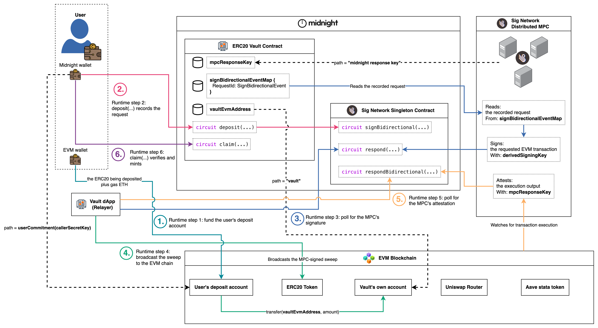
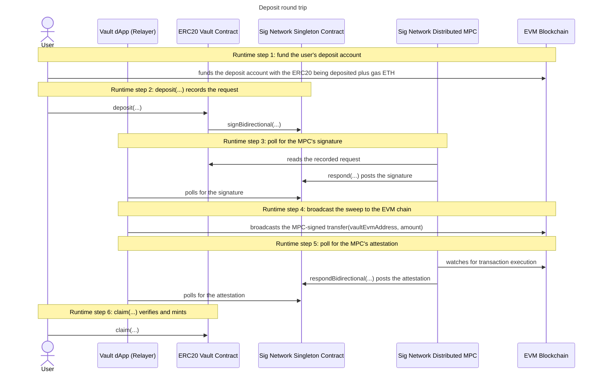

# Deposit

The deposit round trip moves ERC20 tokens from the user's derived EVM deposit
address into the vault's own EVM account, and mints the user's balance on
Midnight once the MPC has attested the transfer. It is one full pass through the
sign bidirectional flow: two Midnight transactions (`deposit(...)`, `claim(...)`)
bracketing one MPC-signed EVM transaction.

## The protocol underneath

Every flow in this example is an instance of this generic protocol. The five
steps, the derived keys and the events are described in the
[repository README](../../../README.md#sign-bidirectional-flow) and in the
[Sig Network documentation](https://docs.sig.network/architecture/sign-bidirectional).

## The deposit round trip

The vault's actors carry the six deposit steps. The first step is the user's
own EVM wallet acting alone, funding the deposit account before any contract
is involved. The user's wallet then drives the two Midnight transactions, the
Vault dApp (Relayer) does the polling and the broadcast, and the MPC reads,
signs and attests.

### Runtime step 1: fund the user's deposit account

The user transfers the ERC20 being deposited plus gas ETH from their own EVM
wallet into their derived deposit account, directly on the EVM chain. No vault
circuit, no MPC and no relayer take part: it is an ordinary EVM transaction
from the user's own wallet. Every later step assumes the deposit account
already holds the tokens to sweep and the ETH to pay its gas.

### Runtime step 2: deposit(...) records the request

The user calls `deposit(...)` with their private amount. The circuit constructs
the EVM sweep transaction `transfer(vaultEvmAddress, amount)`, records the
request in `signBidirectionalEventMap`, and calls the singleton's
`signBidirectional(...)` to request the MPC's signature. The request's
derivation path is the caller's identity commitment, so the MPC will sign with
this user's deposit account key and no one else's.

### Runtime step 3: poll for the MPC's signature

The MPC reads the recorded request from the vault's ledger, signs the sweep
transaction with the user's derived signing key, and posts the signature back
through the singleton's `respond(...)`. The dApp polls the singleton's emitted
signature events until this user's response arrives.

### Runtime step 4: broadcast the sweep to the EVM chain

The dApp assembles the MPC-signed transaction and broadcasts it to the EVM
chain. The MPC only signs: broadcasting is the relayer's responsibility. The
sweep moves the tokens from the user's deposit account into the vault's own
account.

### Runtime step 5: poll for the MPC's attestation

The MPC watches the EVM chain for the transaction's execution and posts an
attestation of its output through the singleton's `respondBidirectional(...)`.
The dApp polls the singleton's emitted respond-bidirectional events and hands
the attested output to the user.

### Runtime step 6: claim(...) verifies and mints

The user calls `claim(...)` with the execution output and the attestation. The
circuit recomputes the attestation digest, verifies the MPC's signature
in-circuit against the pinned `mpcResponseKey`, and mints the user's vault
balance.

## Sequence

---

Up: [ERC20 Vault](../README.md) · Protocol: [Sign Bidirectional Flow](../../../README.md#sign-bidirectional-flow)
