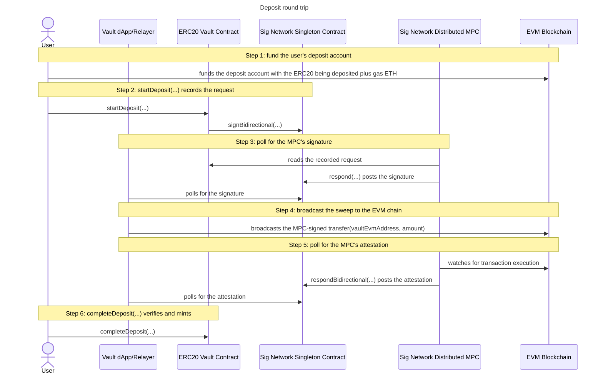

# Deposit

The deposit round trip moves ERC20 tokens from the user's derived EVM deposit
address into the vault's own EVM account, and mints the user's balance on
Midnight once the MPC has attested the transfer. It is one full pass through the
sign bidirectional flow: two Midnight transactions (`startDeposit(...)`, `completeDeposit(...)`)
bracketing one MPC-signed EVM transaction.

## The protocol

It is best to understand the
[sign bidirectional flow](../../../../README.md#sign-bidirectional-protocol-flow) before
you continue here. For more detail see the
[sign bidirectional flow](https://github.com/sig-net/midnight-integration/blob/main/README.md#sign-bidirectional-flow)
in the midnight integration repository.

## The integration

To wire this shape into a contract of your own, start from the
[Integration guide](../../../../README.md#integrator-guide) in the repo README.
For the full walkthrough see the
[Integrator Guide](https://github.com/sig-net/midnight-integration/blob/main/README.md#integrator-guide)
in the midnight integration repository.

## The deposit round trip

The round trip runs from the user funding their derived deposit account on the
EVM chain to the vault minting their shielded balance on Midnight. The first
step is the user's own EVM wallet acting alone, before any contract is
involved. The user's wallet then drives the two Midnight transactions, the Vault
dApp/Relayer does the polling and the broadcast, and the MPC reads, signs and
attests.
[`runDepositRoundTrip`](../../integration-tests/src/flows/deposit-round-trip.ts)
runs steps 2 to 6 end to end (step 1's fork funding is the setup pipeline's
job) as the arrange stage for every flow that needs a
caller already holding shielded vault tokens, the [swap](../swap/swap.md),
[supply](../supply/supply.md) and [redeem](../redeem/redeem.md) specs
among them. The happy-day spec calls those legs long-hand instead, so
each one carries its own assertions.

As illustrated, the flow comprises 6 steps:

- **1.** fund the user's deposit account
  - The user transfers the ERC20 being deposited plus gas ETH from their own EVM
    wallet into their **deposit account**, an EVM address the MPC derives for
    the vault contract from the caller's 32-byte identity commitment (see
    [Derived keys and accounts](../../README.md#derived-keys-and-accounts)). No
    vault circuit, no MPC and no relayer take part: it is an ordinary EVM
    transaction.
  - Every later step assumes the deposit account already holds the tokens to
    sweep and the ETH to pay its own gas. On the local fork the setup pipeline
    deals both to it
    ([`dealForkEvmAccounts`](../../integration-tests/src/fork-funding.ts#L152)),
    and on a real chain the user funds the printed
    `EVM_USER_ADDRESS`.
- **2.** startDeposit(...) records the request
  - The user calls
    [`startDeposit(...)`](../../contract/src/erc20-vault.compact) with the ERC20
    address and the amount, both disclosed on the ledger. The circuit composes the ENTIRE EVM sweep
    transaction itself: the calldata is `transfer(vaultEvmAddress, amount)`
    built in-circuit around the initialise-pinned
    [`vaultEvmAddress`](../../contract/src/erc20-vault.compact), which is
    what stops a malicious client having the MPC sign a transfer to themselves.
  - The request's **derivation path** is not an argument either: the circuit
    recomputes the caller's commitment from the
    [`callerSecretKey()`](../../contract/src/erc20-vault.compact) witness
    with [`userCommitment`](../../contract/src/erc20-vault.compact), so the
    MPC signs with THIS caller's deposit account and no one else's. The caller
    supplies only what is genuinely theirs to choose: their account's nonce, the
    gas envelope their account pays, and the MPC key version.
  - The assembled **SignBidirectionalEventV1**
    ([`constructSignBidirectionalEventV1`](https://github.com/sig-net/midnight-integration/blob/v0.24.0-rc.3/packages/signet-midnight/src/Signet.compact#L144))
    is stored in the ledger's
    [`depositEventMap`](../../contract/src/erc20-vault.compact)
    under its **request id**, the hash of the fields that name one execution (the
    signing key, the sender, a digest of the used transaction entries and the
    execution destination), and the circuit
    then calls the singleton's
    [`signBidirectional`](https://github.com/sig-net/midnight-integration/blob/v0.24.0-rc.3/packages/signet-contract/src/signet-contract.compact#L31)
    to notify the MPC, carrying the map's resolved ledger-tree path.
  - The depositor's settle view (commitment, ERC20, amount) goes into
    [`depositSettleViews`](../../contract/src/erc20-vault.compact) under that
    same request id. Its commitment is the caller's
    [`userCommitment`](../../contract/src/erc20-vault.compact), and NOT the
    unlinkable [`refundCommitment`](../../contract/src/erc20-vault.compact)
    a [withdrawal](../withdraw/withdraw.md) pins: a deposit publishes that
    commitment on the ledger anyway as its request's derivation path, so
    binding the settle view to it reveals nothing the request has not already
    said. The amount is bounded to `Uint<64>` before the request is recorded
    and kept in the view at that width, which spares step 6 decoding it back
    out of the request's ABI words. The entry doubles as the pending-deposit
    marker step 6 consumes.
  - Off-chain, [`start-deposit.ts`](../../integration-tests/src/flows/start-deposit.ts)
    reconstructs that expected record byte for byte, hashes it with the
    library's
    [`calculateRequestId`](https://github.com/sig-net/midnight-integration/blob/v0.24.0-rc.3/packages/signet-midnight/src/signet-request-id.ts#L30)
    TypeScript twin, and asserts the recomputed id appears as a ledger map key.
    That id is what every later step keys on.
- **3.** poll for the MPC's signature
  - The MPC reads the recorded request from the vault's ledger, signs the sweep
    transaction with the user's derived deposit-account key, and posts the
    signature back through the singleton's
    [`respond`](https://github.com/sig-net/midnight-integration/blob/v0.24.0-rc.3/packages/signet-contract/src/signet-contract.compact#L52).
  - The dApp polls the singleton's emitted response events with
    [`poll-signature-response.ts`](../../integration-tests/src/flows/poll-signature-response.ts#L66).
    The event log is unauthenticated (anyone may post), so enumeration and
    verification go through the SDK's
    [`SignetRequestResponseReader`](https://github.com/sig-net/midnight-integration/blob/v0.24.0-rc.3/packages/signet-midnight/src/signet-request-response-reader.ts#L118),
    which judges every post by whether its signature recovers to the request's
    expected signer, the user's deposit account, over the requested
    transaction's signing hash. The first valid post wins.
  - The flow returns the reconstructed sweep as a typed ethers `Transaction`,
    serialised only at the broadcast edge.
- **4.** broadcast the sweep to the EVM chain
  - The MPC only signs, so broadcasting is the relayer's responsibility:
    [`broadcast-evm.ts`](../../integration-tests/src/flows/broadcast-evm.ts#L81)
    sends the signed transaction and waits for one confirmation. The sweep moves
    the ERC20 from the user's deposit account into the vault's own account.
  - The broadcast is idempotent. A signed EVM transaction's hash is a pure
    function of its bytes, so an already-mined sweep short-circuits and a node
    reporting the transaction as already submitted is tolerated. A reverted
    transaction, or one whose nonce a different transaction consumed, is
    surfaced as an error rather than hung on.
- **5.** poll for the MPC's attestation
  - The MPC watches the EVM chain for the transaction's execution and posts an
    attestation of its output through the singleton's
    [`respondBidirectional`](https://github.com/sig-net/midnight-integration/blob/v0.24.0-rc.3/packages/signet-contract/src/signet-contract.compact#L79).
    The emitted event carries the request id it answers, the finalised EVM
    block height, the MPC's verdict (`outputKind`: `executed`, `failed` or
    `unviable`), the output's byte width, the attestation digest
    `upgradeFromTransient(transientHash([requestId, blockHeight, outputKind, serializedOutputLength, serializedOutput]))`
    and the MPC's ECDSA signature over it. The serialised output itself never
    goes on chain.
  - The client must therefore obtain the exact bytes the MPC hashed, from the
    source `RESPOND_OUTPUT_SOURCE` names. Under `evm-node`
    [`respond-output.ts`](../../integration-tests/src/flows/respond-output.ts#L334)
    takes the mined call's raw EVM return data (read from `EVM_RPC_URL` with
    `debug_traceTransaction`, the RPC method the MPC itself uses), then
    decodes it per the request's output deserialisation schema with
    [`deserializeEvmOutput`](https://github.com/sig-net/midnight-integration/blob/v0.24.0-rc.3/packages/signet-midnight/src/abi-serde.ts#L143)
    and re-packs it per the respond serialisation schema with
    [`serializeRespondOutput`](https://github.com/sig-net/midnight-integration/blob/v0.24.0-rc.3/packages/signet-midnight/src/abi-serde.ts#L194):
    the exact two conversions the responder ran, the sweep's 32-byte ABI `bool`
    word in and its 1-byte packed result out, both schemas read off the
    request's own ledger record. Under `mpc-cache` it downloads instead the
    bytes the MPC uploaded to its output cache before posting
    ([`MpcOutputCacheReader`](https://github.com/sig-net/midnight-integration/blob/v0.24.0-rc.3/packages/signet-midnight/src/mpc-output-cache.ts)),
    one object per request id under `MPC_OUTPUT_CACHE_URL`.
  - A post's declared `outputKind` picks the bytes it is checked over. A post
    declaring `executed` is checked over the re-packed output above, and a post
    declaring `failed` (the transaction reverted) or `unviable` (another
    transaction took its nonce) is checked over the EMPTY output the protocol
    attests for a transaction that never executed, which needs no trace at
    all. The first post whose signature verifies over its candidate, against
    the [`mpcResponseKey`](../../contract/src/erc20-vault.compact) read from
    the vault's own ledger, is the attested outcome: the kind is inside the
    signed digest, so a post cannot present a failure as a success. A decode
    failure drops the executed candidate with a warning instead of crashing
    the poll.
  - [`poll-respond-bidirectional.ts`](../../integration-tests/src/flows/poll-respond-bidirectional.ts#L78)
    owns the loop, the timeout and the reporting. Everything resolved here stays
    UNTRUSTED: the respond events are open to anyone and the traced or cached
    output is unauthenticated, and the authoritative check is the in-circuit
    verification step 6 runs.
- **6.** completeDeposit(...) verifies and mints
  - The user calls [`completeDeposit(...)`](../../contract/src/erc20-vault.compact)
    with the attested event and the recomputed output bytes. The circuit
    re-hashes those bytes, with the request id, block height and output kind
    the event carries, into the attestation digest and verifies the event's
    ECDSA signature over it against the initialise-pinned
    [`mpcResponseKey`](../../contract/src/erc20-vault.compact) with
    [`verifyRespondBidirectionalEventV1`](https://github.com/sig-net/midnight-integration/blob/v0.24.0-rc.3/packages/signet-midnight/src/Signet.compact#L401).
    The singleton emits MPC posts unverified, so this is the only authentication
    gate, and the request it settles is the one the verified event names.
  - The verified kind must be `executed`, and the one-byte output is
    deserialised into the schema's `VaultResponse` and its `success` flag
    asserted, so only an attested successful transfer mints. A sweep the MPC
    attested as `failed` or `unviable` cannot be claimed at all, and
    [`complete-deposit.ts`](../../integration-tests/src/flows/complete-deposit.ts) refuses to call
    the circuit for one.
  - The stored request is looked up and removed from
    [`depositEventMap`](../../contract/src/erc20-vault.compact), and the
    [`depositSettleViews`](../../contract/src/erc20-vault.compact) entry pinned
    at startDeposit time is looked up and removed with it. That single
    resolution is the double-claim protection: a request id with no entry left,
    or one that never had a deposit, fails with a clean "Deposit not found".
  - The caller's recomputed
    [`userCommitment`](../../contract/src/erc20-vault.compact) must equal the
    commitment on the settle view, which makes claims depositor-only.
  - The mint's amount and token colour come from that same settle view, its
    typed amount and the vault token of its ERC20, and the shielded vault tokens
    go to the caller or to an optional recipient's coin public key. The mint
    nonce is a fresh RANDOM 32 bytes per claim: one derived from the (public)
    request id would let any observer link the minted coin to the deposit.
    Minting to another wallet needs that wallet's encryption public key mapped
    in, which is why the flow wraps that case in a contract-scoped transaction.

## The shared vault and reader setup

Every circuit call goes through the deployed vault, joined once with the
caller's identity secret as private state: see
[Runtime: joining the deployed vault](../../README.md#runtime-joining-the-deployed-vault)
in the repo README. That secret is the user's own random value, named
`MIDNIGHT_USER1_VAULT_SECRET` in the diagrams and supplied to the integration
tests by the `VAULT_USER_SECRET_KEY` environment variable (falling back to the
`USER_SEED` bytes when unset).

The off-chain steps (3 to 5) each build a `SignetRequestResponseReader` over
the vault and singleton pair through
[`createResponseReader`](../../integration-tests/src/vault-context.ts#L149). The
expected signer of the deposit sweep is the user's deposit account, derived with
[`deriveEvmAddress`](https://github.com/sig-net/midnight-integration/blob/v0.24.0-rc.3/packages/signet-midnight/src/epsilon-derivation.ts#L119)
from the caller's identity commitment rendered as full-width lowercase hex, the
MPC's rendering of every request's 32 opaque path bytes. The key `completeDeposit` verifies
against is derived with
[`deriveMidnightResponseKey`](https://github.com/sig-net/midnight-integration/blob/v0.24.0-rc.3/packages/signet-midnight/src/epsilon-derivation.ts#L231).
Those two functions are the concrete work behind the diagram's abstract
`keyDerivation(...)` notes, and the commitment itself is computed with the
vault's own compiled `userCommitment` circuit, never a TypeScript
re-implementation (see
[Derived keys and accounts](../../README.md#derived-keys-and-accounts)).

## Sequence

---

Next: [Withdraw](../withdraw/withdraw.md) · Up: [ERC20 Vault](../../README.md) · Protocol: [Sign Bidirectional Flow](../../../../README.md#sign-bidirectional-protocol-flow)
