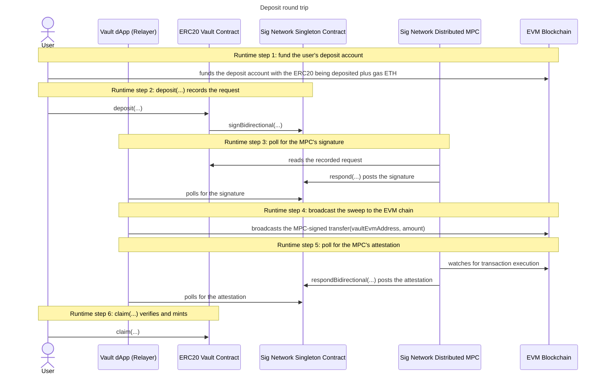

# Deposit

The deposit round trip moves ERC20 tokens from the user's derived EVM deposit
address into the vault's own EVM account, and mints the user's balance on
Midnight once the MPC has attested the transfer. It is one full pass through the
sign bidirectional flow: two Midnight transactions (`deposit(...)`, `claim(...)`)
bracketing one MPC-signed EVM transaction.

## The protocol underneath

It is best to understand the
[sign bidirectional flow](../../../../README.md#sign-bidirectional-flow) before
you continue here. For more detail see the
[sign bidirectional flow](https://github.com/sig-net/midnight-integration/blob/main/README.md#sign-bidirectional-flow)
in the midnight integration repository.

## The deposit round trip


The vault's actors carry the six deposit steps. The first step is the user's
own EVM wallet acting alone, funding the deposit account before any contract
is involved. The user's wallet then drives the two Midnight transactions, the
Vault dApp (Relayer) does the polling and the broadcast, and the MPC reads,
signs and attests.

Each Compact snippet below is abridged from
[`contract/src/erc20-vault.compact`](../../contract/src/erc20-vault.compact), and
each off-chain snippet has an executable counterpart in
[`integration-tests/src/flows/`](../../integration-tests/src/flows/), the
example's executable documentation. The `vault` and `reader` objects the
snippets use are constructed once per run: see
[The shared vault and reader setup](#the-shared-vault-and-reader-setup) below.

### Runtime step 1: fund the user's deposit account

The user transfers the ERC20 being deposited plus gas ETH from their own EVM
wallet into their derived deposit account, directly on the EVM chain. No vault
circuit, no MPC and no relayer take part: it is an ordinary EVM transaction
from the user's own wallet. Every later step assumes the deposit account
already holds the tokens to sweep and the ETH to pay its gas.

A deposit moves ERC20 value from the user's deposit account into the vault's
account on the EVM chain, then mints the same amount of shielded vault tokens
on Midnight. The local-stack setup pipeline funds the deposit account
automatically, and on a real chain you fund the printed
`EVM_USER1_DEPOSIT_ADDRESS`.

### Runtime step 2: deposit(...) records the request

The user calls `deposit(...)` with their private amount. The circuit constructs
the EVM sweep transaction `transfer(vaultEvmAddress, amount)`, records the
request in `signBidirectionalEventMap`, and calls the singleton's
`signBidirectional(...)` to request the MPC's signature. The request's
derivation path is the caller's identity commitment, so the MPC will sign with
this user's deposit account key and no one else's.

The contract composes the ENTIRE transaction itself: the calldata is
`transfer(vaultEvmAddress, amount)` built in-circuit around the
initialize-pinned recipient (which is what stops a malicious client having the
MPC sign a transfer to themselves), and the derivation path is the caller's
identity commitment recomputed from the secret-key witness, so it is not even
an argument. The caller supplies only what is genuinely theirs to choose:
their account's nonce, the gas envelope their account pays, and the MPC key
version.

```compact
export circuit deposit(
  evmNonce: Uint<64>,
  gasLimit: Uint<64>,
  maxFeePerGas: Uint<128>,
  maxPriorityFeePerGas: Uint<128>,
  keyVersion: Uint<8>,
  depositRequest: DepositRequest  // { erc20Address: Bytes<20>, amount: Uint<128> }
): [] {
  // The request's derivation path IS the caller's identity commitment.
  const caller = disclose(userCommitment(callerSecretKey()));

  // Contract-enforced calldata: transfer(vaultEvmAddress, amount). The words
  // are ABI-ready (big-endian): the signer uses them verbatim.
  const calldata = EvmCalldata<2> {
    selector: Bytes [0xa9, 0x05, 0x9c, 0xbb], // transfer(address,uint256)
    noWords: 2 as Uint<16>,
    words: [
      evmAddressAbiWord(vaultEvmAddress),
      numericAbiWord(depositRequest.amount),
    ]
  };
  // ... assemble EvmType2TxParams for the deposit's ERC20 on the
  //     initialize-pinned chain, carrying no ETH ...

  const request = constructSignBidirectionalEvent<EvmType2TxParams<2, 0, 0>, 34, 34>(
    kernel.self(),
    requestNonce,
    keyVersion,
    caller,                         // derivation path = the depositor's commitment
    MPCSignatureAlgorithm.ecdsa,
    MPCDestination.unused,
    pad(64, ""),
    TxParamType.evmType2,
    txParams,
    caip2Id,
    schema,
    schema
  );
  const requestId = disclose(calculateRequestId<EvmType2TxParams<2, 0, 0>, 34, 34>(request));

  // Store the request for the MPC to discover...
  signetRequestNonce.increment(1);
  signBidirectionalEventMap.insert(requestId, disclose(request));

  // ...and notify it, carrying the map's ledger-tree path ([0] at depth 1,
  // the README's Setup step 3).
  signetSigner.signBidirectional(
    requestId,
    constructSignBidirectionalEventNotificationV1(
      kernel.self(),
      1 as Uint<8>,                        // requestsPathDepth
      [0, 0, 0, 0] as Vector<4, Uint<8>>,  // requestsPath, zero padded
    ),
  );
}
```

Invoking it, and getting the request id every later step keys on:

```ts
import { JsonRpcProvider } from "ethers";
import { calculateRequestId, requestIdHex, SIGNET_DEFAULT_KEY_VERSION } from "@sig-net/midnight";

// The sweep sender is the user's deposit account: fetch its next nonce.
const evmNonce = await new JsonRpcProvider(evmRpcUrl).getTransactionCount(evmUserAddress);

await vault.callTx.deposit(
  BigInt(evmNonce),
  100_000n,         // gasLimit: the user's account pays
  30_000_000_000n,  // maxFeePerGas (wei)
  1_000_000_000n,   // maxPriorityFeePerGas (wei)
  SIGNET_DEFAULT_KEY_VERSION,
  { erc20Address, amount },
);

// The ledger map key IS the record's hash: rebuild the expected event record
// and hash it with the library's TypeScript twin.
const requestId = requestIdHex(calculateRequestId(expectedRecord));
```

[`deposit.ts`](../../integration-tests/src/flows/deposit.ts) shows the full
`expectedRecord` reconstruction, byte for byte, and asserts the recomputed id
appears as a ledger map key after the call.

### Runtime step 3: poll for the MPC's signature

The MPC reads the recorded request from the vault's ledger, signs the sweep
transaction with the user's derived signing key, and posts the signature back
through the singleton's `respond(...)`. The dApp polls the singleton's emitted
signature events until this user's response arrives.

The MPC's signature response is emitted as a contract event carrying the
request id it answers. That id is unauthenticated routing data on an open
event log (anyone can post), so use the verifying getter: it only returns a
post whose signature recovers to the user's deposit account over the sweep's
signing hash:

```ts
const { verified } = await reader.getVerifiedSignatureRespondedEvent(requestId, evmUserAddress);
// verified === undefined: no valid response posted yet, poll again.
```

Flow function:
[`poll-signature-response.ts`](../../integration-tests/src/flows/poll-signature-response.ts).

### Runtime step 4: broadcast the sweep to the EVM chain

The dApp assembles the MPC-signed transaction and broadcasts it to the EVM
chain. The MPC only signs: broadcasting is the relayer's responsibility. The
sweep moves the tokens from the user's deposit account into the vault's own
account.

The reader rebuilds the transaction from the request record on the vault's
ledger and attaches the verified MPC signature:

```ts
import { JsonRpcProvider } from "ethers";

const signedSweep = await reader.getSignedEvmTransaction(requestId, evmUserAddress);
await new JsonRpcProvider(evmRpcUrl).broadcastTransaction(signedSweep.serialized);
```

The ERC20 moves from the user's deposit account into the vault's account.
Flow function: [`broadcast-evm.ts`](../../integration-tests/src/flows/broadcast-evm.ts)
(idempotent: an already-mined sweep short-circuits cleanly, a reverted or
nonce-burned one throws).

### Runtime step 5: poll for the MPC's attestation

The MPC watches the EVM chain for the transaction's execution and posts an
attestation of its output through the singleton's `respondBidirectional(...)`.
The dApp polls the singleton's emitted respond-bidirectional events and hands
the attested output to the user.

Once the MPC observes the mined execution it emits an ECDSA-signed
`RespondBidirectionalEvent`. The event carries the request id it answers and
the MPC's signature over the attestation digest
`keccak256(requestId || serializedOutput)`. Neither the digest nor the
serialized output goes on chain: the client must reconstruct the exact bytes
the MPC hashed, in two moves, and then check the signature against them.

**Move 1: fetch the raw execution output.** This is the mined call's raw
EVM return data (for the sweep: the single ABI-encoded `bool` word that
`transfer` returned). Any source works, since the bytes stay untrusted
until the signature check below. With a node that has tracing enabled you can
trace the mined transaction via `debug_traceTransaction` (the same RPC
method the MPC itself uses to extract the output). On the local stack the fakenet
responder saves you that RPC access: it caches each request's traced output
and serves it over its public `/responses/{requestId}` helper API (port
3040). It caches before it posts the attestation, so once an event is
visible the fetch succeeds. Check the response's `success` flag: a reverted
or replaced transaction has no output to fetch at all, and the candidate to
hash is the protocol's fixed 5-byte failure output `0xdeadbeef01`.

**Move 2: re-pack it into the bytes the MPC hashed.** The MPC did not hash
the raw return data. It decoded the raw data per the request's
`outputDeserializationSchema`, then packed the decoded values per its
`respondSerializationSchema`, and hashed THAT. Run the same two conversions
(for the vault: the 32-byte ABI `bool` word in, the 1-byte packed result
out), and the posted signature verifies over the re-packed bytes only if the
MPC attested this outcome. With no digest on the event, that check is the
whole selection.

Everything stays UNTRUSTED here (the respond events are open to anyone, and
the helper API is unauthenticated): the authoritative check is the in-circuit
signature verification `claim` runs in step 6, against the same response key
the vault pinned at initialize.

```ts
import { deserializeEvmOutput, serializeRespondOutput } from "@sig-net/midnight";

// Move 1: the raw EVM return data of the mined sweep, here from the
// fakenet's /responses helper API. Unauthenticated, and any other source
// (e.g. your own trace RPC) works equally: the signature check below is what
// makes the bytes meaningful.
const response = await fetch(`http://localhost:3040/responses/${requestId}`);
const { success, output } = await response.json();
// success === false: nothing was returned to fetch (reverted/replaced tx).
// The candidate to check is then MPC_FAILURE_OUTPUT, not `output`.

// Move 2: raw return data -> the serialized output the MPC hashed. Decode
// per the output deserialization schema, re-pack per the respond
// serialization schema (the exact two conversions the responder ran):
// the 32-byte ABI bool word in, transfer()'s 1-byte packed result out.
const decoded = deserializeEvmOutput('[{"name":"success","type":"bool"}]', output);
const serializedOutput = serializeRespondOutput('[{"name":"success","type":"bool"}]', decoded);

// Signature verification selects WHICH posted event the MPC attested for
// these bytes. mpcResponseKey is the key the vault pinned at initialize,
// read back from its own ledger, so an accepted post is one that proves.
const attestation = await reader.getVerifiedRespondBidirectionalEvent(
  requestId,
  serializedOutput,
  mpcResponseKey,
);
// undefined: nothing attesting these bytes posted yet, poll again.
```

Flow functions:
[`poll-respond-bidirectional.ts`](../../integration-tests/src/flows/poll-respond-bidirectional.ts)
and [`respond-output.ts`](../../integration-tests/src/flows/respond-output.ts)
(which also handles the failure case: a reverted or replaced transaction is
attested as the protocol's fixed 5-byte failure output, `0xdeadbeef01`).

### Runtime step 6: claim(...) verifies and mints

The user calls `claim(...)` with the execution output and the attestation. The
circuit recomputes the attestation digest, verifies the MPC's signature
in-circuit against the pinned `mpcResponseKey`, and mints the user's vault
balance.

The depositor presents the attestation AND the recomputed output bytes to
the vault, which re-hashes the bytes into the digest and verifies the
signature over it in-circuit, and
mints shielded vault tokens for the deposited amount, to the caller or to an
optional alternate recipient's coin public key:

```compact
export circuit claim(
  requestId: RequestId,
  respondBidirectionalEvent: RespondBidirectionalEvent,
  serializedOutput: Bytes<1>,  // the schema-packed EVM result at its exact width
  mintNonce: Bytes<32>,
  recipient: Maybe<Either<ZswapCoinPublicKey, ContractAddress>>,
): [] {
  // The EVM result at its exact packed width: one byte, transfer()'s bool.
  assert(serializedOutput as Field == 1 as Field, "ERC20 transfer returned false");

  // The only authentication gate: the attestation digest is recomputed here
  // from the presented output, and the event's ECDSA signature over it must
  // verify against the initialize-pinned response key.
  assert(
    verifyRespondBidirectionalEvent<1>(
      disclosedRequestId,
      serializedOutput,
      disclose(respondBidirectionalEvent),
      mpcResponseKey
    ),
    "Invalid attestation signature"
  );

  // Double-claim protection: the request must exist and is consumed here.
  const signatureRequest = signBidirectionalEventMap.lookup(disclosedRequestId);
  signBidirectionalEventMap.remove(disclosedRequestId);

  // Depositor gate: the caller's recomputed commitment must match the
  // request's derivation path, which deposit set to the depositor's commitment.
  assert(userCommitment(callerSecretKey()) == signatureRequest.path, "Not the depositor");

  // Mint shielded vault tokens for the deposited amount (calldata word 1),
  // under the token colour of the deposited ERC20 (txParams.to).
  mintShieldedToken(domainSep, amount as Uint<64>, disclose(mintNonce), claimRecipient);
}
```

Invoking it:

```ts
import { requestIdBytes } from "@sig-net/midnight";

// A fresh RANDOM mint nonce per claim: one derived from the (public) request
// id would let any observer link the minted coin to the deposit.
const mintNonce = crypto.getRandomValues(new Uint8Array(32));

// Mint to the caller's own wallet (recipient: none). Compact's Maybe/Either
// are plain structs, so a `none` still carries a default-valued payload.
await vault.callTx.claim(requestIdBytes(requestId), attestation, serializedOutput, mintNonce, {
  is_some: false,
  value: { is_left: true, left: { bytes: new Uint8Array(32) }, right: { bytes: new Uint8Array(32) } },
});
```

The deposited amount is in the caller's wallet as shielded vault tokens.
Flow function: [`claim.ts`](../../integration-tests/src/flows/claim.ts), including
how to mint to a different wallet's coin public key.

## The shared vault and reader setup

Every circuit call goes through the deployed vault, joined once with the
caller's secret key as private state: the `vault` object in the snippets
above comes from the `findDeployedContract` joining snippet in the
[README's integration walkthrough](../../README.md#integration-walkthrough).

The off-chain steps (3 to 5) share one `SignetRequestResponseReader` over the
vault / singleton pair, and the expected signer of the deposit sweep is the
user's deposit account, derived from the caller's identity commitment:

```ts
import { indexerPublicDataProvider } from "@midnight-ntwrk/midnight-js-indexer-public-data-provider";
import {
  deriveEvmAddress,
  signetEventSourceFromPublicDataProvider,
  SignetRequestResponseReader,
} from "@sig-net/midnight";
import { pureCircuits, VAULT_REQUESTS_PATH } from "@midnight-examples/erc20-vault-contract";

// Provider to index the Midnight blockchain.
const publicDataProvider = indexerPublicDataProvider({
  queryURL: indexerUrl,
  subscriptionURL: indexerWsUrl,
});

const reader = new SignetRequestResponseReader({
  // The deployed vault contract.
  requesterContractAddress: vaultContractAddress,

  // signBidirectionalEventMap sits at ledger field 0, path [0] (the README's
  // Setup step 3).
  requesterRequestsPath: VAULT_REQUESTS_PATH,

  // The Signet singleton contract.
  signetContractAddress,

  // Raw contract state: the vault's authenticated request map.
  publicDataProvider,

  // The contract events the singleton emits (the MPC's responses), read
  // through the same provider.
  eventSource: signetEventSourceFromPublicDataProvider(publicDataProvider),
});

// Deposit sweeps are signed by the USER's deposit account: the derivation
// path is the caller's identity commitment, computed with the vault's
// compiled circuit (never a TypeScript re-implementation) and rendered as
// its full-width lowercase hex, the MPC's rendering of every record's 32
// opaque path bytes (see the README's Derived keys and accounts).
const userCommitment = pureCircuits.userCommitment(callerSecretKey);
const evmUserAddress = deriveEvmAddress(
  mpcRootPublicKey,
  vaultContractAddress,
  bytesToHex(userCommitment),
);
```

## Sequence



---

Next: [Withdraw](../withdraw/withdraw.md) · Up: [ERC20 Vault](../../README.md) · Protocol: [Sign Bidirectional Flow](../../../../README.md#sign-bidirectional-flow)
