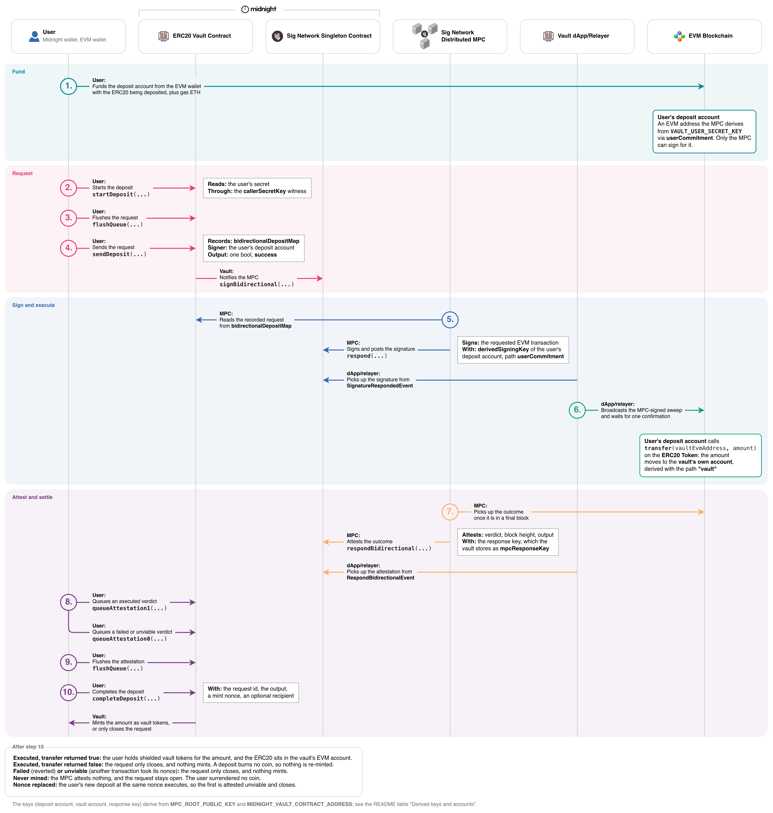
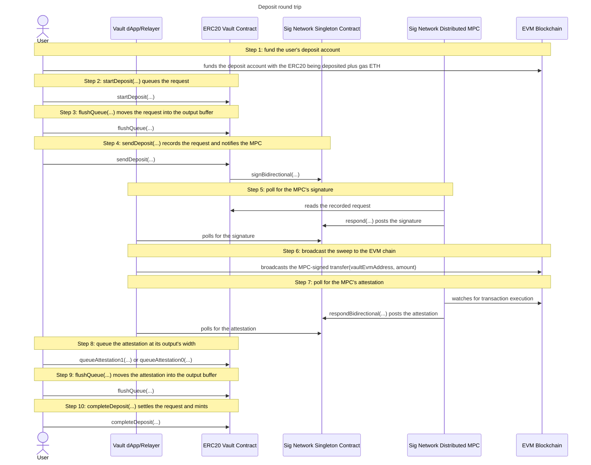

# Deposit

The deposit round trip moves ERC20 tokens from the user's derived EVM deposit
address into the vault's own EVM account, and mints the user's balance on
Midnight once the MPC has attested the transfer. It is one full pass through the
sign bidirectional flow: six Midnight transactions (`startDeposit(...)`, two
`flushQueue(...)` calls, `sendDeposit(...)`, a queue circuit and
`completeDeposit(...)`) around one MPC-signed EVM transaction.

## The protocol

It is best to understand the
[sign bidirectional flow](../../../../README.md#sign-bidirectional-protocol-flow) before
you continue here. For more detail see the
[sign bidirectional flow](https://github.com/sig-net/midnight-integration/blob/main/README.md#sign-bidirectional-flow)
in the midnight integration repository.

## The integration

To wire this shape into a contract of your own, start from the
[Integration guide](../../../../README.md#integrator-guide) in the repo README.
For the full walkthrough see the
[Integrator Guide](https://github.com/sig-net/midnight-integration/blob/main/README.md#integrator-guide)
in the midnight integration repository. The queue the vault runs every request
through is described in [Contention handling](../contention-handling.md).

## The deposit round trip

The round trip runs from the user funding their derived deposit account on the
EVM chain to the vault minting their shielded balance on Midnight. The first
step is the user's own EVM wallet acting alone, before any contract is
involved. The user's wallet then submits every Midnight transaction, the Vault
dApp/Relayer does the polling and the broadcast, and the MPC reads, signs and
attests. Only the start and the complete are the depositor's own: the flushes,
the send and the queue circuit are permissionless, so a relayer may submit
them instead.
[`runDepositRoundTrip`](../../integration-tests/src/flows/deposit-round-trip.ts)
runs steps 2 to 10 end to end (step 1's fork funding is the setup pipeline's
job) as the arrange stage for every flow that needs a
caller already holding shielded vault tokens, the [swap](../swap/swap.md),
[supply](../supply/supply.md) and [redeem](../redeem/redeem.md) specs
among them. The happy-day spec calls those legs long-hand instead, so
each one carries its own assertions.

As illustrated, the flow comprises 10 steps:

- **1.** fund the user's deposit account
  - The user transfers the ERC20 being deposited plus gas ETH from their own EVM
    wallet into their **deposit account**, an EVM address the MPC derives for
    the vault contract from the caller's 32-byte identity commitment (see
    [Derived keys and accounts](../../README.md#derived-keys-and-accounts)). No
    vault circuit, no MPC and no relayer take part: it is an ordinary EVM
    transaction.
  - Every later step assumes the deposit account already holds the tokens to
    sweep and the ETH to pay its own gas. On the local fork the setup pipeline
    deals both to it
    ([`dealForkEvmAccounts`](../../integration-tests/src/fork-funding.ts)),
    and on a real chain the user funds the printed `EVM_USER_ADDRESS`.
- **2.** startDeposit(...) queues the request
  - The user calls [`startDeposit`](../../contract/src/erc20-vault.compact)
    with a fresh random **input index**
    ([`newInputIndex`](../../contract/src/vault-queue.ts)), their deposit
    account's EVM nonce, the gas envelope that account pays, and the
    [`DepositRequest`](../../contract/src/erc20-vault.compact) (the ERC20 and
    the amount). The ERC20 must be one the deployer allowed
    ([`allowedTokens`](../../contract/src/erc20-vault.compact)), the amount is
    bounded to `Uint<64>` here, as the mint in step 10 takes that width, and
    an index already held by `inputRequestBuffer` or `depositArgsMap` is
    refused.
  - The circuit writes the deposit's arguments into
    [`depositArgsMap`](../../contract/src/erc20-vault.compact) under the input
    index: the request, the gas, and the **derivation path**. The path is not
    an argument: the circuit recomputes the caller's
    [`userCommitment`](../../contract/src/erc20-vault.compact) from the
    [`callerSecretKey()`](../../contract/src/erc20-vault.compact) witness, so
    the MPC signs with THIS caller's deposit account and no one else's.
  - It then queues a
    [`RequestBufferEntry`](../../contract/src/erc20-vault.compact) in
    `inputRequestBuffer` under the same index: the action, the named nonce
    (`useNextVaultAccountNonce` unset, so it is taken verbatim), the index, an
    [`ownershipCommitment`](../../contract/src/erc20-vault.compact) of the
    index and the caller's secret, and a hash of the arguments. The ownership
    commitment is deliberately not the `userCommitment`, so the request's
    ownership does not link to the depositor's identity.
  - The start touches only indexes of its own request, so concurrent starts never
    conflict with each other or with a flush, and the deposit surrenders
    nothing yet.
  - Off chain, [`start-deposit.ts`](../../integration-tests/src/flows/start-deposit.ts)
    refuses a deposit the deposit account cannot pay before calling the
    circuit, and reads the entry's **request index** with the SDK's
    [`queuedRequestIndex`](../../contract/src/vault-queue.ts).
- **3.** flushQueue(...) moves the request into the output buffer
  - [`flushQueue`](../../contract/src/erc20-vault.compact) is the one circuit
    that reads and writes the state every request shares. Its request slot
    moves the entry from `inputRequestBuffer` into `outputRequestBuffer` under
    its request index, a hash of every field that determines the EVM
    transaction, and records the current `globalLastSeen` as the entry's
    `lastSeen`, the bound its attestation must beat in step 8.
  - An identical deposit already open holds the same request index, so a flush
    carrying this one fails until the first settles, and the SDK leaves it out
    until then (see
    [The last seen height](../contention-handling.md#the-last-seen-height)).
  - The flush is permissionless and carries whichever waiting items its caller
    chooses. The flow submits it through the SDK's
    [`flushUntil`](../../contract/src/vault-queue.ts), carrying this deposit
    first until it leaves the input buffer, and rebuilds a flush that loses
    its race to another flush (see
    [The flush](../contention-handling.md#the-flush)).
- **4.** sendDeposit(...) records the request and notifies the MPC
  - [`sendDeposit`](../../contract/src/erc20-vault.compact) takes the request
    index and composes the ENTIRE EVM sweep from the flushed entry and its
    arguments: `transfer(vaultEvmAddress, amount)` on the ERC20, built
    in-circuit around the initialise-pinned
    [`vaultEvmAddress`](../../contract/src/erc20-vault.compact), which is what
    stops a client having the MPC sign a transfer to themselves, at the
    depositor's nonce and gas on the pinned `evmChainId`.
  - The assembled **SignBidirectionalEventV1**
    ([`constructSignBidirectionalEventV1`](https://github.com/sig-net/midnight-integration/blob/v0.24.0-rc.6/packages/signet-midnight/src/Signet.compact))
    is stored in [`bidirectionalDepositMap`](../../contract/src/erc20-vault.compact)
    under its **request id**, the hash of the fields that name one execution,
    and [`evictionMap`](../../contract/src/erc20-vault.compact) maps that id
    back to the request index. The circuit then calls the singleton's
    [`signBidirectional`](https://github.com/sig-net/midnight-integration/blob/v0.24.0-rc.6/packages/signet-contract/src/signet-contract.compact)
    to notify the MPC, carrying the map's resolved ledger-tree path
    ([`VAULT_DEPOSIT_REQUESTS_PATH`](../../contract/src/index.ts)).
  - The send chooses nothing, so anyone may submit it: a second send of the
    same entry builds the same request id, which the map refuses.
  - Off chain, [`start-deposit.ts`](../../integration-tests/src/flows/start-deposit.ts)
    reconstructs the expected record byte for byte (the contract-fixed routing
    comes from the
    [`TRANSFER_RESULT_MPC_ROUTING`](../../integration-tests/src/mpc-routing.ts)
    mirror), hashes it with the library's
    [`calculateRequestId`](https://github.com/sig-net/midnight-integration/blob/v0.24.0-rc.6/packages/signet-midnight/src/signet-request-id.ts)
    TypeScript twin, and asserts the recomputed id appears as an index of the
    deposit map. That id is what every later step looks up by.
- **5.** poll for the MPC's signature
  - The MPC reads the recorded request from the vault's ledger, signs the sweep
    transaction with the user's derived deposit-account key, and posts the
    signature back through the singleton's
    [`respond`](https://github.com/sig-net/midnight-integration/blob/v0.24.0-rc.6/packages/signet-contract/src/signet-contract.compact).
  - The dApp polls the singleton's emitted response events with
    [`poll-signature-response.ts`](../../integration-tests/src/flows/poll-signature-response.ts).
    The event log is unauthenticated (anyone may post), so enumeration and
    verification go through the SDK's
    [`SignetRequestResponseReader`](https://github.com/sig-net/midnight-integration/blob/v0.24.0-rc.6/packages/signet-midnight/src/signet-request-response-reader.ts),
    which judges every post by whether its signature recovers to the request's
    expected signer, the user's deposit account, over the requested
    transaction's signing hash. The first valid post wins.
  - The flow returns the reconstructed sweep as a typed ethers `Transaction`,
    serialised only at the broadcast edge.
- **6.** broadcast the sweep to the EVM chain
  - The MPC only signs, so broadcasting is the relayer's responsibility:
    [`broadcast-evm.ts`](../../integration-tests/src/flows/broadcast-evm.ts)
    sends the signed transaction and waits for one confirmation. The sweep moves
    the ERC20 from the user's deposit account into the vault's own account.
  - The broadcast is idempotent. A signed EVM transaction's hash is a pure
    function of its bytes, so an already-mined sweep short-circuits and a node
    reporting the transaction as already submitted is tolerated. A reverted
    transaction, or one whose nonce a different transaction consumed, is
    surfaced as an error rather than hung on.
- **7.** poll for the MPC's attestation
  - The MPC watches the EVM chain for the transaction's execution and posts an
    attestation of its output through the singleton's
    [`respondBidirectional`](https://github.com/sig-net/midnight-integration/blob/v0.24.0-rc.6/packages/signet-contract/src/signet-contract.compact).
    The emitted event carries the request id it answers, the finalised EVM
    block height, the MPC's verdict (`outputKind`: `executed`, `failed` or
    `unviable`), the output's byte width, the attestation digest and the MPC's
    ECDSA signature over it. The serialised output itself never goes on chain.
  - The client must therefore obtain the exact bytes the MPC hashed, from the
    source `RESPOND_OUTPUT_SOURCE` names. Under `evm-node`
    [`respond-output.ts`](../../integration-tests/src/flows/respond-output.ts)
    observes the mined transaction on `EVM_RPC_URL` (its return data traced
    with `debug_traceTransaction`, the RPC method the MPC itself uses) and
    recomputes the attested bytes with the SDK's
    [`executedEvmRespondOutput`](https://github.com/sig-net/midnight-integration/blob/v0.24.0-rc.6/packages/signet-midnight/src/abi-serde.ts):
    the exact conversions the responder ran, the sweep's 32-byte ABI `bool`
    word in and its 1-byte packed result out, both schemas read off the
    request's own ledger record. Under `mpc-cache` it downloads instead the
    bytes the MPC uploaded to its output cache before posting
    ([`MpcOutputCacheReader`](https://github.com/sig-net/midnight-integration/blob/v0.24.0-rc.6/packages/signet-midnight/src/mpc-output-cache.ts)),
    one object per request id under `MPC_OUTPUT_CACHE_URL`.
  - A post's declared `outputKind` picks the bytes it is checked over. A post
    declaring `executed` is checked over the re-packed output above, and a post
    declaring `failed` (the transaction reverted) or `unviable` (another
    transaction took its nonce) is checked over the EMPTY output the protocol
    attests for a transaction that never executed, which needs no trace at
    all. The first post whose signature verifies over its candidate, against
    the [`mpcResponseKey`](../../contract/src/erc20-vault.compact) read from
    the vault's own ledger, is the attested outcome: the kind is inside the
    signed digest, so a post cannot present a failure as a success.
  - [`poll-respond-bidirectional.ts`](../../integration-tests/src/flows/poll-respond-bidirectional.ts)
    owns the loop, the timeout and the reporting. Everything resolved here stays
    UNTRUSTED: the respond events are open to anyone and the traced or cached
    output is unauthenticated, and the authoritative check is the in-circuit
    verification step 8 runs.
- **8.** queue the attestation at its output's width
  - [`queue-attestation.ts`](../../integration-tests/src/flows/queue-attestation.ts)
    hands the attested event and its output bytes to the queue circuit for the
    output's width:
    [`queueAttestation1`](../../contract/src/erc20-vault.compact) for an
    executed sweep's 1-byte packed bool, `queueAttestation0` for a failed or
    unviable sweep's empty output. Anyone may submit it.
  - The circuit re-hashes the output, with the request id, block height and
    output kind the event carries, into the attestation digest and verifies the
    MPC's ECDSA signature over it against the initialise-pinned
    [`mpcResponseKey`](../../contract/src/erc20-vault.compact) with
    [`verifyRespondBidirectionalEventV1`](https://github.com/sig-net/midnight-integration/blob/v0.24.0-rc.6/packages/signet-midnight/src/Signet.compact).
    The singleton emits MPC posts unverified, so this is the authentication
    gate, and it needs the full output to prove which block height the MPC
    signed (see
    [Why the queue takes the full output](../contention-handling.md#why-the-queue-takes-the-full-output)).
  - It then finds the open deposit through `evictionMap`, requires the
    attestation's block height to be strictly above the entry's `lastSeen`,
    refuses a request id already queued or flushed, and stores an
    [`AttestationRecord`](../../contract/src/erc20-vault.compact) (block
    height, output kind and digest, no output) in `inputAttestationBuffer`
    under the request id.
- **9.** flushQueue(...) moves the attestation into the output buffer
  - An attestation slot of [`flushQueue`](../../contract/src/erc20-vault.compact)
    moves the record into `outputAttestationBuffer` and raises
    `globalLastSeen` to its block height when that is higher. Every request
    flushed afterwards takes a `lastSeen` at least that high, which is what
    stops an identical later deposit ever settling with this attestation.
  - `queue-attestation.ts` flushes through `flushUntil` until
    `outputAttestationBuffer` holds the request id, and a rerun finds the
    attestation already queued or flushed and carries on from there.
- **10.** completeDeposit(...) settles the request and mints
  - The user calls [`completeDeposit`](../../contract/src/erc20-vault.compact)
    with the request id, the serialised output, a mint nonce and an optional
    recipient. The circuit finds the open deposit through `evictionMap` and
    requires its flushed attestation, a block height strictly above the
    entry's `lastSeen`, and the caller's recomputed ownership commitment,
    which makes settling depositor-only.
  - It removes the request's event, its arguments, its `evictionMap` entry,
    the flushed attestation and the output entry. A request id missing any of
    them fails, which is the double-settle protection.
  - An `executed` verdict requires the output to hash to the record's digest.
    When the deserialised
    [`VaultResponse`](../../contract/src/erc20-vault.compact) reports the
    transfer returned true, the circuit mints the deposited amount of the
    ERC20's vault token
    ([`vaultTokenDomainSeparator`](../../contract/src/erc20-vault.compact)) to
    the caller or to the optional recipient's coin public key. A transfer that
    returned false only closes the request.
  - A `failed` or `unviable` verdict only closes the request, as the deposit
    surrendered nothing, and the output it is passed is ignored.
  - The mint nonce is a fresh RANDOM 32 bytes per settle: one derived from the
    (public) request id would let any observer link the minted coin to the
    deposit. Minting to another wallet needs that wallet's encryption public
    key mapped in, which is why
    [`complete-deposit.ts`](../../integration-tests/src/flows/complete-deposit.ts)
    wraps that case in a contract-scoped transaction.

## The shared vault and reader setup

Every circuit call goes through the deployed vault, joined once with the
caller's identity secret as private state: see
[Runtime: joining the deployed vault](../../README.md#runtime-joining-the-deployed-vault)
in the vault README. That secret is the user's own random value, named
`MIDNIGHT_USER1_VAULT_SECRET` in the diagrams and supplied to the integration
tests by the `VAULT_USER_SECRET_KEY` environment variable (falling back to the
`USER_SEED` bytes when unset).

The off-chain steps (5 to 7) each build a `SignetRequestResponseReader` over
the vault and singleton pair through
[`createResponseReader`](../../integration-tests/src/vault-context.ts). The
expected signer of the deposit sweep is the user's deposit account, derived with
[`deriveEvmAddress`](https://github.com/sig-net/midnight-integration/blob/v0.24.0-rc.6/packages/signet-midnight/src/epsilon-derivation.ts)
from the caller's identity commitment rendered as full-width lowercase hex, the
MPC's rendering of every request's 32 opaque path bytes. The key the queue
circuits verify against is derived with
[`deriveMidnightResponseKey`](https://github.com/sig-net/midnight-integration/blob/v0.24.0-rc.6/packages/signet-midnight/src/epsilon-derivation.ts).
Those two functions are the concrete work behind the diagram's abstract
`keyDerivation(...)` notes, and the commitment itself is computed with the
vault's own compiled `userCommitment` circuit, never a TypeScript
re-implementation (see
[Derived keys and accounts](../../README.md#derived-keys-and-accounts)).

## Sequence

```mermaid
sequenceDiagram
    title Deposit round trip
    actor User
    participant DApp as Vault dApp/Relayer
    participant Vault as ERC20 Vault Contract
    participant Singleton as Sig Network Singleton Contract
    participant MPC as Sig Network Distributed MPC
    participant EVM as EVM Blockchain

    Note over User,EVM: Step 1: fund the user's deposit account
    User->>EVM: funds the deposit account with the ERC20 being deposited plus gas ETH
    Note over User,Vault: Step 2: startDeposit(...) queues the request
    User->>Vault: startDeposit(...)
    Note over User,Vault: Step 3: flushQueue(...) moves the request into the output buffer
    User->>Vault: flushQueue(...)
    Note over User,Singleton: Step 4: sendDeposit(...) records the request and notifies the MPC
    User->>Vault: sendDeposit(...)
    Vault->>Singleton: signBidirectional(...)
    Note over DApp,MPC: Step 5: poll for the MPC's signature
    MPC->>Vault: reads the recorded request
    MPC->>Singleton: respond(...) posts the signature
    DApp->>Singleton: polls for the signature
    Note over DApp,EVM: Step 6: broadcast the sweep to the EVM chain
    DApp->>EVM: broadcasts the MPC-signed transfer(vaultEvmAddress, amount)
    Note over DApp,EVM: Step 7: poll for the MPC's attestation
    MPC->>EVM: watches for transaction execution
    MPC->>Singleton: respondBidirectional(...) posts the attestation
    DApp->>Singleton: polls for the attestation
    Note over User,Vault: Step 8: queue the attestation at its output's width
    User->>Vault: queueAttestation1(...) or queueAttestation0(...)
    Note over User,Vault: Step 9: flushQueue(...) moves the attestation into the output buffer
    User->>Vault: flushQueue(...)
    Note over User,Vault: Step 10: completeDeposit(...) settles the request and mints
    User->>Vault: completeDeposit(...)
```

---

Next: [Withdraw](../withdraw/withdraw.md) · Up: [ERC20 Vault](../../README.md) · Protocol: [Sign Bidirectional Flow](../../../../README.md#sign-bidirectional-protocol-flow)
