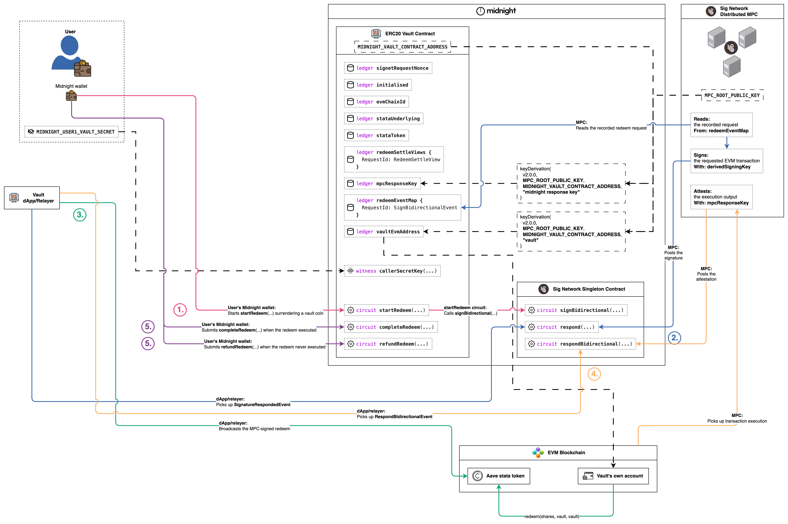
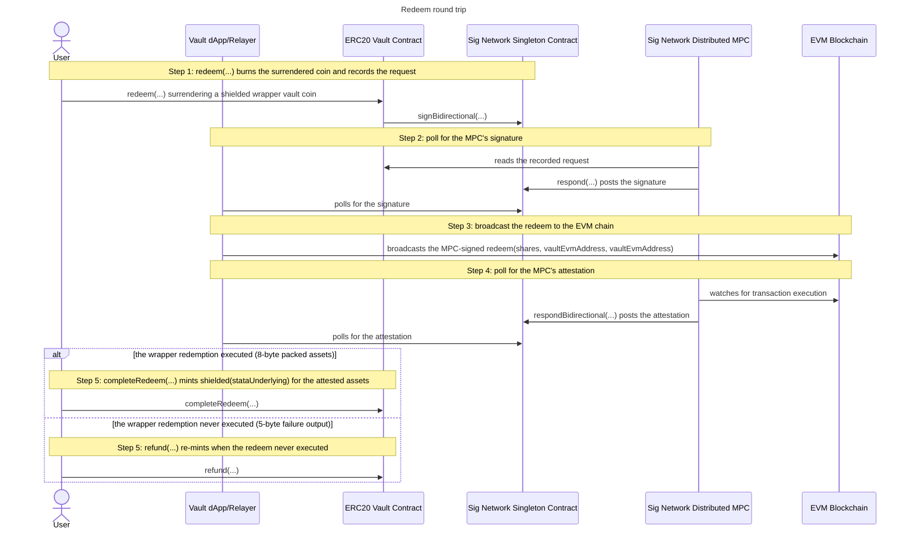

# Redeem

The redeem round trip exits the vault's Aave position through the non-rebasing
ERC-4626 wrapper (stataUSDC), against shielded vault tokens of the wrapper that
the caller surrenders on Midnight. It is the [supply](../supply/supply.md) round
trip run backwards: the wrapper burns shares out of the vault's own EVM account
and pays the underlying USDC back into it, and the caller's claim on that
underlying comes back as a shielded vault token of the underlying's colour.

## The protocol

It is best to understand the
[sign bidirectional flow](../../../../README.md#sign-bidirectional-protocol-flow)
before you continue here. For more detail see the
[sign bidirectional flow](https://github.com/sig-net/midnight-integration/blob/main/README.md#sign-bidirectional-protocol-flow)
in the midnight integration repository.

## The integration

To wire this shape into a contract of your own, start from the
[Integration guide](../../../../README.md#integration-guide) in the repo README.
For the full walkthrough see the
[Integrator Guide](https://github.com/sig-net/midnight-integration/blob/main/README.md#integrator-guide)
in the midnight integration repository.

## The redeem round trip

The round trip runs from the caller surrendering their wrapper vault tokens on
Midnight to the settle call that closes the request. There is no allowance leg:
the vault redeems its OWN shares, so the redeem names the vault's account as
both receiver and owner and the wrapper needs no approval from anyone. The EVM
transaction is sent by the vault's own account, pinned at initialize as
[`vaultEvmAddress`](../../contract/src/erc20-vault.compact#L91). The user's
wallet drives the two Midnight transactions, the Vault dApp/Relayer does the
polling and the broadcast, and the MPC reads, signs and attests exactly as it
does for a [deposit](../deposit/deposit.md). The settle is a branch: both arms
are step 5, and which one runs is decided by the MPC's attested output, never by
the caller.

As illustrated, the flow comprises 5 steps:

- **1.** redeem(...) burns the surrendered coin and records the request
  - The caller surrenders a shielded **vault coin** of exactly the shares being
    redeemed. [`redeem`](../../contract/src/erc20-vault.compact#L1264) checks the
    coin's colour is the wrapper's vault token
    ([`vaultTokenDomainSeparator`](../../contract/src/erc20-vault.compact#L271)
    over the pinned [`stataToken`](../../contract/src/erc20-vault.compact#L159))
    and that its value equals the shares, then burns it: `receiveShielded`
    assigns the coin to the contract, then `sendImmediateShielded` sends its full
    value to the shielded burn address. Both calls are needed, as a contract can
    only spend coins it owns. The surrendered coin is what a
    [supply](../supply/supply.md) minted, so a supply comes first.
  - The circuit builds contract-enforced calldata for
    `redeem(shares, vault, vault)` on the pinned `stataToken`, the ERC-4626
    redemption whose receiver AND owner are both `vaultEvmAddress`. Owner being
    the vault is why the flow needs no allowance leg of its own: the wrapper
    burns shares the caller of the redeem already holds. The `to` of the
    transaction is the pinned wrapper, so a malicious client cannot point the
    pooled position at a contract of their own.
  - The request is recorded in
    [`redeemEventMap`](../../contract/src/erc20-vault.compact#L178), a map of its
    own rather than the supply map: a wrapper redemption is 3 calldata words
    against a supply's 2, and the calldata width is part of the ledger type. Its
    schemas
    ([`redeemOutputSchema`](../../contract/src/erc20-vault.compact#L246) and
    [`redeemRespondSchema`](../../contract/src/erc20-vault.compact#L249), 36 and
    35 bytes) say the wrapper returns a `uint256 assets` the MPC repacks to
    `uint64`. It is ledger field 17, and the notification carries its resolved
    ledger-tree path `[1, 13]` at depth 2, mirrored off chain by
    [`VAULT_REDEEM_REQUESTS_PATH`](../../contract/src/index.ts#L45).
  - The derivation path is the contract-fixed literal `pad(32, "vault")`, so the
    MPC signs with the vault's own account and never with a caller's (see
    [Derived keys and accounts](../../README.md#derived-keys-and-accounts)). The
    gas envelope is contract-fixed at the same limit a supply uses, sized for a
    round trip through the wrapper into Aave. A caller-chosen cap would let
    anyone drain the vault's ETH at will, and retuning the caps means a redeploy.
  - The call is optimistic, and the coin spend IS the authorisation: the wallet
    can only fund the coin from the caller's own balance, so anyone holding
    wrapper vault tokens may redeem.
  - The redeemer's settle view (commitment, shares) goes into
    [`redeemRefundCommitment`](../../contract/src/erc20-vault.compact#L188),
    whose commitment comes from
    [`withdrawRefundCommitment`](../../contract/src/erc20-vault.compact#L298)
    over the caller's secret and the request id, the same identity-breaking
    commitment a [withdrawal](../withdraw/withdraw.md) pins. The shares are
    bounded to `Uint<64>` before the burn, so the refund arm can always re-mint
    them. The entry doubles as the pending-redeem marker step 5 consumes.
  - Off chain, [`redeem.ts`](../../integration-tests/src/flows/redeem.ts#L68)
    reads the vault account's next EVM nonce, funds the coin of the wrapper's
    colour from the caller's shielded balance, calls the circuit, and asserts
    that the request id it recomputes with the SDK's `calculateRequestId` twin
    appears as a key of the redeem map.
- **2.** poll for the MPC's signature
  - The MPC reads the recorded request from the vault's redeem map, signs the
    wrapper redemption with the vault's derived signing key, and posts the
    signature back through the singleton's `respond(...)`.
  - [`poll-signature-response.ts`](../../integration-tests/src/flows/poll-signature-response.ts#L63)
    polls the singleton's emitted signature events through the SDK's
    [`SignetRequestResponseReader`](https://github.com/sig-net/midnight-integration/blob/main/packages/signet-midnight/src/signet-request-response-reader.ts),
    asking `getVerifiedSignatureRespondedEvent` for a post whose signature
    recovers to the expected signer. The redeem-specific argument is the requests
    path: the reader is pointed at `VAULT_REDEEM_REQUESTS_PATH`, not the field-0
    map and not the supply map, so it reads back the record the redeem circuit
    actually stored.
  - The expected signer is the vault's own account, `evmVaultAddress`. The
    request id on the event is unauthenticated routing data on an open log that
    anyone may post to, so the recovery check is what selects the response.
- **3.** broadcast the redeem to the EVM chain
  - The MPC only signs, and broadcasting is the relayer's responsibility. The
    dApp attaches the verified signature to the transaction rebuilt from the
    request record and sends it, and the wrapper burns `shares` out of the
    vault's account, withdraws the matching position from Aave, and pays the
    underlying USDC back into that same account.
  - [`broadcast-evm.ts`](../../integration-tests/src/flows/broadcast-evm.ts#L81)
    is idempotent: a redemption already mined short-circuits, and a node
    reporting the exact transaction as already seen is tolerated. A redeem
    broadcasts with `tolerateRevert`, as a wrapper redemption that reverts on
    chain is a valid outcome the MPC attests as a failure and the step 5 refund
    arm settles, rather than a broadcast error.
- **4.** poll for the MPC's attestation
  - The MPC watches the EVM chain for the transaction's execution and posts an
    attestation of its output through the singleton's
    `respondBidirectional(...)`. The event carries only the request id it answers
    and the MPC's ECDSA signature over the attestation digest of that id and the
    output bytes, so the client recomputes the output bytes independently and
    checks the signature against them, exactly as a
    [deposit](../deposit/deposit.md) does.
  - [`fetchRedeemOutcome`](../../integration-tests/src/flows/redeem.ts#L155)
    recomputes TWO candidates on every tick. **The success candidate** is
    computable only when the transaction executed: the raw execution output,
    decoded per the request's `outputDeserializationSchema` (the `uint256 assets`
    the wrapper returned) and re-packed per its `respondSerializationSchema` (the
    same assets as a `uint64`), which is the 8-byte output the settle circuit
    deserialises natively. **The failure candidate** is always available: the
    protocol's fixed 5-byte
    [`MPC_FAILURE_OUTPUT`](https://github.com/sig-net/midnight-integration/blob/main/packages/signet-midnight/src/constants.ts)
    (`0xdeadbeef01`), which the MPC attests for a transaction that never executed
    at all, reverted on chain or was replaced on the same nonce.
  - Selection is by signature verification alone, against
    [`mpcResponseKey`](../../contract/src/erc20-vault.compact#L78), the response
    key the vault pinned at initialize and reads back from its own ledger. A
    decode failure on the fetched output drops the success candidate instead of
    crashing the poll, which leaves the failure candidate to match.
  - Which candidate verifies is also what routes step 5. Everything fetched here
    stays UNTRUSTED: the verified bytes go into the settle circuit as an
    argument, where the same signature is re-verified in-circuit, and that
    in-circuit check is the authentication gate.
  - The poll loop and its deadline live in
    [`pollRedeemOutcome`](../../integration-tests/src/flows/redeem.ts#L225), and
    [`settleRedeem`](../../integration-tests/src/flows/redeem.ts#L252) is the
    single settle call site: it picks the settle circuit from the resolved
    outcome and passes a fresh random mint nonce either way.
    [`completeRedeem`](../../integration-tests/src/flows/redeem.ts#L289)
    composes the two.
- **5.** completeRedeem(...) mints shielded(stataUnderlying) for the attested assets
  - An executed redemption settles through
    [`completeRedeem`](../../contract/src/erc20-vault.compact#L1346), whose
    `Bytes<8>` output argument is the wrapper's packed `uint64` assets.
    `verifyRespondBidirectionalEvent<8>` re-verifies the MPC's signature over it
    against `mpcResponseKey` before anything else happens.
  - Membership of `redeemEventMap` is the double-settle protection and the proof
    that this request is a pending redeem. Each flow keeps its own request map,
    so a deposit, withdrawal, swap or supply request can never be settled here.
  - The mint is redeemer-only: the caller proves the secret behind the commitment
    pinned at redeem time, matched against the `redeemRefundCommitment` entry,
    and both the request record and the marker are consumed. This arm mints a
    private coin, which is what makes the identity gate necessary at all.
  - The minted amount is the ATTESTED assets, deserialised from the output bytes
    the MPC signed, never a number the caller supplies or a value read back from
    the request record. Shares and assets are different quantities: the wrapper's
    exchange rate climbs as Aave interest accrues, so the assets paid out are the
    principal plus the interest the position earned while it was held, and they
    exceed the underlying a supply of the same shares surrendered. Only the
    executed call knows that number, which is precisely why the settle takes the
    attested output rather than anything pinned at request time.
  - The coin's colour is the vault token of the pinned
    [`stataUnderlying`](../../contract/src/erc20-vault.compact#L158), so a
    completed redeem lands the caller back in plain USDC vault tokens, spendable
    through [withdraw](../withdraw/withdraw.md) or
    [swap](../swap/swap.md) like any other. The mint nonce is caller-chosen
    random: one derived from the public request id would link the minted coin to
    the redeem.
- **5.** refund(...) re-mints when the redeem never executed
  - A wrapper redemption that never ran on the EVM chain settles through
    [`refund`](../../contract/src/erc20-vault.compact#L720) instead, and the
    attested output's WIDTH is what routes the call: the fixed 5-byte failure
    output cannot type-fit `completeRedeem`'s `Bytes<8>`, and an executed result
    cannot type-fit `refund`'s `Bytes<5>`.
  - The same authentication gate runs at the failure width
    (`verifyRespondBidirectionalEvent<5>`), followed by an exact-bytes check:
    only `0xdeadbeef01` refunds, and any other attested 5-byte output is not a
    failure.
  - One circuit serves the withdraw, swap, supply and redeem failure paths. All
    four share this exact signature, so `refund` routes on which pending marker
    holds the request id, and the four markers are separate maps, so exactly one
    matches. A request id in no map, a deposit or an already-settled request,
    fails here with a clean "Request not found".
  - For a redeem the marker is `redeemRefundCommitment`. The commitment and the
    shares come from the settle view pinned at redeem time, and the colour is the
    pinned `stataToken` cell rather than a token address carried in the view, as
    a redeem can only ever have burned that one colour. The taken arm's event map
    entry and marker are both consumed, and the value re-mints once after the
    join.
  - Every arm is requester-only, as a refund mints a private coin: the caller
    must prove the secret behind the pinned commitment. The redeemer's wrapper
    vault tokens are back in their wallet, minted under a nonce that ties them to
    nothing, and the vault's Aave position is exactly where it was: nothing was
    ever burned on chain, so the re-minted coin is a claim on the same shares.

## Shared setup

Every circuit call goes through the deployed vault, joined once with the caller's
identity secret as private state (see
[Runtime: joining the deployed vault](../../README.md#runtime-joining-the-deployed-vault)
in the vault README). That secret is the user's own random value, not a wallet
seed. The diagrams name it `MIDNIGHT_USER1_VAULT_SECRET`, and the integration
tests take it from the environment variable of that name.

The off-chain steps (2 to 4) share one `SignetRequestResponseReader` over the
vault and singleton pair, built by
[`createResponseReader`](../../integration-tests/src/vault-context.ts#L152) and
pointed at the redeem map's ledger-tree path. The expected signer of the EVM
transaction is the vault's own account, whose derivation path is the
contract-fixed `pad(32, "vault")`. The MPC renders a request's 32 opaque path
bytes as their full-width lowercase hex, padding included, and `deriveEvmAddress`
takes the same rendering, so the vault's account derives from
[`VAULT_PATH_HEX`](../../integration-tests/src/mpc-routing.ts#L27).
`deriveEvmAddress` is the concrete function behind the diagram's abstract
`keyDerivation(...)` note, and `deriveMidnightResponseKey` is the one behind the
response key's own note. The response key takes no path: it is per-contract and
independent of any request's derivation path, and both settle arms verify the
MPC's attestation against it.

The flow needs the wrapper to exist on the chain the vault is pinned to, which
means Sepolia or a fork of it.
[`runRedeemRoundTrip`](../../integration-tests/src/flows/redeem.ts#L312) probes
for the wrapper's code with
[`stataAvailable`](../../integration-tests/src/evm-stata.ts#L55) and logs a skip
where it is absent. It also needs the caller to already HOLD the shares it
redeems, so a [supply](../supply/supply.md) round trip runs first and its minted
wrapper vault coin is what this flow burns.

## Sequence

---

Previous: [Supply](../supply/supply.md) · Up: [ERC20 Vault](../../README.md) · Protocol: [Sign Bidirectional Flow](../../../../README.md#sign-bidirectional-protocol-flow)
