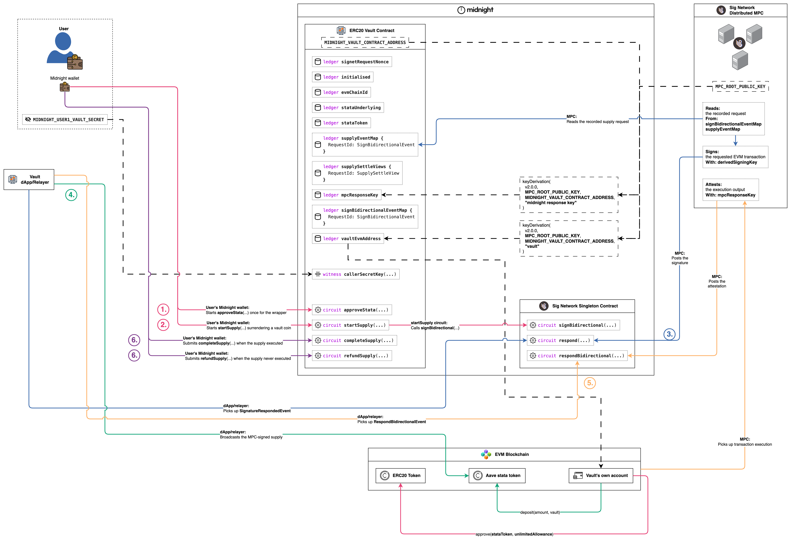
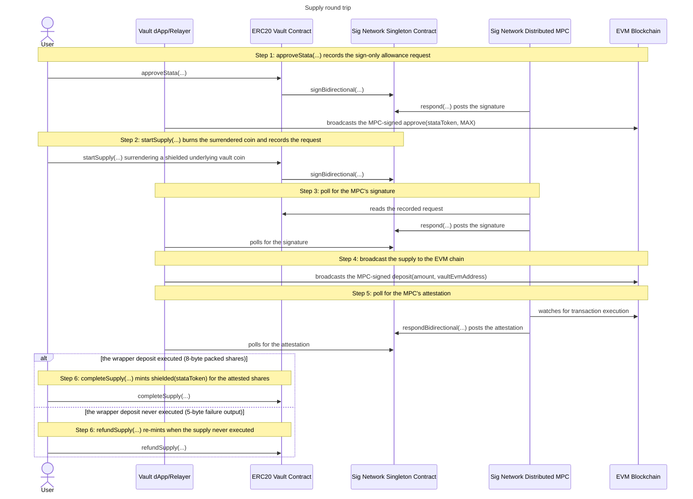

# Supply

<!-- FIXME(docs-diagrams): this page was written against the pre-rename
     contract. Circuit and flow names in the text are updated to the renamed
     circuits (initialise, startX/completeX, per-kind refundX), but the
     drawio/PNG diagram still draws the old names, ledger-field names and any
     remaining #L line anchors predate the refactor. Re-render the diagram and
     re-verify names and anchors against the current contract and flows. -->

The supply round trip lends the vault's pooled USDC on Aave through the
non-rebasing ERC-4626 wrapper (stataUSDC), against shielded vault tokens of the
underlying that the caller surrenders on Midnight. The value never leaves the
vault's own EVM account: the wrapper pulls the underlying out of it and mints
stataUSDC back into it, and the caller's claim on that position comes back as a
shielded vault token of the wrapper's colour.

## The protocol

It is best to understand the
[sign bidirectional flow](../../../../README.md#sign-bidirectional-protocol-flow)
before you continue here. For more detail see the
[sign bidirectional flow](https://github.com/sig-net/midnight-integration/blob/main/README.md#sign-bidirectional-protocol-flow)
in the midnight integration repository.

## The integration

To wire this shape into a contract of your own, start from the
[Integration guide](../../../../README.md#integration-guide) in the repo README.
For the full walkthrough see the
[Integrator Guide](https://github.com/sig-net/midnight-integration/blob/main/README.md#integrator-guide)
in the midnight integration repository.

## The supply round trip

The round trip opens with an allowance the vault grants once and reuses for
every later supply, then runs from the caller surrendering their underlying
vault tokens on Midnight to the settle call that closes the request. Both EVM
transactions are sent by the vault's own account, pinned at initialise as
[`vaultEvmAddress`](../../contract/src/erc20-vault.compact): the vault holds
the pooled funds, so it is the only account with anything to lend. The user's
wallet drives the Midnight transactions, the Vault dApp/Relayer does the
polling and the broadcasts, and the MPC reads, signs and attests exactly as it
does for a [deposit](../deposit/deposit.md). The settle is a branch: both arms
are step 6, and which one runs is decided by the MPC's attested output, never by
the caller.

As illustrated, the flow comprises 6 steps:

- **1.** approveStata(...) records the sign-only allowance request
  - The ERC-4626 wrapper pulls the underlying from the account that calls
    `deposit`, so the vault's account must have approved it first.
    [`approveStata`](../../contract/src/erc20-vault.compact) builds
    contract-enforced calldata for `approve(stataToken, MAX)` called ON the
    pinned [`stataUnderlying`](../../contract/src/erc20-vault.compact),
    with the pinned [`stataToken`](../../contract/src/erc20-vault.compact)
    as the only spender it can ever name. Both addresses arrive at initialise: a
    circuit cannot read the wrapper's `asset()` on chain, so the
    underlying-to-wrapper pairing is trusted configuration rather than something
    the contract derives.
  - The record is a plain 2-word request with the ERC20 `bool` schema, so it
    goes into the field-0
    [`signBidirectionalEventMap`](../../contract/src/erc20-vault.compact)
    alongside deposits and withdrawals, and the derivation path is the
    contract-fixed literal `pad(32, "vault")`. The gas envelope is
    contract-fixed too, as it is the vault's own ETH that pays it.
  - This leg is **sign-only**: it mints nothing and has no settle circuit at
    all, so the round trip ends at the broadcast and no attestation is ever
    polled.
    [`approveStata`](../../integration-tests/src/flows/approve-stata.ts#L56)
    records the request, and the same signature poll and broadcast as steps 3
    and 4 carry it to the chain.
  - The allowance is global and permanent, so the step is idempotent:
    [`ensureStataApproved`](../../integration-tests/src/flows/approve-stata.ts#L115)
    reads the live `allowance(vault, stataToken)` off the underlying and runs
    the leg only when it is zero.
    [`runSupplyRoundTrip`](../../integration-tests/src/flows/supply-round-trip.ts)
    calls it before every supply for exactly that reason.
- **2.** startSupply(...) burns the surrendered coin and records the request
  - The caller surrenders a shielded **vault coin** of exactly the supply
    amount. [`startSupply`](../../contract/src/erc20-vault.compact) checks the
    coin's colour is the underlying's vault token
    ([`vaultTokenDomainSeparator`](../../contract/src/erc20-vault.compact)
    over `stataUnderlying`) and that its value equals the amount, then burns it:
    `receiveShielded` assigns the coin to the contract, then
    `sendImmediateShielded` sends its full value to the shielded burn address.
    Both calls are needed, as a contract can only spend coins it owns.
  - The circuit builds contract-enforced calldata for `deposit(amount, vault)`
    on the pinned `stataToken`, the ERC-4626 deposit whose receiver is
    `vaultEvmAddress`, so the minted shares land in the vault's own account and
    nowhere else. The `to` of the transaction is the pinned wrapper, so a
    malicious client cannot point the pooled funds at a contract of their own.
  - The request is recorded in
    [`supplyEventMap`](../../contract/src/erc20-vault.compact), a map of
    its own rather than the field-0 one: a wrapper deposit returns
    a `uint256 shares` the MPC repacks to `uint64`, and those schema widths
    ([`supplyOutputSchema`](../../contract/src/erc20-vault.compact) and
    [`supplyRespondSchema`](../../contract/src/erc20-vault.compact), 36 and
    35 bytes) are part of the ledger type. It is ledger field 15, and the
    notification carries its resolved ledger-tree path `[1, 11]` at depth 2,
    mirrored off chain by
    [`VAULT_SUPPLY_REQUESTS_PATH`](../../contract/src/index.ts#L42).
  - The derivation path is `pad(32, "vault")` again, so the MPC signs with the
    vault's own account and never with a caller's (see
    [Derived keys and accounts](../../README.md#derived-keys-and-accounts)). The
    gas envelope is contract-fixed, at a limit sized for an Aave supply through
    the wrapper. A caller-chosen cap would let anyone drain the vault's ETH at
    will, and retuning the caps means a redeploy.
  - The call is optimistic, and the coin spend IS the authorisation: the wallet
    can only fund the coin from the caller's own balance, so anyone holding
    underlying vault tokens may supply.
  - The supplier's settle view (commitment, amount) goes into
    [`supplySettleViews`](../../contract/src/erc20-vault.compact),
    whose commitment comes from
    [`refundCommitment`](../../contract/src/erc20-vault.compact)
    over the caller's secret and the request id, the same identity-breaking
    commitment a [withdrawal](../withdraw/withdraw.md) pins. The amount is
    bounded to `Uint<64>` before the burn, so the refund arm can always re-mint
    it. The entry doubles as the pending-supply marker step 6 consumes.
  - Off chain, [`start-supply.ts`](../../integration-tests/src/flows/start-supply.ts)
    reads the vault account's next EVM nonce, funds the coin of the underlying's
    colour from the caller's shielded balance, calls the circuit, and asserts
    that the request id it recomputes with the SDK's `calculateRequestId` twin
    appears as a key of the supply map. The caller must already HOLD that much
    of the underlying vault token, so a deposit of USDC comes first.
- **3.** poll for the MPC's signature
  - The MPC reads the recorded request from the vault's supply map, signs the
    wrapper deposit with the vault's derived signing key, and posts the
    signature back through the singleton's `respond(...)`.
  - [`poll-signature-response.ts`](../../integration-tests/src/flows/poll-signature-response.ts#L63)
    polls the singleton's emitted signature events through the SDK's
    [`SignetRequestResponseReader`](https://github.com/sig-net/midnight-integration/blob/main/packages/signet-midnight/src/signet-request-response-reader.ts),
    asking `getVerifiedSignatureRespondedEvent` for a post whose signature
    recovers to the expected signer. The supply-specific argument is the
    requests path: the reader is pointed at `VAULT_SUPPLY_REQUESTS_PATH`, not
    the field-0 map, so it reads back the record the supply circuit actually
    stored.
  - The expected signer is the vault's own account, `evmVaultAddress`. The
    request id on the event is unauthenticated routing data on an open log that
    anyone may post to, so the recovery check is what selects the response.
- **4.** broadcast the supply to the EVM chain
  - The MPC only signs, and broadcasting is the relayer's responsibility. The
    dApp attaches the verified signature to the transaction rebuilt from the
    request record and sends it, and the wrapper pulls `amount` of the
    underlying out of the vault's account under the step 1 allowance, supplies
    it to Aave, and mints stataUSDC shares back to the vault's account.
  - [`broadcast-evm.ts`](../../integration-tests/src/flows/broadcast-evm.ts#L81)
    is idempotent: a deposit already mined short-circuits, and a node reporting
    the exact transaction as already seen is tolerated. A supply broadcasts with
    `tolerateRevert`, as a wrapper deposit that reverts on chain is a valid
    outcome the MPC attests as a failure and the step 6 refund arm settles,
    rather than a broadcast error.
- **5.** poll for the MPC's attestation
  - The MPC watches the EVM chain for the transaction's execution and posts an
    attestation of its output through the singleton's
    `respondBidirectional(...)`. The event carries only the request id it
    answers and the MPC's ECDSA signature over the attestation digest of that id
    and the output bytes, so the client recomputes the output bytes
    independently and checks the signature against them, exactly as a
    [deposit](../deposit/deposit.md) does.
  - [`fetchSupplyOutcome`](../../integration-tests/src/flows/complete-supply.ts)
    recomputes TWO candidates on every tick. **The success candidate** is
    computable only when the transaction executed: the raw execution output,
    decoded per the request's `outputDeserializationSchema` (the
    `uint256 shares` the wrapper returned) and re-packed per its
    `respondSerializationSchema` (the same shares as a `uint64`), which is the
    8-byte output the settle circuit deserialises natively. **The failure
    candidate** is always available: the protocol's fixed 5-byte
    [`MPC_FAILURE_OUTPUT`](https://github.com/sig-net/midnight-integration/blob/main/packages/signet-midnight/src/constants.ts)
    (`0xdeadbeef01`), which the MPC attests for a transaction that never
    executed at all, reverted on chain or was replaced on the same nonce.
  - Selection is by signature verification alone, against
    [`mpcResponseKey`](../../contract/src/erc20-vault.compact), the response
    key the vault pinned at initialise and reads back from its own ledger. A
    decode failure on the fetched output drops the success candidate instead of
    crashing the poll, which leaves the failure candidate to match.
  - Which candidate verifies is also what routes step 6. Everything fetched here
    stays UNTRUSTED: the verified bytes go into the settle circuit as an
    argument, where the same signature is re-verified in-circuit, and that
    in-circuit check is the authentication gate.
  - The poll loop and its deadline live in
    [`pollSupplyOutcome`](../../integration-tests/src/flows/complete-supply.ts), and
    [`settleSupply`](../../integration-tests/src/flows/complete-supply.ts) is the
    single settle call site: it picks the settle circuit from the resolved
    outcome and passes a fresh random mint nonce either way.
    [`completeSupply`](../../integration-tests/src/flows/complete-supply.ts)
    composes the two.
- **6.** completeSupply(...) mints shielded(stataToken) for the attested shares
  - An executed deposit settles through
    [`completeSupply`](../../contract/src/erc20-vault.compact), whose
    `Bytes<8>` output argument is the wrapper's packed `uint64` shares.
    `verifyRespondBidirectionalEvent<8>` re-verifies the MPC's signature over it
    against `mpcResponseKey` before anything else happens.
  - Membership of `supplyEventMap` is the double-settle protection and the proof
    that this request is a pending supply. Each flow keeps its own request map,
    so a deposit, withdrawal or swap request can never be settled here.
  - The mint is supplier-only: the caller proves the secret behind the
    commitment pinned at supply time, matched against the
    `supplySettleViews` entry, and both the request record and the marker
    are consumed. This arm mints a private coin, which is what makes the
    identity gate necessary at all, and it is the difference from a
    [withdrawal](../withdraw/withdraw.md)'s success arm, which mints nothing and
    needs no identity.
  - The minted amount is the ATTESTED shares, deserialised from the output bytes
    the MPC signed, never a number the caller supplies or a value read back from
    the request record. The coin's colour is the vault token of `stataToken`, so
    a supplier's position in the wrapper is itself a shielded vault token, and
    the redeem flow burns it again. The mint nonce is caller-chosen random: one
    derived from the public request id would link the minted coin to the supply.
  - A supply is exact-input, so there is no change leg. The surrendered amount
    is fully spent by the wrapper deposit, and the shares are the only thing
    minted.
- **6.** refundSupply(...) re-mints when the supply never executed
  - A wrapper deposit that never ran on the EVM chain settles through
    [`refundSupply`](../../contract/src/erc20-vault.compact) instead, and the
    attested output's WIDTH is what routes the call: the fixed 5-byte failure
    output cannot type-fit `completeSupply`'s `Bytes<8>`, and an executed result
    cannot type-fit `refundSupply`'s `Bytes<5>`.
  - The same authentication gate runs at the failure width
    (`verifyRespondBidirectionalEvent<5>`), followed by an exact-bytes check:
    only `0xdeadbeef01` refunds, and any other attested 5-byte output is not a
    failure.
  - Each request kind has its own refund circuit (`refundWithdraw`,
    `refundSwap`, `refundSupply`, `refundRedeem`) sharing one signature and one
    failure check, and `refundSupply` reads ONLY the supply settle-view map: a
    request id of another kind, or one already settled, fails with a clean
    "not found".
  - For a supply that map is `supplySettleViews`. The commitment and the
    amount come from the settle view pinned at startSupply time, and the colour
    is the pinned `stataUnderlying` cell rather than a token address carried in
    the view, as a supply can only ever have burned that one colour. The event
    map entry and the settle view are both consumed, and the value re-mints
    once.
  - Every arm is requester-only, as a refund mints a private coin: the caller
    must prove the secret behind the pinned commitment. The supplier's
    underlying vault tokens are back in their wallet, minted under a nonce that
    ties them to nothing.

## Shared setup

Every circuit call goes through the deployed vault, joined once with the
caller's identity secret as private state (see
[Runtime: joining the deployed vault](../../README.md#runtime-joining-the-deployed-vault)
in the vault README). That secret is the user's own random value, not a wallet
seed. The diagrams name it `MIDNIGHT_USER1_VAULT_SECRET`, and the integration
tests take it from the environment variable of that name.

The off-chain steps (3 to 5) share one `SignetRequestResponseReader` over the
vault and singleton pair, built by
[`createResponseReader`](../../integration-tests/src/vault-context.ts#L152) and
pointed at the supply map's ledger-tree path. The expected signer of both EVM
transactions is the vault's own account, whose derivation path is the
contract-fixed `pad(32, "vault")`. The MPC renders a request's 32 opaque path
bytes as their full-width lowercase hex, padding included, and
`deriveEvmAddress` takes the same rendering, so the vault's account derives from
[`VAULT_PATH_HEX`](../../integration-tests/src/mpc-routing.ts#L27).
`deriveEvmAddress` is the concrete function behind the diagram's abstract
`keyDerivation(...)` note, and `deriveMidnightResponseKey` is the one behind the
response key's own note. The response key takes no path: it is per-contract and
independent of any request's derivation path, and both settle arms verify the
MPC's attestation against it.

The flow needs the wrapper to exist on the chain the vault is pinned to, which
means Sepolia or a fork of it. Both
[`ensureStataApproved`](../../integration-tests/src/flows/approve-stata.ts#L115)
and [`runSupplyRoundTrip`](../../integration-tests/src/flows/supply-round-trip.ts)
probe for the wrapper's code with
[`stataAvailable`](../../integration-tests/src/evm-stata.ts#L55) and log a skip
where it is absent.

## Sequence

---

Previous: [Swap](../swap/swap.md) · Up: [ERC20 Vault](../../README.md) · Protocol: [Sign Bidirectional Flow](../../../../README.md#sign-bidirectional-protocol-flow)
