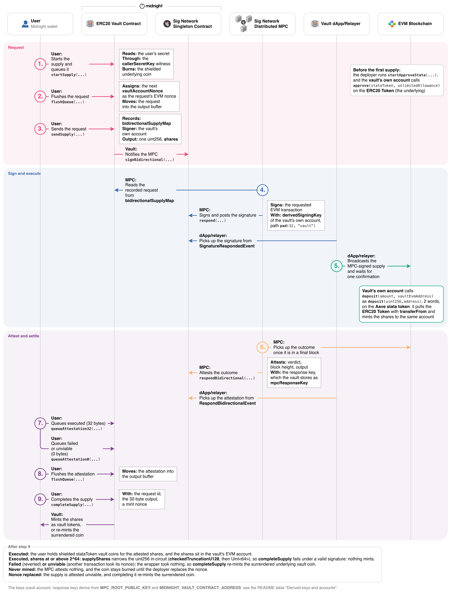

# Supply

The supply round trip lends the vault's pooled USDC on Aave through the
non-rebasing ERC-4626 wrapper (stataUSDC), against shielded vault tokens of the
underlying that the caller surrenders on Midnight. The value never leaves the
vault's own EVM account: the wrapper pulls the underlying out of it and mints
stataUSDC back into it, and the caller's claim on that position comes back as a
shielded vault token of the wrapper's colour.

## The protocol

It is best to understand the
[sign bidirectional flow](../../../../README.md#sign-bidirectional-protocol-flow)
before you continue here. For more detail see the
[sign bidirectional flow](https://github.com/sig-net/midnight-integration/blob/main/README.md#sign-bidirectional-protocol-flow)
in the midnight integration repository.

## The integration

To wire this shape into a contract of your own, start from the
[Integration guide](../../../../README.md#integrator-guide) in the repo README.
For the full walkthrough see the
[Integrator Guide](https://github.com/sig-net/midnight-integration/blob/main/README.md#integrator-guide)
in the midnight integration repository. The queue the vault runs every request
through is described in [Contention handling](../contention-handling.md).

## The supply round trip

The round trip runs from the caller surrendering their underlying vault tokens
on Midnight to the complete call that mints their shares. The EVM transaction
is sent by the vault's own account, pinned at initialise as
[`vaultEvmAddress`](../../contract/src/erc20-vault.compact): the vault holds
the pooled funds, so it is the only account with anything to lend. Every step
runs as it does for a [withdrawal](../withdraw/withdraw.md), over the supply's
own request map,
[`bidirectionalSupplyMap`](../../contract/src/erc20-vault.compact), and the
[deposit](../deposit/deposit.md) page describes the shared machinery in full.

The wrapper pulls the underlying from the vault's account under an allowance
the deployer grants once with a stata approval
([`startApproveStata`](../../contract/src/erc20-vault.compact), see
[Vault-signed requests](../contention-handling.md#vault-signed-requests)),
which the `approve-e2e` spec runs before the lending specs.

As illustrated, the flow comprises 9 steps:

- **1.** startSupply(...) burns the surrendered coin and queues the request
  - The caller surrenders a shielded **vault coin** of exactly the supply
    amount. [`startSupply`](../../contract/src/erc20-vault.compact) checks the
    coin's colour is the underlying's vault token
    ([`vaultTokenDomainSeparator`](../../contract/src/erc20-vault.compact)
    over the pinned [`stataUnderlying`](../../contract/src/erc20-vault.compact))
    and that its value equals the amount, then burns it with the same pair of
    calls a [withdrawal](../withdraw/withdraw.md) uses. The coin spend IS the
    authorisation, so anyone holding underlying vault tokens may supply.
  - Both tokens are contract-fixed, so the
    [`SupplyRequest`](../../contract/src/erc20-vault.compact) names only the
    amount, bounded to `Uint<64>` before the burn so a failure can always
    re-mint it.
  - The circuit copies the vault's gas settings for a supply into
    [`supplyArgsMap`](../../contract/src/erc20-vault.compact) beside the
    request, and queues the entry with `useNextVaultAccountNonce` set and the supplier's
    [`ownershipCommitment`](../../contract/src/erc20-vault.compact).
  - Off chain, [`start-supply.ts`](../../integration-tests/src/flows/start-supply.ts)
    funds the coin of the underlying's colour from the caller's shielded
    balance and calls the circuit. The caller must already HOLD that much of
    the underlying vault token, so a deposit of the underlying comes first.
- **2.** flushQueue(...) assigns the vault nonce and moves the request into the output buffer
  - The flush gives the entry the vault account's next EVM nonce
    ([`vaultAccountNonce`](../../contract/src/erc20-vault.compact)) and moves it
    into `outputRequestBuffer`, exactly as it does for a
    [withdrawal](../withdraw/withdraw.md). `start-supply.ts` then reads the
    entry's index with [`flushedRequestIndex`](../../contract/src/vault-queue.ts).
- **3.** sendSupply(...) records the request and notifies the MPC
  - [`sendSupply`](../../contract/src/erc20-vault.compact) builds
    contract-enforced calldata for `deposit(amount, vaultEvmAddress)` on the
    pinned [`stataToken`](../../contract/src/erc20-vault.compact), so the
    minted shares land in the vault's own account and nowhere else, and a
    client cannot point the pooled funds at a contract of their own.
  - A wrapper deposit returns a `uint256` share count, which the MPC attests
    whole as 32 little-endian bytes, so the request carries its own output
    schema ([`supplyOutputSchema`](../../contract/src/erc20-vault.compact)),
    whose width is part of the supply map's ledger type.
  - The record goes into `bidirectionalSupplyMap` under its request id, signed
    for the vault's own account (path `pad(32, "vault")`) at the assigned
    nonce and the gas the start copied, and the singleton's
    `signBidirectional(...)` call carries the map's path
    ([`VAULT_SUPPLY_REQUESTS_PATH`](../../contract/src/index.ts)).
- **4.** poll for the MPC's signature
  - The MPC signs the wrapper deposit with the vault's derived signing key,
    and [`poll-signature-response.ts`](../../integration-tests/src/flows/poll-signature-response.ts)
    polls for a post whose signature recovers to the vault's own account,
    `evmVaultAddress`, reading the request record from the supply map's path.
- **5.** broadcast the supply to the EVM chain
  - The dApp attaches the verified signature to the transaction rebuilt from
    the request record and sends it. The wrapper pulls `amount` of the
    underlying from the vault's account with `transferFrom`, under the stata
    allowance, and mints shares to the same account.
  - [`broadcast-evm.ts`](../../integration-tests/src/flows/broadcast-evm.ts)
    is idempotent, as it is for a [withdrawal](../withdraw/withdraw.md).
- **6.** poll for the MPC's attestation
  - [`poll-respond-bidirectional.ts`](../../integration-tests/src/flows/poll-respond-bidirectional.ts)
    resolves the MPC's attestation as it does for a
    [deposit](../deposit/deposit.md). A post declaring **`executed`** is
    checked over the wrapper's return decoded per the `uint256` output schema
    and Borsh-serialised as the MPC does, the 32 little-endian bytes that carry
    the shares minted. The exchange rate is live, so the shares come from the
    attestation and are never computed in advance. A post declaring
    **`failed`** or **`unviable`** is checked over the EMPTY output.
- **7.** queue the attestation at its output's width
  - [`queue-attestation.ts`](../../integration-tests/src/flows/queue-attestation.ts)
    submits the outcome to
    [`queueAttestation`](../../contract/src/erc20-vault.compact), whatever its
    verdict. The circuit verifies the MPC's signature over the output's width
    and hash the event carries against
    [`mpcResponseKey`](../../contract/src/erc20-vault.compact), finds the open
    supply through `evictionMap`, requires a block height strictly above its
    `lastSeen`, and queues the attestation record.
- **8.** flushQueue(...) moves the attestation into the output buffer
  - An attestation slot moves the record into `outputAttestationBuffer` and
    folds its block height into `globalLastSeen`.
- **9.** completeSupply(...) mints the attested shares as stataToken vault coins
  - The supplier calls
    [`completeSupply`](../../contract/src/erc20-vault.compact) with the
    request id, the 32-byte serialised output and a mint nonce. The circuit
    requires the flushed attestation, a block height strictly above the
    entry's `lastSeen` and the caller's ownership commitment, which makes
    every mint supplier-only, then removes the request's event, its
    arguments, its `evictionMap` entry, the attestation and the output entry.
  - An `executed` verdict requires the output to have the record's width and hash,
    then mints the attested share count, which the pure
    [`supplyShares`](../../contract/src/erc20-vault.compact) circuit
    narrows from the output in-circuit, as the `stataToken` vault coin.
  - A `failed` or `unviable` verdict means the wrapper took nothing, so the
    circuit re-mints the surrendered `stataUnderlying` amount, and the output
    it is passed is ignored. Either mint goes to the caller under a
    caller-chosen random `mintNonce`, which ties it to nothing.
  - [`complete-supply.ts`](../../integration-tests/src/flows/complete-supply.ts)
    queues and flushes the attestation, then calls the circuit with a fresh
    random mint nonce on every verdict.
    [`runSupplyRoundTrip`](../../integration-tests/src/flows/supply-round-trip.ts)
    runs steps 1 to 9 end to end as the arrange stage of the redeem refund
    spec.

## Shared setup

Every circuit call goes through the deployed vault, joined once with the
caller's identity secret as private state (see
[Runtime: joining the deployed vault](../../README.md#runtime-joining-the-deployed-vault)
in the vault README). That secret is the user's own random value. The
integration tests take it from the `VAULT_USER_SECRET_KEY` environment
variable, falling back to the `USER_SEED` bytes when it is unset.

The two polling steps (4 and 6) each build a `SignetRequestResponseReader` over
the vault and singleton pair through
[`createResponseReader`](../../integration-tests/src/vault-context.ts),
pointed at the supply map's ledger-tree path. The expected signer is the
vault's own account, whose derivation path is the contract-fixed
`pad(32, "vault")`. The MPC renders a request's 32 opaque path bytes as their
full-width lowercase hex, padding included, and `deriveEvmAddress` takes the
same rendering, so the vault's account derives from
[`VAULT_PATH_HEX`](../../contract/src/index.ts).
`deriveEvmAddress` derives the vault's EVM account, and
`deriveMidnightResponseKey` derives the response key: they are the concrete
functions behind the abstract `keyDerivation(...)` notes on the
[actor map](../../README.md#the-actors), and the diagram above names only
their inputs, in its footnote. The response key does not use any request's
derivation path: the MPC derives it for this contract under a
reserved path that no request may name ("midnight response key" in the SDK),
and the queue circuits verify the MPC's attestation against it.

The flow needs the wrapper to exist on the chain the vault is pinned to, which
means Sepolia or a fork of it. The setup pipeline probes for the wrapper's code
with [`stataAvailable`](../../integration-tests/src/evm-stata.ts) before any
spec runs and fails the run where it is absent.

---

Previous: [Swap](../swap/swap.md) · Next: [Redeem](../redeem/redeem.md) · Up: [ERC20 Vault](../../README.md) · Protocol: [Sign Bidirectional Flow](../../../../README.md#sign-bidirectional-protocol-flow)
