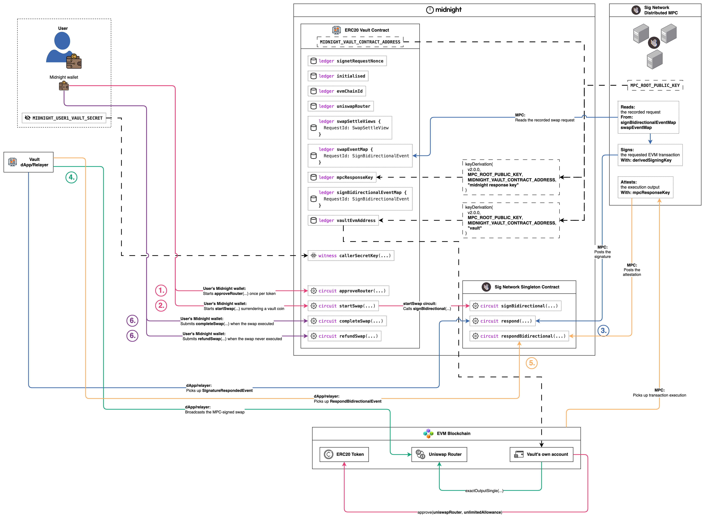
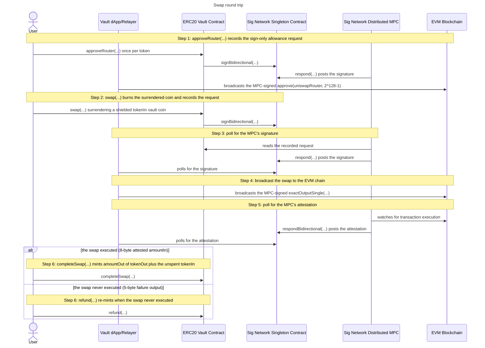

# Swap

The swap round trip has the vault trade its pooled ERC20 tokens on Uniswap V3
as if it were an ordinary EVM user, against shielded vault tokens the swapper
surrenders on Midnight. The swapper burns a coin of one token colour and, on
success, receives coins of another: the tokens themselves never leave the
vault's own EVM account, which both sells and buys, so the pooled balance and
the shielded supply stay equal per token.

## The protocol

It is best to understand the
[sign bidirectional flow](../../../../README.md#sign-bidirectional-protocol-flow) before
you continue here. For more detail see the
[sign bidirectional flow](https://github.com/sig-net/midnight-integration/blob/main/README.md#sign-bidirectional-protocol-flow)
in the midnight integration repository.

## The integration

To wire this shape into a contract of your own, start from the
[Integration guide](../../../../README.md#integration-guide) in the repo README.
For the full walkthrough see the
[Integrator Guide](https://github.com/sig-net/midnight-integration/blob/main/README.md#integrator-guide)
in the midnight integration repository.

## The swap round trip

The round trip runs from the router allowance that makes swapping possible at
all to the settle call that closes the request. It is the
[withdraw](../withdraw/withdraw.md) shape with a router in the middle: the same
optimistic burn, the same vault-signed EVM transaction, the same attested
settle, over a **separate request map at its own ledger field**
([`swapEventMap`](../../contract/src/erc20-vault.compact#L135)) sized for the
seven-word `exactOutputSingle` call. Step 1 sits ahead of the trade proper: a
one-time allowance per token that any caller may run, and that
[`runSwapRoundTrip`](../../integration-tests/src/flows/swap.ts#L348) runs first
through [`ensureRouterApproved`](../../integration-tests/src/flows/approve.ts#L125).
The user's wallet drives the Midnight transactions, the Vault dApp/Relayer
does the polling and the broadcasts, and the MPC reads, signs and attests
exactly as it does for a [deposit](../deposit/deposit.md). The settle is a
branch: both arms are step 6, and which one runs is decided by the MPC's
attested output, never by the caller.

As illustrated, the flow comprises 6 steps:

- **1.** approveRouter(...) records the sign-only allowance request
  - The vault swaps out of one pooled EVM account, so the router must be
    allowed to pull `tokenIn` from it before any swap can execute.
    [`approveRouter`](../../contract/src/erc20-vault.compact#L838) records
    `approve(uniswapRouter, 2^128-1)` on the ERC20 the caller names. The
    spender is the initialize-pinned
    [`uniswapRouter`](../../contract/src/erc20-vault.compact#L127) and the
    amount is contract-fixed, so the caller chooses ONLY the token: nobody can
    approve an arbitrary spender or point the pooled funds at a fake router.
  - The request is **sign-only**. It is a two-word call with the same bool
    result schema as a transfer, so it reuses
    [`signBidirectionalEventMap`](../../contract/src/erc20-vault.compact#L66),
    is signed with the vault's own account, and is polled for and broadcast
    exactly as steps 3 and 4 do for the swap itself, and then it ends. No
    attestation is consumed and there is no settle circuit, so its map entry
    persists unconsumed. A stale or failed allowance is not silently ignored:
    it surfaces as the next swap reverting on chain and refunding.
  - The allowance is global per token, one pooled account being the only
    holder, so the first caller readies a token for everyone.
    [`ensureRouterApproved`](../../integration-tests/src/flows/approve.ts#L125)
    reads the live `allowance()` on chain and short-circuits when it is
    nonzero, and
    [`approveRouter`](../../integration-tests/src/flows/approve.ts#L55) records
    the request when it is not.
- **2.** swap(...) burns the surrendered coin and records the request
  - The caller surrenders a shielded **vault coin** of `tokenIn` worth exactly
    `amountInMaximum`, the worst-case spend.
    [`swap`](../../contract/src/erc20-vault.compact#L929) checks the coin's
    colour is that ERC20's vault token
    ([`vaultTokenDomainSeparator`](../../contract/src/erc20-vault.compact#L271))
    and burns it with the same pair of calls a
    [withdraw](../withdraw/withdraw.md) uses: `receiveShielded` assigns the
    coin to the contract, then `sendImmediateShielded` sends its full value to
    the shielded burn address. The coin spend IS the authorisation.
  - The trade is EXACT-OUTPUT, and that is what makes the optimistic burn
    safe: `amountOut` is an input of the
    [`SwapRequest`](../../contract/src/erc20-vault.compact#L909), asserted to
    fit the `Uint<64>` mint API BEFORE anything is burned, so the mint amount
    is known up front. Under an exact-input trade the mint amount would be the
    swap's result, and an oversized result would strand the already-burned
    coin.
  - The circuit builds contract-enforced calldata for
    `exactOutputSingle((tokenIn, tokenOut, fee, recipient, amountOut, amountInMaximum, 0))`
    on the pinned router. The recipient is
    [`vaultEvmAddress`](../../contract/src/erc20-vault.compact#L91), so the
    bought tokens come back to the pool, and the price bound is 0: slippage is
    enforced on chain by `amountInMaximum` alone, and a trade that would cost
    more reverts into step 6's refund arm.
  - The assembled **SignBidirectionalEvent** goes into
    [`swapEventMap`](../../contract/src/erc20-vault.compact#L135) under the
    **RequestId** (the record's own hash), and the singleton's
    `signBidirectional(...)` call carries that map's own ledger-tree path,
    exported for off-chain readers as
    [`VAULT_SWAP_REQUESTS_PATH`](../../contract/src/index.ts#L39). The map is
    separate from the deposit and withdraw one deliberately: the calldata width
    and both schema widths are part of a request map's ledger type.
  - A swap needs TWO schemas where a transfer needs one.
    [`swapOutputSchema`](../../contract/src/erc20-vault.compact#L218) tells the
    MPC how to decode the router's `uint256` return, and
    [`swapRespondSchema`](../../contract/src/erc20-vault.compact#L221) how to
    repack it as a `uint64` for the attestation, which is what lets step 6
    native-deserialise an 8-byte output.
  - The derivation path is the contract-fixed literal `pad(32, "vault")`, so
    the MPC signs with the vault's own account (see
    [Derived keys and accounts](../../README.md#derived-keys-and-accounts)),
    and that account's ETH pays the gas under a contract-fixed envelope with
    headroom for an exact-output trade crossing many ticks.
  - The swapper's settle view (commitment, `tokenIn`, `tokenOut`, `amountOut`,
    `amountInMaximum`) goes into
    [`swapRefundCommitment`](../../contract/src/erc20-vault.compact#L149) as
    typed fields the circuit validated and bounded before the burn, so step 6
    reads them from there and never from the seven-word request record. The
    commitment comes from
    [`withdrawRefundCommitment`](../../contract/src/erc20-vault.compact#L298)
    over the caller's secret and the request id, the same unlinkable marker a
    withdrawal pins, and the entry doubles as the pending-swap marker step 6
    consumes.
  - Off chain, [`swap.ts`](../../integration-tests/src/flows/swap.ts#L73)
    reads the vault account's next EVM nonce, funds the coin from the caller's
    shielded balance, calls the circuit, and asserts that the request id it
    recomputes with the SDK's `calculateRequestId` twin appears as a key of the
    swap map.
- **3.** poll for the MPC's signature
  - The MPC reads the recorded request from the vault's swap map, signs the
    `exactOutputSingle` call with the vault's derived signing key, and posts
    the signature back through the singleton's `respond(...)`.
  - [`poll-signature-response.ts`](../../integration-tests/src/flows/poll-signature-response.ts#L63)
    polls the singleton's emitted signature events through the SDK's
    [`SignetRequestResponseReader`](https://github.com/sig-net/midnight-integration/blob/main/packages/signet-midnight/src/signet-request-response-reader.ts),
    asking `getVerifiedSignatureRespondedEvent` for a post whose signature
    recovers to the expected signer. The swap passes the swap map's path, as
    that is where the request record it verifies against lives.
  - For a swap the expected signer is the vault's own account,
    `evmVaultAddress`. The request id on the event is unauthenticated routing
    data on an open log that anyone may post to, so the recovery check is what
    selects the response.
- **4.** broadcast the swap to the EVM chain
  - The MPC only signs, and broadcasting is the relayer's responsibility. The
    dApp attaches the verified signature to the transaction rebuilt from the
    request record and sends it. The router pulls only the `tokenIn` it
    actually spends from the vault, under the step 1 allowance, and sends
    exactly `amountOut` of `tokenOut` back to the vault's own account.
  - [`broadcast-evm.ts`](../../integration-tests/src/flows/broadcast-evm.ts#L81)
    is idempotent, as it is for a [withdraw](../withdraw/withdraw.md), and the
    swap broadcasts with `tolerateRevert`: an on-chain revert from slippage,
    thin liquidity or an impossible `amountInMaximum` is a legitimate outcome
    the MPC attests as a failure and step 6 settles as a refund, not a
    broadcast error.
- **5.** poll for the MPC's attestation
  - The MPC watches the EVM chain for the transaction's execution and posts an
    attestation of its output through the singleton's
    `respondBidirectional(...)`. The event carries only the request id it
    answers and the MPC's ECDSA signature over the attestation digest of that
    id and the output bytes, so the client recomputes the output bytes
    independently and checks the signature against them, exactly as a
    [deposit](../deposit/deposit.md) does.
  - [`swap.ts`](../../integration-tests/src/flows/swap.ts#L178) recomputes TWO
    candidate outputs on every tick. **The success candidate** is computable
    only when the transaction executed: the raw execution output, decoded per
    the request's `uint256` output schema and re-packed per its `uint64`
    respond schema, giving the 8 bytes that carry the `amountIn` the router
    really spent. **The failure candidate** is always available: the protocol's
    fixed 5-byte
    [`MPC_FAILURE_OUTPUT`](https://github.com/sig-net/midnight-integration/blob/main/packages/signet-midnight/src/constants.ts)
    (`0xdeadbeef01`), which the MPC attests for a transaction that never
    executed at all, reverted on chain or was replaced on the same nonce.
  - Selection is by signature verification alone, against
    [`mpcResponseKey`](../../contract/src/erc20-vault.compact#L78), the response
    key the vault pinned at initialize and reads back from its own ledger.
  - Which candidate verifies is also what routes step 6. Everything fetched
    here stays UNTRUSTED: the verified bytes go into the settle circuit as an
    argument, where the same signature is re-verified in-circuit, and that
    in-circuit check is the authentication gate.
  - [`pollSwapOutcome`](../../integration-tests/src/flows/swap.ts#L248) owns the
    poll deadline and hands the resolved outcome to the settle step.
- **6.** completeSwap(...) mints amountOut of tokenOut plus the unspent tokenIn
  - An executed swap settles through
    [`completeSwap`](../../contract/src/erc20-vault.compact#L1043), whose
    `Bytes<8>` output argument is the packed `amountIn`.
    `verifyRespondBidirectionalEvent<8>` re-verifies the MPC's signature over it
    against `mpcResponseKey` before anything else happens.
  - Membership of `swapRefundCommitment` is the double-settle protection and the
    proof that this request is a pending swap. Withdrawals mark a separate map,
    so a withdrawal can never be settled here and a swap can never be settled
    through `completeWithdraw`. The settle view carries the typed tokens and
    amounts, so the request record itself is only removed.
  - The arm mints private coins, so it is swapper-only: the caller proves the
    secret behind the commitment pinned at swap time.
  - The first mint is the EXACT `amountOut` of `tokenOut` the request asked
    for, a request input and never a result of the trade, which is what keeps
    the burned coin from being stranded by an unexpected result size. The
    second mint returns the unspent `tokenIn` as change, `amountInMaximum`
    minus the attested `amountIn` deserialised from the 8-byte output into
    [`ExactOutputSingleReturnValue`](../../contract/src/erc20-vault.compact#L228).
    An exact spend mints a zero-value coin, which is harmless, and the change
    coin takes a nonce derived from the caller's own random `mintNonce` so the
    two minted coins stay unlinkable.
  - [`settleSwap`](../../integration-tests/src/flows/swap.ts#L276) is the single
    settle call site: it takes the attested outcome, picks this circuit or
    `refund` from it, and passes a fresh random mint nonce either way.
- **6.** refund(...) re-mints when the swap never executed
  - A swap that never ran on the EVM chain settles through
    [`refund`](../../contract/src/erc20-vault.compact#L720) instead, and the
    attested output's WIDTH is what routes the call: the fixed 5-byte failure
    output cannot type-fit `completeSwap`'s `Bytes<8>`, and an executed result
    cannot type-fit `refund`'s `Bytes<5>`.
  - The same authentication gate runs at the failure width
    (`verifyRespondBidirectionalEvent<5>`), followed by an exact-bytes check:
    only `0xdeadbeef01` refunds, and any other attested 5-byte output is not a
    failure.
  - One circuit serves the withdraw, swap, supply and redeem failure paths. All
    four share this exact signature, so `refund` routes on which pending marker
    holds the request id, and the four markers are separate maps, so exactly one
    matches. A request id in no map, a deposit or an already-settled request,
    fails here with a clean "Request not found".
  - For a swap the marker is `swapRefundCommitment`, and the re-minted colour
    and amount are its `tokenIn` and `amountInMaximum`: the router pulled
    nothing, so the whole surrendered worst-case value comes back. The taken
    arm's event map entry and marker are both consumed, and the value re-mints
    once after the join.
  - Every arm is requester-only, as a refund mints a private coin: the caller
    must prove the secret behind the pinned commitment. The swapper's `tokenIn`
    vault tokens are back in their wallet, minted under a nonce that ties them
    to nothing.

## Shared setup

Every circuit call goes through the deployed vault, joined once with the
caller's identity secret as private state (see
[Runtime: joining the deployed vault](../../README.md#runtime-joining-the-deployed-vault)
in the vault README). That secret is the user's own random value, not a wallet
seed. The diagrams name it `MIDNIGHT_USER1_VAULT_SECRET`, and the integration
tests take it from the environment variable of that name.

A swap starts from a shielded balance the swapper already holds, so a
[deposit](../deposit/deposit.md) precedes it: the caller must hold
`amountInMaximum` of the `tokenIn` vault coin before step 2 can surrender it.
The leg also needs a live Uniswap V3 deployment, so
[`runSwapRoundTrip`](../../integration-tests/src/flows/swap.ts#L348) gates the
whole round trip on `uniswapAvailable` and skips it on an EVM chain without the
router, and it quotes the trade off chain to choose the `amountInMaximum` cap it
surrenders.

The off-chain steps (3 to 5) share one `SignetRequestResponseReader` over the
vault and singleton pair, built by
[`createResponseReader`](../../integration-tests/src/vault-context.ts#L152).
The swap-specific piece is the path: the reader defaults to the deposit and
withdraw request map, and a swap passes
[`VAULT_SWAP_REQUESTS_PATH`](../../contract/src/index.ts#L39) so it reads the
records the swap circuit wrote. Step 1's allowance request keeps the default
path, its record living in the shared map. The expected signer is the same for
both: every request in this flow is signed by the vault's own account, whose
derivation path is the contract-fixed `pad(32, "vault")`. The MPC renders a
request's 32 opaque path bytes as their full-width lowercase hex, padding
included, and `deriveEvmAddress` takes the same rendering, so the vault's
account derives from
[`VAULT_PATH_HEX`](../../integration-tests/src/mpc-routing.ts#L27).
`deriveEvmAddress` is the concrete function behind the diagram's abstract
`keyDerivation(...)` note, and `deriveMidnightResponseKey` is the one behind the
response key's own note. The response key takes no path: it is per-contract and
independent of any request's derivation path, and both settle arms verify the
MPC's attestation against it.

## Sequence

---

Previous: [Withdraw](../withdraw/withdraw.md) · Up: [ERC20 Vault](../../README.md) · Protocol: [Sign Bidirectional Flow](../../../../README.md#sign-bidirectional-protocol-flow)
