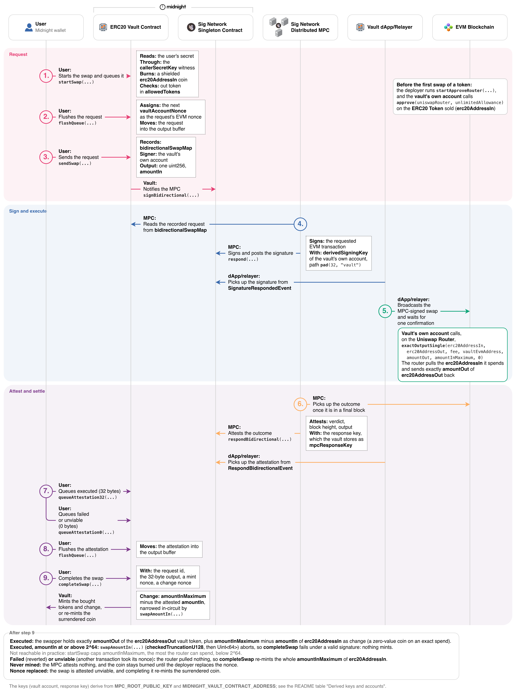
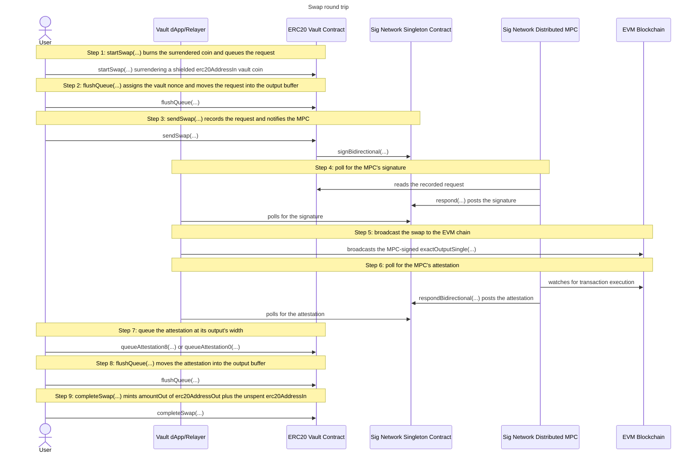

# Swap

The swap round trip has the vault trade its pooled ERC20 tokens on Uniswap V3
as if it were an ordinary EVM user, against shielded vault tokens the swapper
surrenders on Midnight. The swapper burns a coin of one token colour and, on
success, receives coins of another: the tokens themselves never leave the
vault's own EVM account, which both sells and buys, so the pooled balance and
the shielded supply stay equal per token.

## The protocol

It is best to understand the
[sign bidirectional flow](../../../../README.md#sign-bidirectional-protocol-flow) before
you continue here. For more detail see the
[sign bidirectional flow](https://github.com/sig-net/midnight-integration/blob/main/README.md#sign-bidirectional-flow)
in the midnight integration repository.

## The integration

To wire this shape into a contract of your own, start from the
[Integration guide](../../../../README.md#integrator-guide) in the repo README.
For the full walkthrough see the
[Integrator Guide](https://github.com/sig-net/midnight-integration/blob/main/README.md#integrator-guide)
in the midnight integration repository. The queue the vault runs every request
through is described in [Contention handling](../contention-handling.md).

## The swap round trip

The round trip runs from the caller surrendering their vault tokens on
Midnight to the complete call that mints what the trade bought. It is the
[withdraw](../withdraw/withdraw.md) shape with a router in the middle: the same
optimistic burn, the same vault-signed EVM transaction at a nonce the flush
assigns, the same queued and flushed attestation, over the swap's own request
map, [`bidirectionalSwapMap`](../../contract/src/erc20-vault.compact), typed
for the seven-word `exactOutputSingle` call and the swap's own schemas. The
[deposit](../deposit/deposit.md) page describes the shared machinery in full.

The router spends from the vault account under an allowance granted once per
token by a deployer-gated approval
([`startApproveRouter`](../../contract/src/erc20-vault.compact), see
[Vault-signed requests](../contention-handling.md#vault-signed-requests)),
which the `approve-e2e` spec runs before the swap specs.

As illustrated, the flow comprises 9 steps:

- **1.** startSwap(...) burns the surrendered coin and queues the request
  - The caller surrenders a shielded **vault coin** of `erc20AddressIn` worth
    exactly `amountInMaximum`, the worst-case spend.
    [`startSwap`](../../contract/src/erc20-vault.compact) checks the coin's
    colour is that ERC20's vault token
    ([`vaultTokenDomainSeparator`](../../contract/src/erc20-vault.compact))
    and burns it with the same pair of calls a
    [withdraw](../withdraw/withdraw.md) uses. The coin spend IS the
    authorisation. `erc20AddressOut` must be one the deployer allowed
    ([`allowedTokens`](../../contract/src/erc20-vault.compact)), as the
    complete mints its vault token.
  - The trade is EXACT-OUTPUT, and that is what makes the optimistic burn
    safe: `amountOut` is an input of the
    [`SwapRequest`](../../contract/src/erc20-vault.compact), asserted to fit
    the `Uint<64>` mint API BEFORE anything is burned, as is
    `amountInMaximum`, so every amount the complete circuit can mint is known
    and bounded at start.
  - The circuit copies the vault's gas settings for a swap into
    [`swapArgsMap`](../../contract/src/erc20-vault.compact) beside the request,
    and queues the entry with `useNextVaultAccountNonce` set and the swapper's
    [`ownershipCommitment`](../../contract/src/erc20-vault.compact).
  - Off chain, [`start-swap.ts`](../../integration-tests/src/flows/start-swap.ts)
    funds the coin from the caller's shielded balance and calls the circuit.
    The specs choose `amountInMaximum` from a live Uniswap quote
    ([`quoteExactOutputSingle`](../../integration-tests/src/evm-swap.ts)).
- **2.** flushQueue(...) assigns the vault nonce and moves the request into the output buffer
  - The flush gives the entry the vault account's next EVM nonce
    ([`vaultAccountNonce`](../../contract/src/erc20-vault.compact)) and moves it
    into `outputRequestBuffer`, exactly as it does for a
    [withdrawal](../withdraw/withdraw.md). `start-swap.ts` then reads the
    entry's index with [`flushedRequestIndex`](../../contract/src/vault-queue.ts).
- **3.** sendSwap(...) records the request and notifies the MPC
  - [`sendSwap`](../../contract/src/erc20-vault.compact) builds
    contract-enforced calldata for
    `exactOutputSingle((erc20AddressIn, erc20AddressOut, fee, vaultEvmAddress, amountOut, amountInMaximum, 0))`
    on the pinned [`uniswapRouter`](../../contract/src/erc20-vault.compact).
    The recipient is [`vaultEvmAddress`](../../contract/src/erc20-vault.compact),
    so the bought tokens come back to the pool, and the price bound is 0:
    slippage is enforced on chain by `amountInMaximum` alone, and a trade that
    would cost more reverts, which step 9 settles by re-minting.
  - A swap needs TWO schemas where a transfer needs one.
    [`swapOutputSchema`](../../contract/src/erc20-vault.compact) tells the
    MPC how to decode the router's `uint256` return, and
    [`swapRespondSchema`](../../contract/src/erc20-vault.compact) how to
    repack it as a `uint64` for the attestation, which is what lets step 9
    deserialise an 8-byte output.
  - The record goes into `bidirectionalSwapMap` under its request id, signed
    for the vault's own account (path `pad(32, "vault")`) at the assigned
    nonce and the gas the start copied, and the singleton's
    `signBidirectional(...)` call carries the map's path
    ([`VAULT_SWAP_REQUESTS_PATH`](../../contract/src/index.ts)).
- **4.** poll for the MPC's signature
  - The MPC signs the `exactOutputSingle` call with the vault's derived
    signing key, and
    [`poll-signature-response.ts`](../../integration-tests/src/flows/poll-signature-response.ts)
    polls for a post whose signature recovers to the vault's own account,
    `evmVaultAddress`, reading the request record from the swap map's path.
- **5.** broadcast the swap to the EVM chain
  - The dApp attaches the verified signature to the transaction rebuilt from
    the request record and sends it. The router pulls only the
    `erc20AddressIn` it actually spends from the vault's account, under the
    router allowance, and sends exactly `amountOut` of `erc20AddressOut` back
    to it.
  - [`broadcast-evm.ts`](../../integration-tests/src/flows/broadcast-evm.ts)
    is idempotent, as it is for a [withdraw](../withdraw/withdraw.md). A
    caller that expects the swap may revert passes `tolerateRevert`, as the
    swap refund spec does: an on-chain revert from slippage, thin liquidity or
    an impossible `amountInMaximum` is an outcome the MPC attests as a failure,
    not a broadcast error.
- **6.** poll for the MPC's attestation
  - [`poll-respond-bidirectional.ts`](../../integration-tests/src/flows/poll-respond-bidirectional.ts)
    resolves the MPC's attestation as it does for a
    [deposit](../deposit/deposit.md). A post declaring **`executed`** is
    checked over the router's return decoded per the `uint256` output schema
    and re-packed per the `uint64` respond schema, the 8 bytes that carry the
    `amountIn` the router really spent. A post declaring **`failed`** or
    **`unviable`** is checked over the EMPTY output.
- **7.** queue the attestation at its output's width
  - [`queue-attestation.ts`](../../integration-tests/src/flows/queue-attestation.ts)
    submits an executed swap to
    [`queueAttestation8`](../../contract/src/erc20-vault.compact) and a failed
    or unviable one to `queueAttestation0`. The circuit verifies the MPC's
    signature over the output against
    [`mpcResponseKey`](../../contract/src/erc20-vault.compact), finds the open
    swap through `evictionMap`, requires a block height strictly above its
    `lastSeen`, and queues the attestation record.
- **8.** flushQueue(...) moves the attestation into the output buffer
  - An attestation slot moves the record into `outputAttestationBuffer` and
    folds its block height into `globalLastSeen`.
- **9.** completeSwap(...) mints amountOut of erc20AddressOut plus the unspent erc20AddressIn
  - The swapper calls [`completeSwap`](../../contract/src/erc20-vault.compact)
    with the request id, the 8-byte serialised output and two mint nonces. The
    circuit requires the flushed attestation, a block height strictly above
    the entry's `lastSeen` and the caller's ownership commitment, which makes
    every mint swapper-only, then removes the request's event, its arguments,
    its `evictionMap` entry, the attestation and the output entry.
  - An `executed` verdict requires the output to hash to the record's digest,
    then mints the EXACT `amountOut` of `erc20AddressOut` the request asked
    for, a request input and never a result of the trade, and returns the
    unspent `erc20AddressIn` as change: `amountInMaximum` minus the attested
    `amountIn`, which the pure
    [`swapAmountIn`](../../contract/src/erc20-vault.compact) circuit
    deserialises from the output. An exact spend mints a zero-value change
    coin, and the change coin takes its own `changeNonce`, which the circuit
    asserts differs from `mintNonce`, so the two minted coins stay unlinkable.
  - A `failed` or `unviable` verdict means the router pulled nothing, so the
    circuit re-mints the whole surrendered `amountInMaximum` of
    `erc20AddressIn` under `mintNonce`, and the output it is passed is ignored.
  - [`settleSwap`](../../integration-tests/src/flows/complete-swap.ts) reads
    the swap's arguments off the ledger before the complete removes them,
    queues and flushes the attestation, then calls the circuit with fresh
    random nonces on every verdict.

## Shared setup

Every circuit call goes through the deployed vault, joined once with the
caller's identity secret as private state (see
[Runtime: joining the deployed vault](../../README.md#runtime-joining-the-deployed-vault)
in the vault README). That secret is the user's own random value, not a wallet
seed. The diagrams name it `MIDNIGHT_USER1_VAULT_SECRET`, and the integration
tests take it from the `VAULT_USER_SECRET_KEY` environment variable.

A swap starts from a shielded balance the swapper already holds, so a
[deposit](../deposit/deposit.md) precedes it: the caller must hold
`amountInMaximum` of the `erc20AddressIn` vault coin before step 1 can
surrender it. The leg also needs a live Uniswap V3 deployment: the setup
pipeline checks for the router with `uniswapAvailable` before any spec runs
and fails the run on an EVM chain without it.

The off-chain steps (4 to 6) each build a `SignetRequestResponseReader` over
the vault and singleton pair through
[`createResponseReader`](../../integration-tests/src/vault-context.ts). The
swap-specific piece is the path: a swap passes
[`VAULT_SWAP_REQUESTS_PATH`](../../contract/src/index.ts) so the reader reads
the records `sendSwap` wrote. The expected signer is the vault's own account,
whose derivation path is the contract-fixed `pad(32, "vault")`. The MPC
renders a request's 32 opaque path bytes as their full-width lowercase hex,
padding included, and `deriveEvmAddress` takes the same rendering, so the
vault's account derives from
[`VAULT_PATH_HEX`](../../contract/src/index.ts).
`deriveEvmAddress` is the concrete function behind the diagram's abstract
`keyDerivation(...)` note, and `deriveMidnightResponseKey` is the one behind the
response key's own note. The response key takes no path: it is per-contract and
independent of any request's derivation path, and the queue circuits verify the
MPC's attestation against it.

## Sequence

```mermaid
sequenceDiagram
    title Swap round trip
    actor User
    participant DApp as Vault dApp/Relayer
    participant Vault as ERC20 Vault Contract
    participant Singleton as Sig Network Singleton Contract
    participant MPC as Sig Network Distributed MPC
    participant EVM as EVM Blockchain

    Note over User,Vault: Step 1: startSwap(...) burns the surrendered coin and queues the request
    User->>Vault: startSwap(...) surrendering a shielded erc20AddressIn vault coin
    Note over User,Vault: Step 2: flushQueue(...) assigns the vault nonce and moves the request into the output buffer
    User->>Vault: flushQueue(...)
    Note over User,Singleton: Step 3: sendSwap(...) records the request and notifies the MPC
    User->>Vault: sendSwap(...)
    Vault->>Singleton: signBidirectional(...)
    Note over DApp,MPC: Step 4: poll for the MPC's signature
    MPC->>Vault: reads the recorded request
    MPC->>Singleton: respond(...) posts the signature
    DApp->>Singleton: polls for the signature
    Note over DApp,EVM: Step 5: broadcast the swap to the EVM chain
    DApp->>EVM: broadcasts the MPC-signed exactOutputSingle(...)
    Note over DApp,EVM: Step 6: poll for the MPC's attestation
    MPC->>EVM: watches for transaction execution
    MPC->>Singleton: respondBidirectional(...) posts the attestation
    DApp->>Singleton: polls for the attestation
    Note over User,Vault: Step 7: queue the attestation at its output's width
    User->>Vault: queueAttestation8(...) or queueAttestation0(...)
    Note over User,Vault: Step 8: flushQueue(...) moves the attestation into the output buffer
    User->>Vault: flushQueue(...)
    Note over User,Vault: Step 9: completeSwap(...) mints amountOut of erc20AddressOut plus the unspent erc20AddressIn
    User->>Vault: completeSwap(...)
```

---

Previous: [Withdraw](../withdraw/withdraw.md) · Next: [Supply](../supply/supply.md) · Up: [ERC20 Vault](../../README.md) · Protocol: [Sign Bidirectional Flow](../../../../README.md#sign-bidirectional-protocol-flow)
