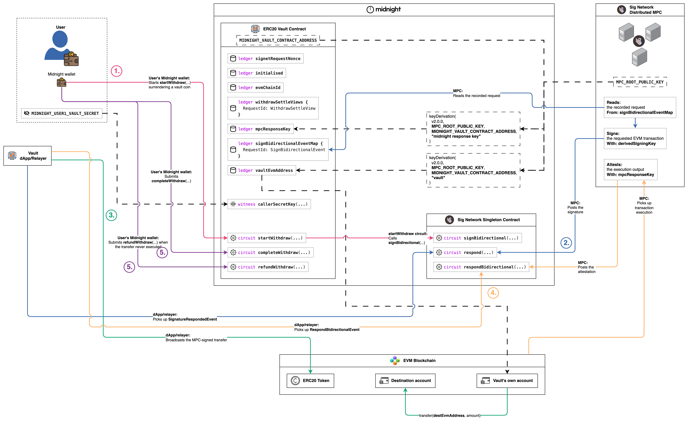
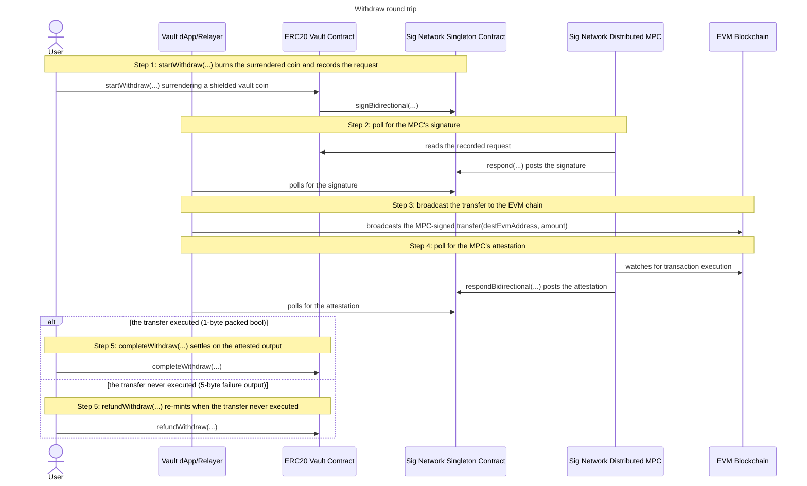

# Withdraw

The withdraw round trip moves ERC20 tokens out of the vault's own EVM account
to any destination the caller names, against shielded vault tokens the caller
surrenders on Midnight. It is the deposit round trip with the roles swapped:
the value is already pooled in the vault's account, so there is nothing to
fund first, and the vault's own account is the EVM sender of the requested
transfer.

## The protocol

It is best to understand the
[sign bidirectional flow](../../../../README.md#sign-bidirectional-protocol-flow) before
you continue here. For more detail see the
[sign bidirectional flow](https://github.com/sig-net/midnight-integration/blob/main/README.md#sign-bidirectional-protocol-flow)
in the midnight integration repository.

## The integration

To wire this shape into a contract of your own, start from the
[Integration guide](../../../../README.md#integration-guide) in the repo README.
For the full walkthrough see the
[Integrator Guide](https://github.com/sig-net/midnight-integration/blob/main/README.md#integrator-guide)
in the midnight integration repository.

## The withdraw round trip

The round trip runs from the caller surrendering their vault tokens on
Midnight to the settle call that closes the request. There is no fund step:
the ERC20 to move already sits in the vault's own EVM account, pinned at
initialise as [`vaultEvmAddress`](../../contract/src/erc20-vault.compact).
The user's wallet drives the two Midnight transactions, the Vault dApp
(Relayer) does the polling and the broadcast, and the MPC reads, signs and
attests exactly as it does for a [deposit](../deposit/deposit.md). The settle
is a branch: both arms are step 5, and which one runs is decided by the MPC's
attested output, never by the caller.

As illustrated, the flow comprises 5 steps:

- **1.** startWithdraw(...) burns the surrendered coin and records the request
  - The caller surrenders a shielded **vault coin** of exactly the withdraw
    amount. [`startWithdraw`](../../contract/src/erc20-vault.compact) checks
    the coin's colour is that ERC20's vault token
    ([`vaultTokenDomainSeparator`](../../contract/src/erc20-vault.compact))
    and burns it: `receiveShielded` assigns the coin to the contract, then
    `sendImmediateShielded` sends its full value to the shielded burn address.
    Both calls are needed, as a contract can only spend coins it owns. Vault
    tokens are IOUs, and a refund re-mints them.
  - The circuit builds contract-enforced calldata for
    `transfer(destEvmAddress, amount)` on the ERC20 named in the
    [`WithdrawRequest`](../../contract/src/erc20-vault.compact),
    constructs the **SignBidirectionalEvent** around it, stores that record in
    [`signBidirectionalEventMap`](../../contract/src/erc20-vault.compact)
    under the **RequestId** (the record's own hash), and calls the Sig Network
    singleton's `signBidirectional(...)` so the MPC picks the request up.
  - The derivation path is the contract-fixed literal `pad(32, "vault")`, so
    the MPC signs with the vault's own account and never with a caller's (see
    [Derived keys and accounts](../../README.md#derived-keys-and-accounts)).
    That account's ETH also pays the gas, so the whole fee envelope is
    contract-fixed: a caller-chosen fee cap would let anyone drain the vault's
    ETH at will, and retuning the caps means a redeploy.
  - The call is optimistic, and the coin spend IS the authorisation: the wallet
    can only fund the coin from the caller's own balance, so anyone holding
    vault tokens may withdraw to any destination.
  - The withdrawer's settle view (commitment, token, amount) goes into
    [`withdrawSettleViews`](../../contract/src/erc20-vault.compact), whose
    commitment comes from
    [`refundCommitment`](../../contract/src/erc20-vault.compact)
    over the caller's secret and the request id. It is deliberately NOT
    [`userCommitment`](../../contract/src/erc20-vault.compact): the
    deposit path publishes that commitment on the ledger as its request's
    derivation path, so reusing it here would let anyone link a refund marker
    to a depositor's identity. Binding the request id also keeps two refunds by
    the same secret unlinkable to each other. The entry doubles as the
    pending-withdrawal marker step 5 consumes.
  - Off chain, [`start-withdraw.ts`](../../integration-tests/src/flows/start-withdraw.ts)
    reads the vault account's next EVM nonce, funds the coin from the caller's
    shielded balance, calls the circuit, and asserts that the request id it
    recomputes with the SDK's `calculateRequestId` twin appears as a ledger map
    key.
- **2.** poll for the MPC's signature
  - The MPC reads the recorded request from the vault's ledger, signs the
    transfer with the vault's derived signing key, and posts the signature back
    through the singleton's `respond(...)`.
  - [`poll-signature-response.ts`](../../integration-tests/src/flows/poll-signature-response.ts#L66)
    polls the singleton's emitted signature events through the SDK's
    [`SignetRequestResponseReader`](https://github.com/sig-net/midnight-integration/blob/main/packages/signet-midnight/src/signet-request-response-reader.ts),
    asking `getVerifiedSignatureRespondedEvent` for a post whose signature
    recovers to the expected signer.
  - For a withdrawal the expected signer is the vault's own account,
    `evmVaultAddress`. The request id on the event is unauthenticated routing
    data on an open log that anyone may post to, so the recovery check is what
    selects the response.
- **3.** broadcast the transfer to the EVM chain
  - The MPC only signs, and broadcasting is the relayer's responsibility. The
    dApp rebuilds the transaction from the request record on the vault's ledger,
    attaches the verified signature
    (`signBidirectionalEventToSignedEvmTransaction`), and broadcasts it, moving
    the tokens out of the vault's own account to the destination the request
    named.
  - [`broadcast-evm.ts`](../../integration-tests/src/flows/broadcast-evm.ts#L81)
    is idempotent: a transfer already mined short-circuits, a node reporting the
    exact transaction as already seen is tolerated, and a reverted or
    nonce-burned transfer throws.
- **4.** poll for the MPC's attestation
  - The MPC watches the EVM chain for the transaction's execution and posts an
    attestation of its output through the singleton's
    `respondBidirectional(...)`. The event carries only the request id it
    answers and the MPC's ECDSA signature over the attestation digest of that
    id and the output bytes, so the client recomputes the output bytes
    independently and checks the signature against them, exactly as a
    [deposit](../deposit/deposit.md) does.
  - [`respond-output.ts`](../../integration-tests/src/flows/respond-output.ts#L105)
    recomputes TWO candidate outputs on every tick. **The success candidate** is
    computable only when the transaction executed: the raw execution output,
    decoded per the request's `outputDeserializationSchema` and re-packed per
    its `respondSerializationSchema`, which for a transfer turns the 32-byte ABI
    `bool` word into one byte (`0x01` the transfer went through, `0x00` the
    ERC20 returned false). **The failure candidate** is always available: the
    protocol's fixed 5-byte
    [`MPC_FAILURE_OUTPUT`](https://github.com/sig-net/midnight-integration/blob/main/packages/signet-midnight/src/constants.ts)
    (`0xdeadbeef01`), which the MPC attests for a transaction that never
    executed at all, reverted on chain or replaced on the same nonce.
  - Selection is by signature verification alone, against
    [`mpcResponseKey`](../../contract/src/erc20-vault.compact), the response
    key the vault pinned at initialise and reads back from its own ledger. The
    fetched output's own success flag is unauthenticated and decides nothing.
  - Which candidate verifies is also what routes step 5. Everything fetched here
    stays UNTRUSTED: the verified bytes go into the settle circuit as an
    argument, where the same signature is re-verified in-circuit, and that
    in-circuit check is the authentication gate.
  - [`poll-respond-bidirectional.ts`](../../integration-tests/src/flows/poll-respond-bidirectional.ts#L54)
    owns the poll deadline and hands the resolved outcome to the settle step.
- **5.** completeWithdraw(...) settles on the attested output
  - An executed transfer settles through
    [`completeWithdraw`](../../contract/src/erc20-vault.compact), whose
    `Bytes<1>` output argument is the transfer's packed bool.
    `verifyRespondBidirectionalEvent<1>` re-verifies the MPC's signature over it
    against `mpcResponseKey` before anything else happens.
  - Membership of `withdrawSettleViews` is the double-settle protection and the
    proof that this request is a pending withdrawal. Deposits never insert that
    marker, so a deposit request cannot be settled here, and its own settle
    circuit is the depositor-gated `completeDeposit`. The settle view carries the typed
    token and amount, so the request record itself is only removed.
  - On `0x01` the withdrawal is final, the surrendered value stays burned, and
    the call is pure cleanup: it mints nothing and needs no identity, so ANYONE
    holding the attested success may settle it.
  - On `0x00` the ERC20 returned false and the surrendered value re-mints to the
    withdrawer, so this branch is withdrawer-only: the caller proves the secret
    behind the commitment pinned at withdraw time, and the coin mints under a
    caller-chosen random `mintNonce`. A nonce derived from the public request id
    would link the refunded coin to the withdrawal.
  - [`complete-withdraw.ts`](../../integration-tests/src/flows/complete-withdraw.ts#L43)
    is the single settle call site: it resolves the attested outcome, picks this
    circuit or `refundWithdraw` from it, and passes a fresh random mint nonce either way.
- **5.** refundWithdraw(...) re-mints when the transfer never executed
  - A transfer that never ran on the EVM chain settles through
    [`refundWithdraw`](../../contract/src/erc20-vault.compact) instead, and the
    attested output's WIDTH is what routes the call: the fixed 5-byte failure
    output cannot type-fit `completeWithdraw`'s `Bytes<1>`, and an executed
    result cannot type-fit `refundWithdraw`'s `Bytes<5>`.
  - The same authentication gate runs at the failure width
    (`verifyRespondBidirectionalEvent<5>`), followed by an exact-bytes check:
    only `0xdeadbeef01` refunds, and any other attested 5-byte output is not a
    failure.
  - Each request kind has its own refund circuit (`refundWithdraw`,
    `refundSwap`, `refundSupply`, `refundRedeem`) sharing one signature and one
    failure check, and `refundWithdraw` reads ONLY the withdraw settle-view map: a
    request id of another kind, or one already settled, fails with a clean
    "not found".
  - For a withdrawal that map is `withdrawSettleViews`, and the commitment,
    token and amount come from the settle view pinned at startWithdraw time.
    The event map entry and the settle view are both consumed, and the value
    re-mints once.
  - Every arm is requester-only, as a refund mints a private coin: the caller
    must prove the secret behind the pinned commitment. The withdrawer's vault
    tokens are back in their wallet, minted under a nonce that ties them to
    nothing.

## Shared setup

Every circuit call goes through the deployed vault, joined once with the
caller's identity secret as private state (see
[Runtime: joining the deployed vault](../../README.md#runtime-joining-the-deployed-vault)
in the vault README). That secret is the user's own random value, not a wallet
seed. The diagrams name it `MIDNIGHT_USER1_VAULT_SECRET`, and the integration
tests take it from the environment variable of that name, which lands with the
contract and test changes that split it from the Midnight wallet seed.

The off-chain steps (2 to 4) share one `SignetRequestResponseReader` over the
vault and singleton pair, built by
[`createResponseReader`](../../integration-tests/src/vault-context.ts#L149).
The withdraw-specific piece is the expected signer: every withdraw transfer is
signed by the vault's own account, whose derivation path is the contract-fixed
`pad(32, "vault")`. The MPC renders a request's 32 opaque path bytes as their
full-width lowercase hex, padding included, and `deriveEvmAddress` takes the
same rendering, so the vault's account derives from
[`VAULT_PATH_HEX`](../../contract/src/index.ts#L29).
`deriveEvmAddress` is the concrete function behind the diagram's abstract
`keyDerivation(...)` note, and `deriveMidnightResponseKey` is the one behind the
response key's own note. The response key takes no path: it is per-contract and
independent of any request's derivation path, and both settle arms verify the
MPC's attestation against it.

## Sequence

---

Previous: [Deposit](../deposit/deposit.md) · Up: [ERC20 Vault](../../README.md) · Protocol: [Sign Bidirectional Flow](../../../../README.md#sign-bidirectional-protocol-flow)
