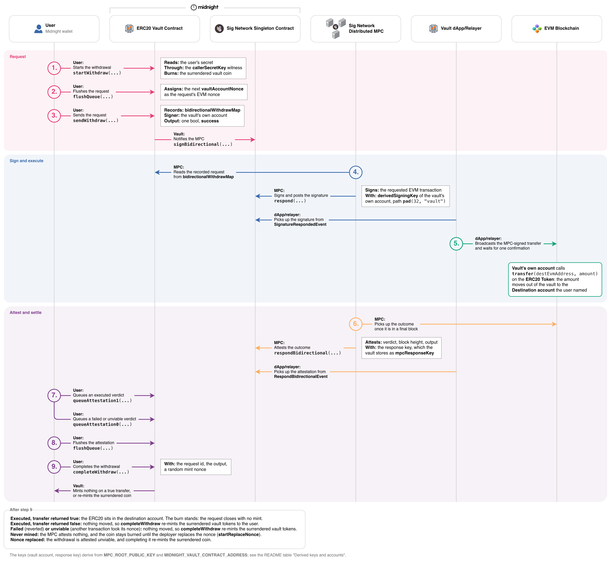
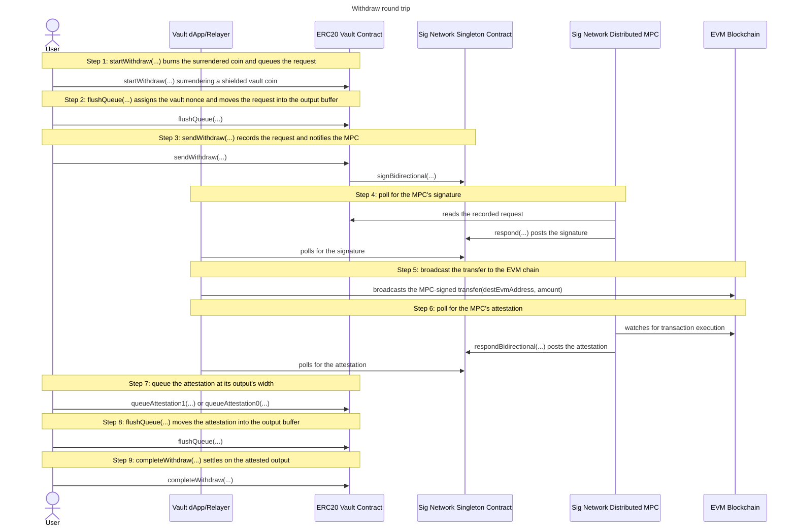

# Withdraw

The withdraw round trip moves ERC20 tokens out of the vault's own EVM account
to any destination the caller names, against shielded vault tokens the caller
surrenders on Midnight. It is the deposit round trip with the roles swapped:
the value is already pooled in the vault's account, so there is nothing to
fund first, and the vault's own account is the EVM sender of the requested
transfer.

## The protocol

It is best to understand the
[sign bidirectional flow](../../../../README.md#sign-bidirectional-protocol-flow) before
you continue here. For more detail see the
[sign bidirectional flow](https://github.com/sig-net/midnight-integration/blob/main/README.md#sign-bidirectional-flow)
in the midnight integration repository.

## The integration

To wire this shape into a contract of your own, start from the
[Integration guide](../../../../README.md#integrator-guide) in the repo README.
For the full walkthrough see the
[Integrator Guide](https://github.com/sig-net/midnight-integration/blob/main/README.md#integrator-guide)
in the midnight integration repository. The queue the vault runs every request
through is described in [Contention handling](../contention-handling.md).

## The withdraw round trip

The round trip runs from the caller surrendering their vault tokens on
Midnight to the complete call that closes the request. There is no fund step:
the ERC20 to move already sits in the vault's own EVM account, pinned at
initialise as [`vaultEvmAddress`](../../contract/src/erc20-vault.compact).
Every step runs as it does for a [deposit](../deposit/deposit.md), which
describes the shared machinery in full, with two differences: the vault's own
account signs the transfer, so the flush assigns its nonce, and the complete
circuit re-mints the surrendered value whenever the transfer did not go
through.

As illustrated, the flow comprises 9 steps:

- **1.** startWithdraw(...) burns the surrendered coin and queues the request
  - The caller surrenders a shielded **vault coin** of exactly the withdraw
    amount. [`startWithdraw`](../../contract/src/erc20-vault.compact) checks
    the coin's colour is that ERC20's vault token
    ([`vaultTokenDomainSeparator`](../../contract/src/erc20-vault.compact))
    and burns it: `receiveShielded` assigns the coin to the contract, then
    `sendImmediateShielded` sends its full value to the shielded burn address.
    Both calls are needed, as a contract can only spend coins it owns. Vault
    tokens are IOUs, and a failed withdrawal re-mints them.
  - The call is optimistic, and the coin spend IS the authorisation: the wallet
    can only fund the coin from the caller's own balance, so anyone holding
    vault tokens may withdraw to any destination. The amount is bounded to
    `Uint<64>`, the width a re-mint takes.
  - The vault's own account signs and pays, so the caller chooses no gas: the
    circuit copies the vault's gas settings (`vaultGasLimits`,
    `vaultMaxFeePerGas`, `vaultMaxPriorityFeePerGas`) into
    [`withdrawArgsMap`](../../contract/src/erc20-vault.compact) beside the
    [`WithdrawRequest`](../../contract/src/erc20-vault.compact), under a fresh
    random input index.
  - It queues the entry in `inputRequestBuffer` with `useNextVaultAccountNonce` set and a
    placeholder nonce of 0, plus the
    [`ownershipCommitment`](../../contract/src/erc20-vault.compact) that makes
    completing the withdrawal, and taking any re-mint, withdrawer-only.
  - Off chain, [`start-withdraw.ts`](../../integration-tests/src/flows/start-withdraw.ts)
    funds the coin from the caller's shielded balance and calls the circuit.
- **2.** flushQueue(...) assigns the vault nonce and moves the request into the output buffer
  - A request slot of [`flushQueue`](../../contract/src/erc20-vault.compact)
    gives a vault-signed entry the current
    [`vaultAccountNonce`](../../contract/src/erc20-vault.compact) before it
    computes the request index, then moves the entry into `outputRequestBuffer`
    with `globalLastSeen` as its `lastSeen` and advances the nonce by one.
    Each vault-signed request therefore carries a nonce no other request holds,
    so two otherwise identical withdrawals never wait on each other (see
    [Vault-signed requests](../contention-handling.md#vault-signed-requests)).
  - The request index covers the assigned nonce, so it exists only after the
    flush: `start-withdraw.ts` flushes through the SDK's
    [`flushUntil`](../../contract/src/vault-queue.ts) until the entry leaves
    the input buffer, then reads the index with
    [`flushedRequestIndex`](../../contract/src/vault-queue.ts).
- **3.** sendWithdraw(...) records the request and notifies the MPC
  - [`sendWithdraw`](../../contract/src/erc20-vault.compact) builds
    contract-enforced calldata for `transfer(destEvmAddress, amount)` on the
    ERC20 the request names, at the nonce the flush assigned and the gas the
    start copied, under the contract-fixed derivation path `pad(32, "vault")`,
    so the MPC signs with the vault's own account and never with a caller's
    (see [Derived keys and accounts](../../README.md#derived-keys-and-accounts)).
  - It stores the **SignBidirectionalEventV1** in
    [`bidirectionalWithdrawMap`](../../contract/src/erc20-vault.compact) under
    its request id, maps the id to the request index in `evictionMap`, and calls
    the singleton's `signBidirectional(...)` with the map's path
    ([`VAULT_WITHDRAW_REQUESTS_PATH`](../../contract/src/index.ts)).
    Anyone may send it, and a second send is refused.
  - Off chain, `start-withdraw.ts` rebuilds the expected record from the
    flushed entry and its stored arguments and asserts its recomputed request
    id is an index of the withdraw map.
- **4.** poll for the MPC's signature
  - The MPC reads the recorded request from the vault's ledger, signs the
    transfer with the vault's derived signing key, and posts the signature back
    through the singleton's `respond(...)`.
  - [`poll-signature-response.ts`](../../integration-tests/src/flows/poll-signature-response.ts)
    polls the singleton's emitted signature events through the SDK's
    [`SignetRequestResponseReader`](https://github.com/sig-net/midnight-integration/blob/v0.24.0-rc.6/packages/signet-midnight/src/signet-request-response-reader.ts),
    asking `getVerifiedSignatureRespondedEvent` for a post whose signature
    recovers to the expected signer: for a withdrawal, the vault's own
    account, `evmVaultAddress`.
- **5.** broadcast the transfer to the EVM chain
  - The dApp rebuilds the transaction from the request record on the vault's
    ledger, attaches the verified signature
    (`signBidirectionalEventToSignedEvmTransaction`), and broadcasts it,
    moving the tokens out of the vault's own account to the destination the
    request named.
  - [`broadcast-evm.ts`](../../integration-tests/src/flows/broadcast-evm.ts)
    is idempotent: a transfer already mined short-circuits, a node reporting the
    exact transaction as already seen is tolerated, and a reverted or
    nonce-burned transfer throws.
- **6.** poll for the MPC's attestation
  - The MPC posts an attestation of the transfer's outcome through the
    singleton's `respondBidirectional(...)`, and
    [`poll-respond-bidirectional.ts`](../../integration-tests/src/flows/poll-respond-bidirectional.ts)
    resolves it exactly as a [deposit](../deposit/deposit.md) does: a post
    declaring **`executed`** is checked over the transfer's packed bool (`0x01`
    the transfer went through, `0x00` the ERC20 returned false), and a post
    declaring **`failed`** (reverted on chain) or **`unviable`** (another
    transaction took its nonce) over the EMPTY output.
  - Selection is by signature verification alone, against
    [`mpcResponseKey`](../../contract/src/erc20-vault.compact), and everything
    resolved here stays UNTRUSTED until step 7 re-verifies it in-circuit.
- **7.** queue the attestation at its output's width
  - [`queue-attestation.ts`](../../integration-tests/src/flows/queue-attestation.ts)
    submits the verified outcome to
    [`queueAttestation1`](../../contract/src/erc20-vault.compact) for an
    executed transfer or `queueAttestation0` for a failed or unviable one.
    The circuit verifies the MPC's signature over the output, finds the open
    withdrawal through `evictionMap`, requires a block height strictly above
    its `lastSeen`, and queues the
    [`AttestationRecord`](../../contract/src/erc20-vault.compact) in
    `inputAttestationBuffer`.
- **8.** flushQueue(...) moves the attestation into the output buffer
  - An attestation slot moves the record into `outputAttestationBuffer` and
    folds its block height into `globalLastSeen`.
- **9.** completeWithdraw(...) settles on the attested output
  - The withdrawer calls
    [`completeWithdraw`](../../contract/src/erc20-vault.compact) with the
    request id, the serialised output and a mint nonce. The circuit requires
    the flushed attestation, a block height strictly above the entry's
    `lastSeen` and the caller's ownership commitment, then removes the
    request's event, its arguments, its `evictionMap` entry, the attestation
    and the output entry, so the request settles once.
  - An `executed` verdict requires the output to hash to the record's digest.
    A transfer that returned true moved the tokens, so the burn stands and the
    call only closes the request.
  - A transfer that returned false, or a `failed` or `unviable` one, moved
    nothing, so the circuit re-mints the surrendered amount of the ERC20's
    vault token to the caller, under a caller-chosen random `mintNonce`: a
    nonce derived from the public request id would link the re-minted coin to
    the withdrawal. On a failure the output it is passed is ignored.
  - [`complete-withdraw.ts`](../../integration-tests/src/flows/complete-withdraw.ts)
    queues and flushes the attestation, then calls the circuit with a fresh
    random mint nonce on every verdict.

## Shared setup

Every circuit call goes through the deployed vault, joined once with the
caller's identity secret as private state (see
[Runtime: joining the deployed vault](../../README.md#runtime-joining-the-deployed-vault)
in the vault README). That secret is the user's own random value. The diagrams name it
`MIDNIGHT_USER1_VAULT_SECRET`, and the integration tests take it from the
`VAULT_USER_SECRET_KEY` environment variable, falling back to the `USER_SEED`
bytes when it is unset.

The off-chain steps (4 to 6) each build a `SignetRequestResponseReader` over
the vault and singleton pair through
[`createResponseReader`](../../integration-tests/src/vault-context.ts), passing
the withdraw map's path. The withdraw-specific piece is the expected signer:
every withdraw transfer is signed by the vault's own account, whose derivation
path is the contract-fixed `pad(32, "vault")`. The MPC renders a request's 32
opaque path bytes as their full-width lowercase hex, padding included, and
`deriveEvmAddress` takes the same rendering, so the vault's account derives
from [`VAULT_PATH_HEX`](../../contract/src/index.ts).
`deriveEvmAddress` is the concrete function behind the diagram's abstract
`keyDerivation(...)` note, and `deriveMidnightResponseKey` is the one behind the
response key's own note. The response key takes no path: it is per-contract and
independent of any request's derivation path, and the queue circuits verify the
MPC's attestation against it.

## Sequence

```mermaid
sequenceDiagram
    title Withdraw round trip
    actor User
    participant DApp as Vault dApp/Relayer
    participant Vault as ERC20 Vault Contract
    participant Singleton as Sig Network Singleton Contract
    participant MPC as Sig Network Distributed MPC
    participant EVM as EVM Blockchain

    Note over User,Vault: Step 1: startWithdraw(...) burns the surrendered coin and queues the request
    User->>Vault: startWithdraw(...) surrendering a shielded vault coin
    Note over User,Vault: Step 2: flushQueue(...) assigns the vault nonce and moves the request into the output buffer
    User->>Vault: flushQueue(...)
    Note over User,Singleton: Step 3: sendWithdraw(...) records the request and notifies the MPC
    User->>Vault: sendWithdraw(...)
    Vault->>Singleton: signBidirectional(...)
    Note over DApp,MPC: Step 4: poll for the MPC's signature
    MPC->>Vault: reads the recorded request
    MPC->>Singleton: respond(...) posts the signature
    DApp->>Singleton: polls for the signature
    Note over DApp,EVM: Step 5: broadcast the transfer to the EVM chain
    DApp->>EVM: broadcasts the MPC-signed transfer(destEvmAddress, amount)
    Note over DApp,EVM: Step 6: poll for the MPC's attestation
    MPC->>EVM: watches for transaction execution
    MPC->>Singleton: respondBidirectional(...) posts the attestation
    DApp->>Singleton: polls for the attestation
    Note over User,Vault: Step 7: queue the attestation at its output's width
    User->>Vault: queueAttestation1(...) or queueAttestation0(...)
    Note over User,Vault: Step 8: flushQueue(...) moves the attestation into the output buffer
    User->>Vault: flushQueue(...)
    Note over User,Vault: Step 9: completeWithdraw(...) settles on the attested output
    User->>Vault: completeWithdraw(...)
```

---

Previous: [Deposit](../deposit/deposit.md) · Next: [Swap](../swap/swap.md) · Up: [ERC20 Vault](../../README.md) · Protocol: [Sign Bidirectional Flow](../../../../README.md#sign-bidirectional-protocol-flow)
